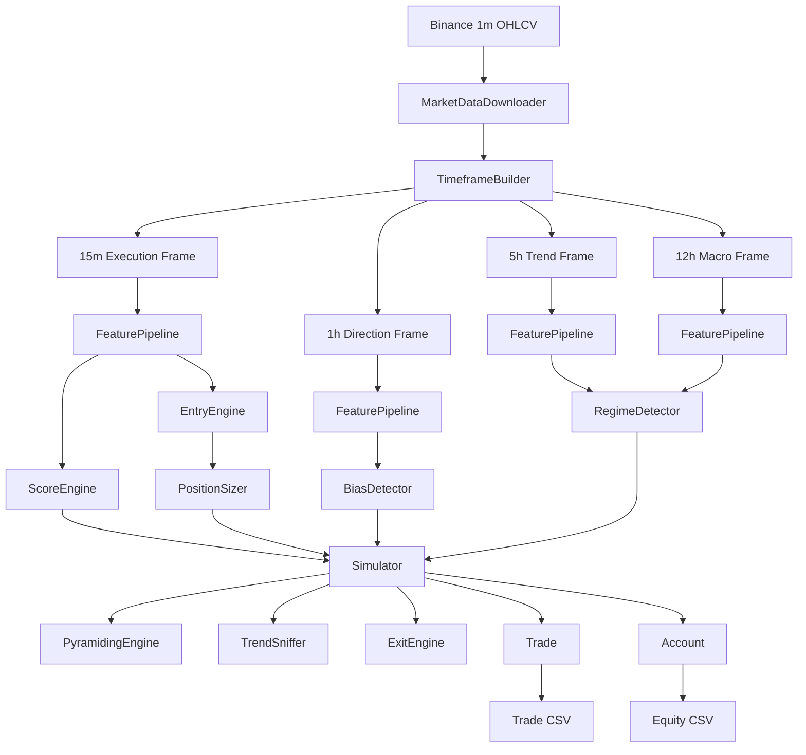
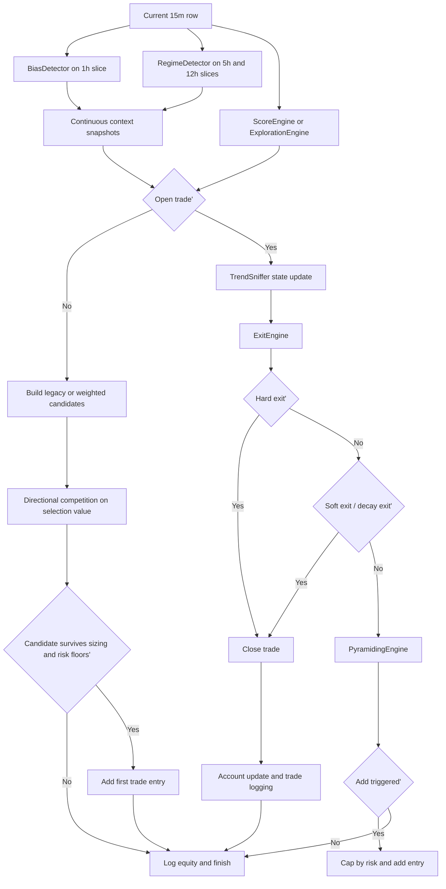

# Retail Trading System

Retail Trading System is a modular Python trading framework for Binance OHLCV
market data. It is built around one central idea: a trend-following strategy
should make every decision from closed candles, risk a controlled fraction of
capital, hold winners as long as structure remains healthy, and scale only when
the market proves the trade right.

This repository is not a generic indicator collection. It is a complete trading
pipeline with configuration, data ingestion, resampling, feature generation,
context detection, entry logic, risk-based sizing, pyramiding, exit handling,
accounting, and CSV audit trails for both backtesting and near-live simulation.

The codebase is deliberately modular. Each folder owns one stage of the system,
and the simulator orchestrates those stages one candle at a time. The result is
a strategy path that is traceable from raw Binance candles all the way to final
trade PnL.

## Table of Contents

- [System Overview](#system-overview)
- [Architectural Philosophy](#architectural-philosophy)
- [Repository Map](#repository-map)
- [High-Level Operating Model](#high-level-operating-model)
- [Operational Workflow](#operational-workflow)
- [Timeframe Hierarchy](#timeframe-hierarchy)
- [Configuration Model](#configuration-model)
- [Current Research Baseline](#current-research-baseline)
- [Console Experience](#console-experience)
- [Data Layer](#data-layer)
- [Feature Layer](#feature-layer)
- [Context Layer](#context-layer)
- [Entry Layer](#entry-layer)
- [Risk and Trade Management](#risk-and-trade-management)
- [Simulation Core](#simulation-core)
- [Backtest Mode](#backtest-mode)
- [Live Simulation Mode](#live-simulation-mode)
- [Outputs and CSV Schemas](#outputs-and-csv-schemas)
- [Testing and Verification](#testing-and-verification)
- [Design Invariants](#design-invariants)
- [Known Constraints and Current Boundaries](#known-constraints-and-current-boundaries)
- [Extension Guide](#extension-guide)
- [Quick Start](#quick-start)
- [Dependencies](#dependencies)

## System Overview

At the broadest level, the system ingests one-minute Binance candles, rebuilds
the strategy's higher timeframes, computes all derived features, waits for a
closed 15-minute execution candle, and then lets the simulator evaluate which
directional opportunities exist, how strong they are, how much capital they
deserve, whether an open trade can be added to, and when that trade should be
exited.

The repository now carries two architecture layers on purpose:

- a locked, long-only, gated baseline that remains preserved for historical
  comparison and validation
- an active weighted directional path that is looser in participation, logs all
  weighted opportunities, and is being refactored toward higher daily trade
  frequency and smarter capital allocation

The working config therefore no longer treats `bias`, `regime`, and
`breakout/breakdown` purely as permissions in every mode. In the weighted path,
they act as strength modifiers and exposure shapers, while the legacy gated
path remains available for comparison.

The same simulator core is reused in both historical backtesting and near-live
simulation. That is an important architectural choice: the system does not keep
separate strategy logic for "research mode" and "live mode." It keeps one
decision engine and changes only the data source and execution loop.

### At a Glance

| Attribute | Current Behavior |
| --- | --- |
| Venue | Binance spot-style OHLCV market data |
| Source granularity | `1m` base candles |
| Execution clock | Closed `15m` candles only |
| Direction | Working config: weighted long + short capable; locked baseline: long-only |
| Bias context | `1h` price vs EMA, EMA slope, and continuous directional-strength snapshot |
| Regime context | `12h` macro + `5h` trend confirmation, with normalized strength snapshot |
| Entry model | Legacy gated engine plus weighted continuous opportunity engine |
| Sizing model | Risk per trade as a fraction of equity |
| Scaling model | Add to winners at configured `+R` levels with quality-gated pyramiding |
| Soft exit | State-aware trailing and trend-behavior decay detection |
| Hard exit | Intrabar touch of structural stop, executed at stop price |
| Audit trail | Trade, equity, opportunity, validation, and robustness CSVs |
| Debug control | Global `app.debug` flag in config |

## Architectural Philosophy

The system follows a strict separation of concerns. Raw market data is prepared
before any decision logic sees it. Context modules determine whether conditions
are directionally supportive. Entry modules decide whether a specific execution
candle justifies a trade. Risk modules decide how much capital may be exposed.
Management modules decide whether to hold, scale, or exit. Logging modules
persist every outcome for later forensic review.

This separation matters because trading systems tend to become unreliable when
signal generation, state management, and accounting are mixed together. In this
repository, the simulator is intentionally thin. It asks other modules for one
decision each, then applies those decisions to the current trade and account.
That makes the strategy path inspectable and testable.

The project also favors event-based decisions over static state checks wherever
timing quality matters. Breakouts are detected when price crosses a level, not
merely because price remains above it. Pyramiding is triggered when price crosses
the next `+R` level, not merely because price already lives above that level.
This event-driven style reduces late entries and repeated signals.

## Repository Map

| Path | Responsibility |
| --- | --- |
| `config/` | JSON-backed configuration loader and environment handling |
| `common/` | Shared runtime helpers such as debug-output control |
| `data/` | Binance client, historical download logic, CSV loading, resampling |
| `features/` | Indicator helpers, candle metrics, and the feature pipeline |
| `bias/` | Directional market bias detection |
| `regime/` | Higher-timeframe environment scoring |
| `entry/` | Breakout, retest, scoring, and entry conversion |
| `position/` | Risk-based position sizing |
| `pyramiding/` | Add-to-winner logic and risk-budget capping |
| `sniffing/` | Trend-health evaluation for holding trades |
| `exit/` | Hard exit logic |
| `simulation/` | Trade state, account state, and simulator orchestration |
| `backtest/` | Historical runner, engine, and CSV loggers |
| `live_sim/` | Near-live runner, multi-asset paper portfolio, candle clock, and live loggers |
| `tests/` | Focused unit and regression tests for the system's critical behavior |
| `main_download.py` | CLI entry point for resumable historical `1m` downloads |
| `main_resample.py` | CLI entry point for rebuilding and saving higher timeframes |
| `main_backtest.py` | CLI entry point for full historical runs |
| `main_live.py` | CLI entry point for near-live single-symbol execution or multi-asset paper scanning |
| `main_walkforward.py` | CLI entry point for walk-forward validation and controlled branch testing |
| `main_monte_carlo.py` | CLI entry point for Monte Carlo and trade-concentration robustness analysis |
| `main_edge_lab.py` | CLI entry point for isolated edge-family diagnostics and lean bucket-table generation |
| `main_calibrate.py` | CLI entry point for opportunity-to-trade calibration reports |

## High-Level Operating Model

The following diagram summarizes the full pipeline from raw market data to
trade results.



The simulator operates on one execution candle at a time. In backtesting, that
means iterating through historical `15m` candles. In live simulation, that
means polling recent `1m` data until a new closed `15m` candle appears. In both
modes, the internal strategy logic is identical once the current execution row
and higher-timeframe slices are available.

## Operational Workflow

The project now supports a practical end-to-end command-line workflow rather
than assuming everything starts from `main_backtest.py`.

| Step | Command | Purpose |
| --- | --- | --- |
| `1` | `python main_download.py` | Download and checkpoint local `1m` history from Binance |
| `2` | `python main_resample.py` | Optional: materialize `15m`, `1h`, `5h`, and `12h` CSVs for inspection |
| `3` | `python main_backtest.py` | Run the historical replay path: by default a multi-asset portfolio backtest aligned with the live paper portfolio |
| `4` | `python main_edge_lab.py --symbols BTCUSDT ETHUSDT SOLUSDT` | Isolate hidden edge families and build a small deployable edge table |
| `5` | `python main_calibrate.py` | Build opportunity-to-trade calibration reports from the latest backtest outputs |
| `6` | `python main_walkforward.py --scheme multifold --branch-spec ...` | Run controlled multi-fold validation across candidate branches |
| `7` | `python main_monte_carlo.py ...` | Stress-test completed trades with bootstrap and concentration analysis |
| `8` | `python main_live.py` | Run the live path: by default a multi-asset paper portfolio scanner with local warmup history plus fresh Binance `1m` candles |

Two practical clarifications matter:

- `main_backtest.py` already resamples and computes features internally, so
  `main_resample.py` is optional for strategy correctness.
- The default historical mode is now `backtest.mode = "portfolio_replay"`.
  Set `backtest.mode` back to `single_symbol` if you want the older
  one-position simulator path and checkpointed `BacktestEngine`.
- `main_live.py` now boots from local `1m` history first, then merges
  recent Binance candles into that in-memory state before resampling.
- The default live mode is now `portfolio_paper`, not the old single-symbol
  loop. Set `live_sim.mode` back to `single_symbol` if you want the legacy
  behavior.
- `main_backtest.py` and `main_live.py` serve different jobs: the backtest path
  is the historical research layer, while the live path is a near-live paper
  execution layer and does not replay the full dataset trade-by-trade.

## Timeframe Hierarchy

The system is intentionally multi-timeframe. Each timeframe has a dedicated job
and is not interchangeable with the others.

| Timeframe | Role | Current Use |
| --- | --- | --- |
| `1m` | Base market data | Downloaded from Binance and resampled upward |
| `15m` | Execution timeframe | Entries, pyramiding checks, exits, candle metrics |
| `1h` | Direction timeframe | Bias detection |
| `5h` | Trend confirmation timeframe | Regime scoring via structure confirmation |
| `12h` | Macro timeframe | Regime scoring via structure and slope |

### Why the hierarchy matters

The design prevents the execution layer from making decisions without broader
context. A `15m` breakout is not enough on its own. The system first asks
whether the `1h` direction is aligned and whether the `12h`/`5h` environment is
at least moderate. This reduces the chance that a locally strong candle is
traded in a larger weak or sideways market.

### Candle alignment and lookahead control

Resampled candles are right-labeled and treated as closed units. Higher-timeframe
slices are always restricted with `.loc[:current_execution_timestamp]` before
the simulator sees them. That means the strategy only sees higher-timeframe bars
that would already have been complete at the execution timestamp being tested.

## Configuration Model

All runtime behavior is driven by [`config/settings.json`](config/settings.json).
The project treats configuration as part of the system definition. Strategy
weights, thresholds, timeframes, paths, retry behavior, and logging behavior are
not scattered across the codebase.

### Configuration sources

1. JSON file: `config/settings.json`
2. Optional environment file: `.env`
3. Optional override path: `TRADING_SYSTEM_CONFIG`

### Core configuration sections

| Section | Purpose |
| --- | --- |
| `app` | Default symbol and debug switch |
| `account` | Initial equity and risk per trade |
| `backtest` | Output, checkpoint, opportunity logging, and calibration-report settings |
| `binance` | Network, retry, timeout, and request behavior |
| `downloads.history` | Checkpointing and resume behavior |
| `entry` | Legacy score-threshold compatibility plus score-specific refinement hooks |
| `features` | EMA periods, structure windows, compression, pressure-model, and candle-metric settings |
| `history` | Backtest date range |
| `live_sim` | Live mode, output directory, polling interval, scanned universe, continuous opportunity scoring, and paper-portfolio controls |
| `position` | Minimum stop-distance safeguards and optional size caps |
| `storage` | Base data directory |
| `strategy.directional` | Enabled sides for the active directional engine |
| `strategy.edge_selection` | Optional lean bucket-table filter and size-scaling layer |
| `strategy.execution` | Legacy gated vs weighted execution mode and weighted-strength settings |
| `strategy.daily_controls` | Daily trade-flow, risk-budget, and profit-protection controls |
| `strategy.exploration` | Early pressure/ignition probe settings for the exploratory signal family |
| `strategy.bias` | Bias EMA and slope threshold |
| `strategy.regime` | Regime weights, slope threshold, and regime bands |
| `strategy.scoring` | Entry score weights and candle-quality thresholds |
| `strategy.sniffing` | State-based trailing, decay detection, and side-aware hold logic |
| `strategy.pyramiding` | Add levels and total risk budget |
| `timeframes` | Base, execution, direction, trend, macro, resample settings |

### Environment variables

The repository includes [`.env.template`](.env.template). The typical local
variables are:

```text
BINANCE_API_KEY=
BINANCE_API_SECRET=
TRADING_SYSTEM_CONFIG=config/settings.json
```

Public OHLCV requests do not require keys, but the Binance client is prepared
to load credentials for future authenticated endpoints.

### Debug control

The global switch is:

```json
"app": {
  "default_symbol": "BTCUSDT",
  "debug": true
}
```

When `app.debug` is `false`, the internal print-heavy modules route their output
through `common/debug.py` and remain silent. This is a practical middle ground
between development verbosity and a fully structured logging framework.

## Current Research Baseline

The repository now carries two distinct strategy layers that should not be
confused:

- a locked long-only gated baseline that remains the historical comparison
  anchor
- an active weighted directional working config that is looser in participation,
  logs every opportunity, and is being refactored toward calibration and
  portfolio-style allocation

### Locked baseline snapshot

The locked baseline is the older, intentionally selective path:

- long-only
- additive score model with threshold conversion
- breakout-led entry confirmation
- elite-only pyramiding expansion
- state-based trailing and hard-stop execution

Its job now is to remain a stable benchmark while the weighted refactor grows
into a broader, higher-frequency opportunity engine.

### Active weighted working config

`config/settings.json` now defaults to the weighted directional path rather than
the locked gated baseline.

| Capability | Current behavior |
| --- | --- |
| Execution mode | `strategy.execution.mode = "weighted"` |
| Enabled sides | `strategy.directional.enabled_sides = ["long", "short"]` |
| Bias handling | Continuous multiplier, not a hard blocker |
| Regime handling | Continuous multiplier, not a hard blocker |
| Event handling | Breakout/breakdown remain bonuses, not universal requirements |
| Opportunity logging | Enabled by default into `backtest/output/opportunities.csv` |
| Lean edge selection | Optional `strategy.edge_selection` lookup table built from `main_edge_lab.py` |
| Daily controls | Enabled by default: daily loss brake, target brake, risk cap, and trade-flow cap |
| Exploration layer | Implemented but `strategy.exploration.enabled = false` by default |

The weighted path is intentionally looser than the locked baseline. The design
goal is to allow many more candidates to exist, then scale capital by measured
strength instead of relying on compounded hard gates.

### Lean edge-selection layer

The repo now includes a deliberately small edge-selection seam built for
execution, not research sprawl.

The deployable bucket uses only:

- `edge_type`
- `bias_bucket`
- `body_bucket`
- `vwap_bucket`

`main_edge_lab.py` can turn raw isolated forward-return diagnostics into:

- `backtest/output/edge_lab/edge_bucket_summary.csv`
- `backtest/output/edge_lab/edge_table.json`

The runtime weighted engine can optionally load that JSON through
`strategy.edge_selection`. When enabled, the bucket becomes the final
selection/scaling layer:

1. the weighted engine still generates broad candidates
2. the bucket decides whether that situation is historically tradable
3. a small `bucket_risk_mult` nudges capital up or down

This is intentionally not a large model. It is a small, explainable filter on
top of the looser weighted path.

### Refined breakout edge-lab status

The current edge-lab focus is no longer "generic breakout". It is the narrower
question:

- `impulse_breakout`
- `pressure_breakout`
- `breakout_pullback`

The bucket structure remains intentionally small:

- `edge_type`
- `bias_bucket`
- `body_bucket`
- `vwap_bucket`

That keeps the lab explainable while changing the quality of the underlying
signals rather than exploding bucket complexity.

Latest wider local run:

```bash
python main_edge_lab.py --symbols AAVEUSDT AVAXUSDT BNBUSDT BTCUSDT ETHUSDT LINKUSDT SOLUSDT TRXUSDT XRPUSDT --horizons 1 3 5 --bucket-min-count 150 --bucket-min-avg-return-net 0.0
```

What that run showed:

- broad refined breakout families are still mostly fee-negative
- `pressure_breakout` remained negative across the tested horizons
- `breakout_pullback` did not survive once the universe widened
- exactly one bucket survived the current fee-aware filter with real sample
  depth:
  - `impulse_breakout|neutral|strong|far`
  - `selected_horizon = 5`
  - `signal_count = 4029`
  - `avg_return_net = 0.000212`
  - `win_rate_net ≈ 44.85%`

That matters because it is the first breakout-derived bucket in this repo that
stayed positive after the configured `0.1%` round-trip fee across the wider
9-symbol local universe.

### Production edge candidate

The repo now includes an explicit production-candidate table for that edge:

- `config/edge_tables/impulse_breakout_production.json`

And a controlled branch-comparison spec:

- `config/branches/impulse_breakout_production_candidates.json`

That branch does **not** add more filters. It does four simple things:

1. enables edge selection with `bucket_only` sizing authority
2. restricts the branch to the discovered long-side impulse bucket
3. lowers base risk to `0.25%`
4. applies an edge-specific execution profile:
   - `max_hold_candles = 6`
   - pyramiding disabled
   - trailing disabled
   - light profit lock only after `+1.5R`

This keeps the runtime aligned with the edge's measured behavior rather than
forcing it through the slower generic trend-management path.

### Deployment result

The first honest branch comparison is now available under:

- `backtest/output/validation/weighted_impulse_breakout_compare/branch_comparison__impulse_breakout_production_candidates.csv`
- `backtest/output/validation/weighted_impulse_breakout_fullrange/branch_comparison__impulse_breakout_production_candidates.csv`

What that comparison showed:

- the impulse bucket **does** improve per-trade quality materially
- it also **reduces** drawdown materially
- but in the current one-slot runtime it cuts trade flow and total PnL too much

Single split (`BTCUSDT`, current runtime config):

- `weighted_broad_current`
  - train PF `1.084`, avg R `0.0190`, DD `-27.45%`, trades `22502`
  - test PF `1.062`, avg R `0.0080`, DD `-24.27%`, trades `25719`
- `impulse_breakout_production`
  - train PF `1.160`, avg R `0.0350`, DD `-6.65%`, trades `15335`
  - test PF `1.123`, avg R `0.0283`, DD `-4.78%`, trades `15277`

Full range:

- `weighted_broad_current`
  - net PnL `+141440.09`
  - PF `1.069`
  - avg R `0.0132`
  - DD `-33.53%`
  - trades `48221`
- `impulse_breakout_production`
  - net PnL `+25485.73`
  - PF `1.166`
  - avg R `0.0351`
  - DD `-6.65%`
  - trades `22232`

So the conclusion is precise:

- the bucket is a **real deployable edge**
- it is **better quality** than the broad weighted flow
- but as a standalone selector inside the current one-position simulator it is
  too narrow to replace the broader engine as the main growth path

That means the right next use is:

- keep it as a protected production candidate
- use it as a high-quality sub-engine
- later combine it with multi-position / multi-asset allocation instead of
  forcing it to become the only trade source

### Active refinement hooks

The refinement hooks are still available, but the live weighted config keeps
them lighter than the locked baseline:

| Refinement | Current working-config behavior |
| --- | --- |
| Score threshold | `entry.score_threshold = 4` remains for legacy compatibility |
| Compression filter | `entry.block_compression = false` |
| Score bucket exclusion | `entry.blocked_scores = []` |
| Score-specific body filter | Score `8` requires `body_strength >= 2.0` |
| Score-specific wick filter | Score `8` rejects `0.1 <= upper_wick_ratio < 0.3` |

### Directional and exploratory research extensions

The research harness now supports both directional competition and an optional
pressure-probe layer.

| Capability | Current implementation |
| --- | --- |
| Unified side selection | Competing `long` vs `short` weighted candidates on the same `15m` candle |
| Bearish structure events | `breakdown` below prior rolling low |
| Side-aware trade math | Shared `Trade` object with mirrored stops, mirrored PnL, and side-aware risk |
| Side-aware regime scoring | Bullish and bearish `12h` / `5h` environment scoring |
| Exploratory pressure layer | Pressure score plus ignition event via `entry/exploration_engine.py` |
| Opportunity calibration seam | Logged opportunities can be linked back to executed trades by `opportunity_id` |

### Active trailing and pyramiding behavior

The working architecture now uses:

- a state-based trailing engine with `init`, `confirmation`, `expansion`,
  `decay`, and `exit` phases
- a distinct `active_stop` that ratchets over time without rewriting the
  original structural stop used for `R` math
- side-aware short behavior that tightens faster than the long side
- quality-gated pyramiding that still references the original entry and shared
  structural stop

Current configured add structure:

| Level | Trigger | Base size fraction | Elite behavior |
| --- | --- | --- | --- |
| `1` | `+1R` cross | `0.5` | Standard |
| `2` | `+2R` cross | `0.5` | Multiplied by `1.5`, so effective add size is `0.75` |

### Latest validated locked-baseline snapshot

Using the locked long baseline on the configured historical range
`2018-01-01 -> 2026-05-22`, the latest full rerun produced:

| Metric | Latest result |
| --- | --- |
| Initial equity | `20000.00` |
| Final equity | `43678.91` |
| Net PnL | `+23678.91` |
| Trades | `741` |
| Win rate | `42.24%` |
| Profit factor | `1.454` |
| Average `pnl_R_initial` | `0.1124` |
| Max drawdown | `-12.17%` |

This is a research snapshot, not a live-performance claim. It should not be
confused with the current weighted default config. It remains useful because it
is the strongest preserved benchmark for historical comparison.

### Controlled validation state

Recent multi-fold validation work produced two important conclusions:

- conditional `score 5` pruning is worth testing, but blunt removal still harms
  fold stability even when it improves average edge
- the new long+short engine is functionally complete, but the first short
  branches remain weaker than the locked long baseline and therefore are not
  yet promoted

## Console Experience

The repository now exposes a much cleaner terminal UX than a traditional
print-spam research script.

### Historical download dashboard

`main_download.py` uses a Rich live dashboard that shows:

- colored progress bar
- batch number and current time window
- rows saved and estimated completion
- TLS mode and checkpoint path
- recent events such as retries, saves, resumes, and completion

### Backtest dashboard

`main_backtest.py` uses a separate Rich live dashboard that shows:

- processed execution candles and percent complete
- elapsed time and ETA
- current equity and net PnL
- trade count, wins, losses, and win rate
- recent pipeline events such as load, resample, feature build, resume, and completion

During a dashboard-driven backtest, the framework force-suppresses module debug
spam so the screen stays readable.

## Data Layer

The data layer transforms external market data into a local, validated, and
resampled dataset that the strategy can trust.

### BinanceClient

`data/binance_client.py` is the lowest-level network module. It encapsulates the
Binance REST request, timeout behavior, retry logic, throttle spacing, and
response handling. It also supports `ssl_verify` and `ca_bundle_path`, which is
useful in corporate environments with custom certificate chains. It is
deliberately small, because its job is not strategy logic. Its job is to return
raw klines reliably.

### MarketDataDownloader

`data/downloader.py` owns the higher-level market-data workflow:

- downloading historical `1m` candles
- resuming interrupted downloads
- checkpoint writing and reading
- partial CSV accumulation
- duplicate removal
- closed-candle validation
- fetching recent candles for live simulation
- loading local CSVs into pandas DataFrames

### Historical checkpointing

Historical downloads are resumable. During a long run, the system keeps:

| Artifact | Purpose |
| --- | --- |
| `*.partial.csv` | Incrementally appended unfinished candle history |
| `*.checkpoint.json` | Resume cursor and download metadata |
| Final `*.csv` | Clean deduplicated completed history |

This means a multi-hour download can survive network interruption or terminal
closure without restarting from the first candle.

The checkpoint writer also retries Windows file-replace operations to reduce
crashes caused by transient OneDrive or indexing locks.

If you extend the configured end date, the downloader can also bootstrap the
new target range from the newest compatible completed CSV for the same symbol,
interval, and start date. That means extending a file such as
`..._to_2026-05-12.csv` to `..._to_2026-05-22.csv` does not require a full
redownload from `2018-01-01`.

### TimeframeBuilder

`data/resampler.py` rebuilds higher-timeframe OHLCV bars from the `1m` base
stream. The builder:

1. resamples `open`, `high`, `low`, `close`, and `volume`
2. drops any still-incomplete higher-timeframe candle
3. saves each timeframe to its configured storage path

The key correctness property is that incomplete resampled candles are removed
before strategy logic sees them. That is essential for both backtesting realism
and live-simulation consistency.

## Feature Layer

The feature layer is the analytical foundation of the strategy. It converts raw
OHLCV bars into the exact columns consumed by bias, regime, scoring, entry,
pyramiding, and exit logic.

### Feature pipeline responsibilities

`features/feature_pipeline.py` computes, in order:

1. trend EMAs
2. rolling structure highs and lows
3. compression ranges
4. event-based breakout and breakdown columns
5. candle-quality metrics
6. VWAP, ATR, MACD, and Bollinger context
7. pressure-model features for exploratory instability probes
8. NaN cleanup on all required feature columns

### Derived columns

| Column family | Meaning |
| --- | --- |
| `ema20`, `ema50` | Fast and slow trend filters |
| `hh20` | Rolling structural high |
| `ll10` | Rolling structural low |
| `range_10`, `range_30` | Short and long volatility ranges |
| `compression` | Whether short range is compressed relative to long range |
| `prev_close` | Prior close, used for event logic |
| `hh20_prev` | Prior structural high |
| `ll10_prev` | Prior structural low |
| `above_breakout_level` | State flag: current close above prior high |
| `breakout` | Event flag: current close crossed above prior high |
| `below_breakdown_level` | State flag: current close below prior low |
| `breakdown` | Event flag: current close crossed below prior low |
| `body_strength` | Candle body normalized by rolling average body |
| `upper_wick_ratio` | Upper wick relative to body |
| `lower_wick_ratio` | Lower wick relative to body |
| `close_position` | Where the close sits inside the candle's range |
| `session_vwap`, `vwap_distance_ratio` | Session mean-reversion anchor and normalized distance |
| `atr`, `atr_rising` | Volatility level and expansion flag |
| `macd_hist` | Momentum histogram |
| `bb_upper`, `bb_lower` | Bollinger breakout context |
| `pressure_score_long`, `pressure_score_short` | Exploratory instability scores |
| `pressure_ignition_long`, `pressure_ignition_short` | Pressure-release trigger events |

### Indicator helpers

`features/indicators.py` intentionally keeps low-level indicator math simple:

| Helper | Description |
| --- | --- |
| `ema(series, period)` | Exponential moving average |
| `rolling_high(series, period)` | Highest high over a rolling window |
| `rolling_low(series, period)` | Lowest low over a rolling window |

### Compression

Compression is calculated by comparing a short-term price range to a longer-term
range:

```text
compression = range_fast < ratio * range_slow
```

This does not forecast direction. It marks a market condition in which price has
contracted and may be more attractive for breakout expansion.

### Breakout event logic

Breakout timing is event-based, not state-based. The pipeline computes:

```text
above_breakout_level = close > hh_prev
breakout = above_breakout_level and prev_close <= hh_prev
```

That distinction is critical. A static condition like "close above prior high"
stays true for many candles. An event-based condition becomes true only at the
moment of crossing, which is what the entry engine needs.

### Candle metrics

`features/candle_metrics.py` quantifies candle quality using normalized values
instead of pattern names. This makes the strategy more robust across different
volatility regimes and different nominal price levels.

### NaN handling

The feature pipeline explicitly drops incomplete rows at the end of the build.
That prevents early rolling-window NaNs from leaking into downstream logic and
creating false signals during warm-up periods.

## Context Layer

The context layer answers two related questions:

1. Which direction currently has the stronger structural context'
2. How much should that context influence exposure or candidate ranking'

These concerns are handled by `BiasDetector` and `RegimeDetector`. In the
legacy gated path they can still behave like permissions. In the weighted path
they primarily feed continuous context snapshots.

### BiasDetector

`bias/bias_detector.py` determines directional bias from the `1h` timeframe.
It now exposes both a categorical label and a richer snapshot for the weighted
path.

The logic is:

```text
bullish if close > ema and relative_ema_slope > +threshold
bearish if close < ema and relative_ema_slope < -threshold
neutral otherwise
```

The slope is relative, not absolute:

```text
slope = (current_ema - past_ema) / past_ema
```

That makes the calculation scale-independent and avoids the problem where the
same shape would produce different slope magnitudes on assets at different price
levels.

The weighted path consumes:

- `label`
- `price_vs_ema_ratio`
- `ema_slope`
- `distance_strength`
- `slope_strength`
- `directional_strength`

### RegimeDetector

`regime/regime_detector.py` scores the broader market environment using the
`12h` macro timeframe and the `5h` confirmation timeframe. It now exposes both
legacy score/class outputs and a richer regime snapshot.

Current scoring inputs:

| Signal | Default Weight | Meaning |
| --- | --- | --- |
| `12h close > ema50` | `2` | Macro structure is bullish |
| `12h relative ema50 slope > threshold` | `1` | Macro trend is rising with sufficient slope |
| `5h close > ema50` | `1` | Intermediate trend confirms the macro direction |

Current bands:

| Score band | Interpretation | Weighted-path meaning |
| --- | --- | --- |
| `>= strong_score` | Strong | Highest regime multiplier |
| `>= moderate_score` and `< strong_score` | Moderate | Neutral baseline multiplier |
| `< moderate_score` | Weak | Penalty, not automatic rejection |

The weighted path consumes:

- `raw_score`
- `max_score`
- `class`
- `normalized_strength`
- directional alignment flags

The runtime still does not use regime as a full portfolio allocator. That
larger refactor is still in progress.

## Entry Layer

The entry layer converts a context-enriched execution candle into either a
legacy gated trade or a weighted opportunity candidate.

### ScoreEngine

`entry/scoring.py` still builds a transparent additive score, but the refactor
now exposes that score as decomposed components rather than only as one opaque
integer.

Current scoring components:

| Component | Default Weight | Condition |
| --- | --- | --- |
| Bias alignment | `2` | Direction aligned with the side being scored |
| Trend confirmation | `1` | `15m` trend aligned with the side being scored |
| VWAP alignment | `1` | Price location favorable relative to VWAP |
| Compression | `1` | Compressed structure present |
| Breakout / breakdown event | `2` | Structural event fired in the scored direction |
| Strong body | `1` | `body_strength > body_strength_min` |
| Strong close position | `1` | Close is favorable for the scored direction |
| Clean wick structure | `1` | Wick profile supports the scored direction |
| ATR / volatility context | `1` | Volatility expansion is supportive |
| MACD / momentum context | `1` | Momentum confirms the side |
| Bollinger breakout context | `1` | Band context supports expansion |

The score threshold still exists for legacy compatibility:

```text
entry.score_threshold = 4
```

### BreakoutDetector

`entry/breakout.py` duplicates the event-based breakout check as an explicit
detector module. It requires both `prev_close` and the previous structural high
column, and it computes the breakout directly from the row rather than trusting
a looser fallback.

### EntryEngine

`entry/entry_engine.py` is now a facade over two paths:

- `entry/legacy_entry_engine.py`
- `entry/weighted_opportunity_engine.py`

The legacy path still behaves like the older selective system:

1. bias check
2. score threshold check
3. structural event check
4. trade conversion

The weighted path behaves differently:

1. compute score details and normalized score
2. blend score with continuous momentum features
3. apply bias, regime, and event modifiers
4. optionally map the candidate into a small edge bucket built from
   `main_edge_lab.py`
5. produce a weighted candidate with:
   - `signal_strength`
   - `final_strength`
   - `entry_risk_multiplier`
   - `selection_value`
6. let the simulator decide whether that candidate deserves capital

This distinction is important. The refactor goal is broader participation with
smarter sizing, not re-creating the old gate stack in a fancier form.

### What the bucket layer does and does not do

The optional bucket layer is intentionally lean:

- it does not replace the weighted engine
- it does not add dozens of extra variables
- it does not do online machine learning

It only answers:

> Has this simple edge/bias/body/VWAP situation shown enough net edge to deserve
> capital?

If yes, the candidate stays alive and receives a small size multiplier. If no,
the candidate is skipped when edge selection is enabled.

### Current refinement filters

The entry engine now supports additional config-driven filtering beyond the base
score threshold:

| Filter | Purpose |
| --- | --- |
| `entry.block_compression` | Reject setups formed during compressed conditions |
| `entry.blocked_scores` | Exclude known weak score buckets without changing the score engine |
| `entry.min_body_strength_by_score` | Require stronger momentum for specific score cohorts |
| `entry.blocked_upper_wick_ranges_by_score` | Exclude score-specific wick structures that backtest poorly |

These are intentionally placed in the entry-conversion layer rather than inside
the scoring engine. That keeps the score model interpretable while allowing
surgical filtering of weak subpopulations discovered during research.

The locked baseline historically used more of these hooks. The current weighted
working config keeps them intentionally lighter so the engine stays broad enough
to generate a higher daily opportunity count.

### RetestDetector

`entry/retest.py` exists in the repository but is not part of the active entry
path. The current system uses breakout entries, not retest entries.

## Risk and Trade Management

This part of the system determines not only whether a trade exists, but how much
capital is exposed, whether the position may be enlarged, and whether the trade
still deserves to be held.

### PositionSizer

`position/sizing.py` uses a classical risk-based sizing formula:

```text
risk_amount = equity * risk_per_trade
risk_per_unit = abs(entry_price - stop_price)
position_size = risk_amount / risk_per_unit
```

The module also includes safety constraints:

| Safeguard | Purpose |
| --- | --- |
| `min_stop_distance_ratio` | Rejects trades with unrealistically tight stops relative to price |
| `min_stop_distance_absolute` | Rejects trades with stops below an absolute floor |
| `max_position_size_units` | Optional hard cap on unit size |
| `max_notional_equity_multiple` | Optional cap on notional exposure relative to equity |

If sizing returns `0`, the simulator now skips the trade cleanly instead of
creating a zero-size dummy position.

### PyramidingEngine

`pyramiding/pyramiding_engine.py` handles scaling into winning trades.

Its current behavior is:

| Rule | Meaning |
| --- | --- |
| Add only after trade is already profitable | Never add to a loser |
| Trigger on event cross of configured `+R` level | Avoid repeated adds while price stays above a level |
| Require `trend_ok` | Do not scale into weakening structure |
| Enforce sequential levels | Level 2 cannot fire before level 1 |
| Require a quality gate for elite adds | Only the strongest open trades unlock larger add budgets |
| Cap additions by total stop-risk budget | Prevent runaway exposure |

Default configured levels:

| Level | Trigger | Size fraction of base entry |
| --- | --- | --- |
| `1` | `+1R` | `0.5` |
| `2` | `+2R` | `0.5` |

Pyramiding uses the original entry price and original `R` as the reference for
future levels. That keeps scaling tied to the original trade structure rather
than to a floating average entry.

When the quality gate passes, the active baseline also:

- allows a larger total pyramid risk budget (`2.5x` configured trade risk)
- scales the level-2 add size by `1.5`, making the effective level-2 add
  fraction `0.75` of the base entry size

This creates a deliberate distinction between ordinary winning trades and elite
trades that have earned additional capital concentration.

### TrendSniffer

`sniffing/trend_sniffer.py` is now a state-based trailing engine rather than a
simple confirmation counter. It asks:

> What phase is this trade in, and how aggressively should protection tighten'

Current phases:

| State | Intent |
| --- | --- |
| `init` | Tight invalidation while the hypothesis is still unproven |
| `confirmation` | Moderate room while the move starts to organize |
| `expansion` | Wider structural trailing so strong trends can breathe |
| `decay` | Active tightening when behavior deteriorates |
| `exit` | Force the trade out when the move no longer makes sense |

The trailing engine does this with:

- EMA-anchor selection by state
- ATR buffers by state
- momentum and decay scoring
- VWAP and wick behavior checks
- side-aware short settings that tighten faster than the long side

The original structural stop is still preserved for risk sizing and `R`
accounting. The trailing system manages a separate ratcheting `active_stop`.

### ExitEngine

`exit/exit_engine.py` still handles hard exits only. Its job remains separate
from trend-health logic:

```text
exit if low <= stop_price
hold otherwise
```

When a hard stop is triggered, the simulator exits at the active stop already in
force for that candle. Newly tightened trailing stops only become active on the
next candle, which avoids same-candle lookahead.

The separation between `TrendSniffer` and `ExitEngine` is intentional:

- `TrendSniffer` handles soft structural weakening
- `ExitEngine` handles hard capital-protection exits

## Simulation Core

The simulator is the orchestrator that turns all module outputs into one trade
lifecycle. It currently supports both the legacy gated path and the weighted
candidate path, but it still runs through a single open-position lane.

### Decision sequence inside `Simulator.step()`



### Entry path

If there is no open trade, the simulator:

1. computes bias and regime snapshots
2. scores the execution candle, and optionally exploratory pressure
3. builds weighted or legacy candidates depending on mode
4. optionally runs the lean edge-table selector
5. logs weighted opportunities for later calibration
6. compares candidates on `selection_value`
7. applies daily trade-flow and realized-risk controls
8. sizes the winner
9. skips invalid zero-size or floor-failed candidates
10. opens the trade by adding the first entry layer

### Daily execution controls

The active config now includes a small execution-control layer under
`strategy.daily_controls`.

Its purpose is not to predict better. Its purpose is to keep daily execution
realistic and controllable:

- stop taking new entries once realized daily loss breaches a configured floor
- reduce new-entry risk after a positive day reaches the target zone
- reduce new-entry risk after a weak day turns negative
- cap total realized daily risk usage
- cap daily trade count and require higher strength beyond a soft cap

That gives the system a way to pursue regular daily participation without
allowing one bad day to expand uncontrollably.

### Management path

If there is already an open trade, the simulator:

1. checks the currently active hard stop
2. updates trailing state, momentum, decay, and the next `active_stop`
3. exits on hard-stop breach
4. exits on state-based decay if hard stop did not fire
5. only then checks pyramiding

That ordering reflects the current implementation and keeps all trade management
in one place.

### Trade object

`simulation/trade.py` stores the full lifecycle of one position.

Key stored state:

| Field | Meaning |
| --- | --- |
| `trade_id`, `opportunity_id` | Stable trade identifier plus optional link back to the originating logged opportunity |
| `signal_family` | `trend` or `exploratory` |
| `entry_time`, `entry_price` | Original setup timing and execution price |
| `stop` | Structural stop based on rolling low |
| `active_stop` | Current ratcheting protective stop managed by the trailing engine |
| `R` | Initial absolute risk unit from first entry price to stop |
| `entries` | All entry layers, including pyramids |
| `conditions` | Why the trade was taken |
| `exit_time`, `exit_price` | Trade close details |
| `pnl` | Total quote-currency profit or loss |
| `pnl_R_total` | Profit relative to total deployed stop-risk |
| `pnl_R_initial` | Profit relative to first-entry stop-risk |
| `initial_risk_amount` | Risk from the initial entry only |
| `total_risk_amount` | Total risk across all layers to the shared stop |
| `equity_return_fraction` | Realized trade return relative to equity at trade entry |
| `score_norm`, `final_strength` | Weighted-path calibration fields |
| `trail_state` and trailing telemetry | State-machine diagnostics for forensic review |

This dual-R reporting matters because pyramiding changes total deployed risk.
The repository now preserves both interpretations explicitly.

### Account object

`simulation/account.py` tracks:

- current equity
- number of trades
- wins and losses
- win rate

Equity is updated only when a trade closes. The account does not mark to market
unrealized PnL between candles.

## Backtest Mode

Backtesting now supports two historical modes over local market data:

- `backtest.mode = "portfolio_replay"`:
  the default path. It replays the same multi-asset ranking, adaptive
  thresholding, and shared-risk execution logic used by the live paper
  portfolio, but over historical candles.
- `backtest.mode = "single_symbol"`:
  the older compatibility path. It replays one symbol through the legacy
  `Simulator` and `BacktestEngine`.

### Entry point

```bash
python main_backtest.py
```

### Historical modes

#### Portfolio replay

In `portfolio_replay` mode, `main_backtest.py`:

1. loads the configured symbol universe from local `1m` history
2. clips every symbol to the requested historical window
3. rebuilds `15m` and `1h` strategy timeframes per symbol
4. recomputes features on those historical frames
5. precomputes aligned `1h` bias snapshots and cross-symbol momentum ranks
6. replays every `15m` timestamp across the universe
7. ranks same-step candidates with the same continuous score used in the live scanner
8. applies the same adaptive daily threshold and shared-risk portfolio rules
9. manages multiple simultaneous paper positions with the same `LivePaperPortfolio`
10. writes trade, equity, signal-scan, score-bucket, daily-summary, and portfolio-state artifacts

This is the historical analogue of the live multi-asset paper portfolio. It is
the correct research path for validating daily trade flow, adaptive selection,
and shared capital usage before running `main_live.py`.

The historical replay does not assume knowledge of future top movers. At each
historical timestamp, the system ranks symbols using only data available up to
that point, exactly as the live scanner would. In other words, it does not try
to predict which symbol will become the top gainer later; it simply measures
relative strength inside the market snapshot that exists at that candle close.
That keeps the backtest aligned with the live ranking behavior and avoids
lookahead bias.

Portfolio replay can also be computationally heavier than the legacy
single-symbol path because it manages multi-asset state, cross-symbol ranking,
adaptive thresholds, and concurrent positions on every replay step. Large
universes and long date ranges may therefore need narrower windows or more
incremental execution during research runs.

#### Legacy single-symbol replay

`backtest/runner.py` performs these stages:

1. load local `1m` CSV
2. build `15m`, `1h`, `5h`, and `12h` timeframes
3. compute features on all strategy timeframes
4. instantiate the simulator and CSV loggers
5. optionally enable the opportunity logger
6. hand everything to `BacktestEngine`

The single-symbol backtest always uses the configured `1m` history as the canonical source,
then rebuilds the higher timeframes from that source during the run. Prebuilt
`15m`, `1h`, `5h`, and `12h` CSVs are useful for inspection, but they are not
the historical execution source of truth.

### Backtest engine behavior

`backtest/engine.py` iterates through `15m` candles and slices the higher
timeframes to the current execution timestamp on every step.

The engine no longer starts from a fixed warm-up index. It now begins at the
first execution timestamp where the required `15m`, `1h`, `5h`, and `12h`
contexts all exist. That preserves realism and prevents invalid early-candle
evaluation.

### Backtest checkpointing

The legacy `single_symbol` backtest is resumable. If the process is interrupted, the engine
stores:

| Artifact | Purpose |
| --- | --- |
| `backtest/output/_checkpoints/*.checkpoint.json` | Next execution index and simulator state snapshot |
| `backtest/output/trades.csv` | Trade log continued safely on resume |
| `backtest/output/equity.csv` | Equity log continued safely on resume |

On a fresh `single_symbol` run, the output CSVs are recreated from scratch. On a resume, the
current checkpoint and output files are reused so the run can continue from the
last saved execution step.

The newer `portfolio_replay` mode currently writes a full fresh report per run
and does not yet use the checkpoint store.

### Backtest outputs

`portfolio_replay` now writes:

```text
backtest/output/trades.csv
backtest/output/equity.csv
backtest/output/signals.csv
backtest/output/score_bucket_summary.csv
backtest/output/daily_summary.csv
backtest/output/portfolio_status.json
```

The legacy `single_symbol` mode writes:

```text
backtest/output/trades.csv
backtest/output/equity.csv
backtest/output/opportunities.csv
backtest/output/_checkpoints/<symbol>_backtest_<start>_to_<end>.checkpoint.json
```

Because output filenames embed the configured start and end dates, changing the
configured historical range produces a different output and checkpoint family.

When `main_calibrate.py` is run after a backtest, the default calibration
reports are written under:

```text
backtest/output/calibration/
```

## Live Simulation Mode

Live simulation reuses the same strategy core but replaces historical iteration
with a polling loop.

### Entry point

```bash
python main_live.py
```

### Live modes

`main_live.py` now supports two runtime modes:

- `live_sim.mode = "portfolio_paper"`:
  the default path. It scans the configured multi-asset universe, ranks live
  opportunities with a continuous score, applies an adaptive threshold to keep
  daily flow near the configured target, and paper-trades multiple simultaneous
  positions with shared equity.
- `live_sim.mode = "single_symbol"`:
  the older compatibility path. It keeps the original single-symbol live loop
  and calls the shared `Simulator` directly.

This distinction is important:

- `main_backtest.py` is a historical simulation path. It replays past candles
  across the configured dataset and produces a full research report such as
  `trades.csv`, `equity.csv`, and `opportunities.csv`.
- `main_live.py` is a near-live execution path. It uses local history only for
  warmup, context building, and state continuity, then makes decisions on each
  newly closed real-time candle.

So the live portfolio system does not produce a single full historical replay
report by design. Its real performance record comes from continuous paper
execution over time, not from one backtest run.

### Portfolio-paper loop behavior

In `portfolio_paper` mode, `live_sim/runner.py` continuously:

1. loads local `1m` bootstrap history for every configured symbol
2. trims each symbol's state to the warmup window needed by the feature stack
3. fetches fresh recent Binance `1m` candles for each symbol
4. merges, deduplicates, and sorts the in-memory `1m` state per symbol
5. rebuilds `15m`, `1h`, `5h`, and `12h` in memory for every symbol
6. recomputes features on every timeframe
7. detects whether a new `15m` candle has appeared for each symbol
8. computes recent cross-symbol momentum ranks and identifies top movers
9. builds live opportunity candidates using the same bucket semantics as the edge lab
10. scores those candidates with a continuous `0-1` opportunity score
11. adapts the score threshold intra-day so trade flow can relax toward the configured floor
12. opens paper trades across multiple symbols while respecting total-risk and per-asset caps
13. manages existing trades with the shared hard-stop and trailing components
14. writes trade, signal-scan, score-bucket, and portfolio-state artifacts
15. sleeps for `live_sim.poll_seconds`

`Top movers` in this system means strongest symbols right now, not symbols
predicted to be tomorrow's winners. The live scanner ranks the current market
snapshot at each closed `15m` candle, and the historical portfolio replay uses
that exact same relative-strength idea at each historical candle close.

### Legacy single-symbol loop behavior

In `single_symbol` mode, `live_sim/runner.py` continuously:

1. loads local `1m` bootstrap history from the completed CSV, or falls back to the partial CSV
2. trims that state to the required warmup window for the current feature and context stack
3. fetches the latest recent `1m` candles from Binance
4. merges, deduplicates, and sorts the in-memory `1m` state
5. rebuilds all strategy timeframes
6. recomputes features on every timeframe
7. checks whether a new `15m` candle has appeared
8. if so, slices the higher timeframes to that candle time
9. runs the same simulator step used by backtesting
10. sleeps for `live_sim.poll_seconds`

### Candle clock

`live_sim/candle_clock.py` prevents repeated execution on the same `15m`
candle. It also safely handles the case where the `15m` DataFrame is empty.

Because the live loop depends on local bootstrap history, the intended order
is:

1. `python main_download.py`
2. `python main_live.py`

### Live outputs

By default:

```text
live_sim/output/trades.csv
live_sim/output/signals.csv
live_sim/output/score_bucket_summary.csv
live_sim/output/portfolio_status.json
```

The live path now logs both executions and scanned candidates. The portfolio
state JSON exposes the current adaptive threshold, active score weights, daily
trade counts, and open-position count.

## Outputs and CSV Schemas

The repository treats CSV outputs as audit artifacts, not as incidental logs.
They are designed to explain not just what happened, but why it happened.

### Backtest trade log

`backtest/output/trades.csv` columns:

| Column | Meaning |
| --- | --- |
| `trade_id`, `opportunity_id`, `symbol` | Unique trade identifier, optional back-link to `opportunities.csv`, and traded symbol |
| `side` | `long` or `short` |
| `signal_family` | `trend` or `exploratory` |
| `edge_type`, `body_bucket`, `vwap_bucket`, `edge_bucket_key` | Lean runtime bucket metadata when edge selection is active |
| `bucket_expected_return`, `bucket_risk_mult` | Expected-return proxy and sizing nudge from the edge table |
| `entry_time` | First entry timestamp |
| `exit_time` | Exit timestamp |
| `entry_price` | First entry price |
| `exit_price` | Exit price |
| `stop_price` | Shared structural stop used by the trade |
| `active_stop_price` | Ratcheting stop that was active when the trade closed |
| `pnl` | Quote-currency profit or loss |
| `pnl_R` | Compatibility alias for total-risk R |
| `pnl_R_total` | PnL divided by total deployed risk |
| `pnl_R_initial` | PnL divided by initial entry risk |
| `equity_return_fraction` | Trade PnL normalized by account equity at entry |
| `initial_risk_amount` | Risk of the first layer |
| `total_risk_amount` | Total risk of all layers to stop |
| `entry_risk_multiplier` | Weighted-path capital scaling applied at entry |
| `runtime_risk_multiplier` | Daily-control multiplier applied on top of entry scaling |
| `bias` | Directional bias at entry |
| `regime_score` | Higher-timeframe regime score at entry |
| `regime_class` | Regime label such as `strong` or `moderate` |
| `entry_threshold` | Entry threshold active when the trade was taken |
| `exit_reason` | Why the trade was closed, such as hard exit or trend weakness |
| `entry_layer_count` | Number of filled entry layers across the trade lifecycle |
| `pyramid_level` | Final pyramid depth reached by the trade |
| `score` | Entry score |
| `body_strength` | Candle metric at entry |
| `close_position` | Candle metric at entry |
| `upper_wick_ratio` | Candle metric at entry |
| `lower_wick_ratio` | Candle metric at entry |
| `compression` | Whether setup formed during compression |
| `breakout` | Whether entry candle was a breakout event |
| `breakdown` | Whether entry candle was a breakdown event |
| `session_vwap` | Session VWAP at entry |
| `vwap_distance_ratio` | Distance from VWAP at entry |
| `ema_gap_ratio` | Fast/slow EMA separation at entry |
| `atr` | ATR value at entry |
| `macd_hist` | MACD histogram at entry |
| `opportunity_score`, `score_bucket`, `momentum_rank` | Live paper-portfolio ranking score, bucket, and cross-symbol momentum percentile |
| `score_norm`, `momentum_strength`, `final_strength` | Weighted-path strength diagnostics |
| `trail_state`, `trail_anchor_column`, `trail_anchor_price` | Trailing state-machine telemetry |

### Opportunity log

`backtest/output/opportunities.csv` is the calibration-grade log for the
weighted path. It records candidates whether or not they become trades.

Important columns include:

| Column | Meaning |
| --- | --- |
| `opportunity_id` | Stable identifier later reused by the trade log when executed |
| `timestamp`, `side`, `signal_family` | Candidate timing and direction |
| `edge_type`, `body_bucket`, `vwap_bucket`, `bucket_key` | Lean bucket classification fields |
| `bucket_valid`, `bucket_expected_return`, `bucket_risk_mult` | Edge-table verdict and suggested size scaling |
| `raw_score`, `score_norm`, `score_max` | Score-engine outputs |
| `momentum_strength`, `signal_strength`, `final_strength` | Weighted-path ranking fields |
| `bias_weight`, `regime_weight`, `event_bonus` | Context multipliers |
| `entry_risk_multiplier` | Proposed capital scaling |
| `eligible`, `rejection_reason` | Whether the candidate survived the weighted path |
| `bias_*`, `regime_*` fields | Continuous context snapshots used by the weighted engine |
| `*_points` component fields | Score-component breakdown for later calibration |

### Calibration outputs

`main_calibrate.py` turns the opportunity log and trade log into calibration
reports such as:

| File | Purpose |
| --- | --- |
| `opportunity_trade_join.csv` | Opportunity-to-trade linkage table |
| `strength_bucket_summary.csv` | Realized performance by weighted-strength bucket |
| `signal_family_summary.csv` | Performance split by side and signal family |
| `daily_frequency_summary.csv` | Opportunity and execution frequency by day |
| `calibration_overview.csv` | Aggregate execution-rate and expectancy overview |

### Edge-lab outputs

`main_edge_lab.py` is the deliberately stripped-down hidden-edge diagnostics
tool. It is separate from the main simulator because its job is hypothesis
isolation, not trade execution.

It produces:

| File | Purpose |
| --- | --- |
| `edge_signals.csv` | Every isolated refined breakout signal across the chosen symbols |
| `edge_summary.csv` | Forward-return summary by edge family, side, and horizon |
| `edge_daily_frequency.csv` | Signal flow by day |
| `edge_overview.csv` | Top-level frequency and expectancy snapshot |
| `edge_bucket_summary.csv` | Small bucket-table summary using `edge_type`, `bias`, `body`, and `VWAP distance` |
| `edge_table.json` | Runtime-loadable lookup table for `strategy.edge_selection` |

The current refined breakout families are:

- `impulse_breakout`
- `pressure_breakout`
- `breakout_pullback`

### Equity log

`backtest/output/equity.csv` columns:

| Column | Meaning |
| --- | --- |
| `timestamp` | Strategy step timestamp |
| `equity` | Account equity after that step |

### Backtest signal scan log

`backtest/output/signals.csv` records every scored historical portfolio
candidate before selection.

Important columns include:

- `symbol`, `timestamp`, `edge_type`, `bias`
- `body_bucket`, `vwap_bucket`, `bucket_key`
- `is_top_mover`, `momentum_rank`
- `score`, `score_bucket`, `threshold`
- `selected`, `selection_reason`

### Backtest portfolio state

In `portfolio_replay` mode:

- `backtest/output/score_bucket_summary.csv` aggregates realized historical
  trade performance by score bucket
- `backtest/output/daily_summary.csv` tracks daily realized PnL, entries taken,
  and the effective threshold
- `backtest/output/portfolio_status.json` stores the final replay state,
  adaptive threshold, score weights, and current equity

### Live trade log

`live_sim/output/trades.csv` uses the same schema as the backtest trade log.

### Live signal scan log

`live_sim/output/signals.csv` records every scored live candidate before
portfolio selection.

Important columns include:

- `symbol`, `timestamp`, `edge_type`, `bias`
- `body_bucket`, `vwap_bucket`, `bucket_key`
- `is_top_mover`, `momentum_rank`
- `score`, `score_bucket`, `threshold`
- `selected`, `selection_reason`

### Live portfolio state

`live_sim/output/score_bucket_summary.csv` aggregates realized paper-trade
results by score bucket. `live_sim/output/portfolio_status.json` exposes the
current adaptive threshold, score weights, daily trade counts, current equity,
and open-position count.

## Testing and Verification

The repository includes a focused `unittest` suite under `tests/`.

### What is covered

| Test area | Purpose |
| --- | --- |
| Breakout logic | Verify event-based breakout timing |
| Bias snapshots | Verify categorical labels plus continuous bias-strength payload |
| Directional regime logic | Verify mirrored bearish environment scoring and normalized snapshots |
| Feature pipeline | Verify state-transition breakout marking and NaN cleanup |
| Trend sniffer | Verify state-based trailing and side-aware decay logic |
| Pyramiding | Verify event-based adds and trend gating |
| Position sizing | Verify stop-floor safeguards and caps |
| Score decomposition | Verify normalized score and component breakdowns |
| Opportunity calibration | Verify opportunity-to-trade joins and calibration report generation |
| Simulator management | Verify weighted candidate routing, exit ordering, and pyramiding path |
| Trade metrics | Verify total-risk and initial-risk `R` calculations |
| Loggers | Verify file creation, headers, and appended rows |
| Debug control | Verify `app.debug` actually suppresses output |
| Download checkpointing | Verify resumable writes and transient replace retries |
| TLS configuration | Verify `ssl_verify` and custom CA bundle behavior |
| Live bootstrap | Verify local warmup loading and recent-candle merge behavior |
| Backtest resume | Verify checkpoint save/restore and valid dynamic start index |

### Test command

```bash
python -m unittest discover -s tests -v
```

## Design Invariants

The following rules describe what the system is trying to guarantee at all
times.

| Invariant | Why it matters |
| --- | --- |
| Strategy decisions use closed candles only | Prevents mid-candle noise and hidden lookahead |
| Higher-timeframe slices stop at the current execution timestamp | Preserves historical realism |
| Breakout is event-based | Avoids late entries and repeated triggers |
| Pyramiding is event-based | Avoids repeated adds while price remains above a level |
| Position sizing is risk-based | Keeps capital exposure normalized across setups |
| Trend holding is tolerant, not perfectionist | Helps the system stay in large winners |
| Hard stop logic is separate from soft trend logic | Keeps capital protection distinct from trade management |
| Feature rows with incomplete rolling values are dropped | Prevents NaN contamination |
| Output CSVs preserve both setup context and performance | Supports forensic review after a run |

## Known Constraints and Current Boundaries

This section documents current boundaries so readers can distinguish design from
deliberate incompleteness.

### Strategy scope

- The locked baseline is currently long-only.
- The active working config is weighted and long+short capable, but the locked
  historical benchmark is still the older long-only baseline.
- The repo also contains an experimental exploratory pressure layer that is
  disabled by default.
- The lean edge-table selector exists, but it remains optional because the
  refined BTC/ETH/SOL breakout lab currently shows only one fee-surviving
  bucket at `min_count = 150`, so the selector is still too narrow to act as a
  global production gate by default.
- `entry/retest.py` exists but is not part of the active entry path.
- The runtime simulator still operates through a single open-position lane.
- True multi-position and multi-asset portfolio execution are still planned
  refactors, not completed runtime behavior.

### Execution realism

- There is no fee model.
- There is no slippage model.
- There is no partial-fill model.
- Equity is updated on realized trade close, not mark-to-market unrealized value.
- The edge lab is fee-aware for diagnostics, but the simulator itself still does
  not subtract execution fees from live trade PnL.

### Backtest behavior

- The backtest currently rebuilds higher timeframes from canonical `1m` history
  on every run, even if prebuilt higher-timeframe CSVs already exist.
- The current engine does not explicitly force-close an open trade at the final
  candle of the dataset.
- Output files are not versioned automatically per run; a fresh completed run
  rewrites `backtest/output/trades.csv` and `backtest/output/equity.csv`.
- Calibration reports depend on the latest `opportunities.csv` and `trades.csv`
  and therefore also reflect the most recent completed run.

### Logging

- Module logging is still print-based under a shared switch rather than a full
  structured logging framework.
- The Rich dashboards currently exist for historical download and backtest, not
  for the live simulation loop.

## Extension Guide

The safest way to extend the system is to preserve the same separation of
concerns that already exists.

### Recommended extension patterns

| Goal | Best extension point |
| --- | --- |
| Change thresholds or weights | `config/settings.json` |
| Add new features | `features/feature_pipeline.py` |
| Add a new context filter | `bias/` or `regime/` depending on scope |
| Add entry scoring factors | `entry/scoring.py` |
| Add a new entry style | `entry/` plus simulator integration |
| Modify sizing rules | `position/sizing.py` |
| Modify add-to-winner rules | `pyramiding/pyramiding_engine.py` |
| Modify hold/soft-exit behavior | `sniffing/trend_sniffer.py` |
| Modify hard exit behavior | `exit/exit_engine.py` |
| Add new persistence artifacts | `backtest/` and `live_sim/` loggers |

### Practical guidance

If a change affects timing, implement it as an event when possible. If a change
affects thresholds, prefer configuration over hardcoding. If a change affects
capital exposure, keep it in the sizing or pyramiding layers rather than hiding
it inside signal modules.

## Quick Start

### 1. Install dependencies

```bash
pip install -r requirements.txt
```

### 2. Create your local environment file

```bash
cp .env.template .env
```

If you are on PowerShell and do not have `cp` aliased as expected, create the
file manually from `.env.template`.

### 3. Configure the strategy

Edit:

```text
config/settings.json
```

Minimum values to understand before running:

- `app.default_symbol`
- `history.start_date`
- `history.end_date`
- `account.initial_equity`
- `account.risk_per_trade`
- `entry.score_threshold`
- `strategy.bias.*`
- `strategy.regime.*`
- `strategy.scoring.*`
- `strategy.sniffing.*`
- `strategy.pyramiding.*`
- `app.debug`

### 4. Obtain or download `1m` history

Use the dedicated downloader:

```bash
python main_download.py
```

The downloader writes a resumable `1m` history under:

```text
data_storage/<symbol>/1m/<symbol>_1m_<start>_to_<end>.csv
```

If you want to override the range or symbol:

```bash
python main_download.py --symbol BTCUSDT --start-date 2024-01-01 --end-date 2024-12-31
```

If you extend the configured end date later, rerunning `main_download.py` will
reuse the latest compatible completed CSV as a bootstrap source before
requesting only the missing candles.

The local workspace can already hold multiple symbols under `data_storage/`.
That is useful for upcoming multi-asset research even though the current runtime
simulator still executes one open position at a time.

### 5. Optionally materialize higher timeframe CSVs

```bash
python main_resample.py
```

This is useful for inspection and debugging, but it is not required for
backtesting because `main_backtest.py` already resamples internally.

### 6. Run the backtest

```bash
python main_backtest.py
```

The backtest:

- rebuilds `15m`, `1h`, `5h`, and `12h` candles from the local `1m` history
- computes features on all strategy timeframes
- applies the active weighted or legacy execution path, trailing logic, and selective pyramiding rules
- runs the shared simulator
- writes trade and equity CSVs
- writes `opportunities.csv` when `backtest.opportunity_log_enabled = true`
- shows a Rich progress dashboard
- saves checkpoints so interrupted runs can resume

### 7. Calibrate the opportunity engine

```bash
python main_calibrate.py
```

This command links `opportunities.csv` back to executed trades and produces
bucketed calibration reports under `backtest/output/calibration/`.

### 8. Run the refined breakout edge lab

```bash
python main_edge_lab.py --symbols AAVEUSDT AVAXUSDT BNBUSDT BTCUSDT ETHUSDT LINKUSDT SOLUSDT TRXUSDT XRPUSDT --horizons 1 3 5 --bucket-min-count 150 --bucket-min-avg-return-net 0.0
```

This is the current lean edge-discovery loop. It isolates three refined
breakout populations:

- `impulse_breakout`
- `pressure_breakout`
- `breakout_pullback`

It then builds `edge_bucket_summary.csv` and `edge_table.json` so you can see
whether any fee-aware breakout subpopulation is strong enough to justify the
optional runtime selector. The latest wider-universe run produced one
deployable bucket:

- `impulse_breakout|neutral|strong|far`

### 9. Run live simulation

```bash
python main_live.py
```

The live simulation now bootstraps from local `1m` history first, then appends
fresh Binance `1m` data before each resample-and-decision cycle.

## Dependencies

The current `requirements.txt` contains:

| Package | Role |
| --- | --- |
| `pandas` | Time-series storage, rolling windows, resampling |
| `numpy` | Numerical helpers |
| `requests` | Binance HTTP requests |
| `matplotlib` | Available for analysis/visualization workflows |
| `rich` | Live terminal dashboards for download and backtest progress |

## Closing Note

The project is best understood as an auditable strategy engine rather than a
single script. Its strength lies not only in the strategy idea itself, but in
the way data preparation, context, entry timing, risk control, scaling, exit
logic, and reporting have been separated into modules that can be reviewed,
tested, and evolved independently.
