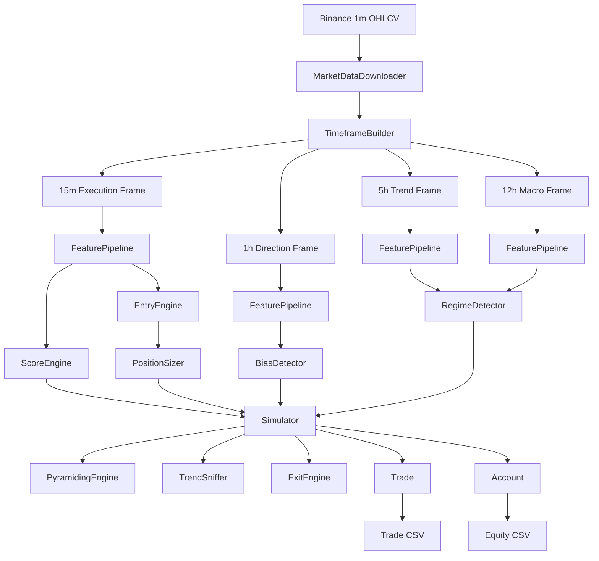
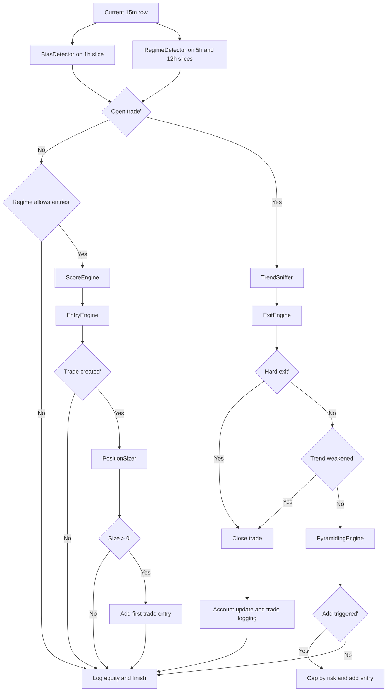

# Retail Trading System

Retail Trading System is a modular Python trading framework for Binance OHLCV
market data. It is built around one central idea: a trend-following strategy
should make every decision from closed candles, risk a controlled fraction of
capital, hold winners as long as structure remains healthy, and scale only when
the market proves the trade right.

This repository is not a generic indicator collection. It is a complete trading
pipeline with configuration, data ingestion, resampling, feature generation,
context detection, entry logic, risk-based sizing, pyramiding, exit handling,
accounting, and CSV audit trails for both backtesting and near-live simulation.

The codebase is deliberately modular. Each folder owns one stage of the system,
and the simulator orchestrates those stages one candle at a time. The result is
a strategy path that is traceable from raw Binance candles all the way to final
trade PnL.

## Table of Contents

- [System Overview](#system-overview)
- [Architectural Philosophy](#architectural-philosophy)
- [Repository Map](#repository-map)
- [High-Level Operating Model](#high-level-operating-model)
- [Timeframe Hierarchy](#timeframe-hierarchy)
- [Configuration Model](#configuration-model)
- [Data Layer](#data-layer)
- [Feature Layer](#feature-layer)
- [Context Layer](#context-layer)
- [Entry Layer](#entry-layer)
- [Risk and Trade Management](#risk-and-trade-management)
- [Simulation Core](#simulation-core)
- [Backtest Mode](#backtest-mode)
- [Live Simulation Mode](#live-simulation-mode)
- [Outputs and CSV Schemas](#outputs-and-csv-schemas)
- [Testing and Verification](#testing-and-verification)
- [Design Invariants](#design-invariants)
- [Known Constraints and Current Boundaries](#known-constraints-and-current-boundaries)
- [Extension Guide](#extension-guide)
- [Quick Start](#quick-start)
- [Dependencies](#dependencies)

## System Overview

At the broadest level, the system ingests one-minute Binance candles, rebuilds
the strategy's higher timeframes, computes all derived features, waits for a
closed 15-minute execution candle, and then lets the simulator evaluate whether
the market context supports a long entry, whether a setup is strong enough to
trade, how large the position should be, whether an open trade can be added to,
and when that trade should be exited.

The strategy is currently long-only. It uses a higher-timeframe directional
bias, a regime score that blocks weak environments, an event-based breakout
trigger, a point-based setup score, risk-based sizing, staged pyramiding, a
tolerant trend-health check for holding winners, and a hard structural stop for
capital protection.

The same simulator core is reused in both historical backtesting and near-live
simulation. That is an important architectural choice: the system does not keep
separate strategy logic for "research mode" and "live mode." It keeps one
decision engine and changes only the data source and execution loop.

### At a Glance

| Attribute | Current Behavior |
| --- | --- |
| Venue | Binance spot-style OHLCV market data |
| Source granularity | `1m` base candles |
| Execution clock | Closed `15m` candles only |
| Direction | Long-only |
| Bias filter | `1h` price vs EMA and relative EMA slope |
| Regime filter | `12h` macro + `5h` trend confirmation |
| Entry trigger | Event-based breakout above prior rolling high |
| Sizing model | Risk per trade as a fraction of equity |
| Scaling model | Add to winners at configured `+R` levels |
| Soft exit | Trend health deterioration |
| Hard exit | Price below structural stop |
| Audit trail | Trade CSVs and equity CSVs |
| Debug control | Global `app.debug` flag in config |

## Architectural Philosophy

The system follows a strict separation of concerns. Raw market data is prepared
before any decision logic sees it. Context modules determine whether conditions
are directionally supportive. Entry modules decide whether a specific execution
candle justifies a trade. Risk modules decide how much capital may be exposed.
Management modules decide whether to hold, scale, or exit. Logging modules
persist every outcome for later forensic review.

This separation matters because trading systems tend to become unreliable when
signal generation, state management, and accounting are mixed together. In this
repository, the simulator is intentionally thin. It asks other modules for one
decision each, then applies those decisions to the current trade and account.
That makes the strategy path inspectable and testable.

The project also favors event-based decisions over static state checks wherever
timing quality matters. Breakouts are detected when price crosses a level, not
merely because price remains above it. Pyramiding is triggered when price crosses
the next `+R` level, not merely because price already lives above that level.
This event-driven style reduces late entries and repeated signals.

## Repository Map

| Path | Responsibility |
| --- | --- |
| `config/` | JSON-backed configuration loader and environment handling |
| `common/` | Shared runtime helpers such as debug-output control |
| `data/` | Binance client, historical download logic, CSV loading, resampling |
| `features/` | Indicator helpers, candle metrics, and the feature pipeline |
| `bias/` | Directional market bias detection |
| `regime/` | Higher-timeframe environment scoring |
| `entry/` | Breakout, retest, scoring, and entry conversion |
| `position/` | Risk-based position sizing |
| `pyramiding/` | Add-to-winner logic and risk-budget capping |
| `sniffing/` | Trend-health evaluation for holding trades |
| `exit/` | Hard exit logic |
| `simulation/` | Trade state, account state, and simulator orchestration |
| `backtest/` | Historical runner, engine, and CSV loggers |
| `live_sim/` | Near-live runner, candle clock, and live trade logger |
| `tests/` | Focused unit and regression tests for the system's critical behavior |
| `main_backtest.py` | CLI entry point for full historical runs |
| `main_live.py` | CLI entry point for near-live polling and execution |

## High-Level Operating Model

The following diagram summarizes the full pipeline from raw market data to
trade results.



The simulator operates on one execution candle at a time. In backtesting, that
means iterating through historical `15m` candles. In live simulation, that
means polling recent `1m` data until a new closed `15m` candle appears. In both
modes, the internal strategy logic is identical once the current execution row
and higher-timeframe slices are available.

## Timeframe Hierarchy

The system is intentionally multi-timeframe. Each timeframe has a dedicated job
and is not interchangeable with the others.

| Timeframe | Role | Current Use |
| --- | --- | --- |
| `1m` | Base market data | Downloaded from Binance and resampled upward |
| `15m` | Execution timeframe | Entries, pyramiding checks, exits, candle metrics |
| `1h` | Direction timeframe | Bias detection |
| `5h` | Trend confirmation timeframe | Regime scoring via structure confirmation |
| `12h` | Macro timeframe | Regime scoring via structure and slope |

### Why the hierarchy matters

The design prevents the execution layer from making decisions without broader
context. A `15m` breakout is not enough on its own. The system first asks
whether the `1h` direction is aligned and whether the `12h`/`5h` environment is
at least moderate. This reduces the chance that a locally strong candle is
traded in a larger weak or sideways market.

### Candle alignment and lookahead control

Resampled candles are right-labeled and treated as closed units. Higher-timeframe
slices are always restricted with `.loc[:current_execution_timestamp]` before
the simulator sees them. That means the strategy only sees higher-timeframe bars
that would already have been complete at the execution timestamp being tested.

## Configuration Model

All runtime behavior is driven by [`config/settings.json`](config/settings.json).
The project treats configuration as part of the system definition. Strategy
weights, thresholds, timeframes, paths, retry behavior, and logging behavior are
not scattered across the codebase.

### Configuration sources

1. JSON file: `config/settings.json`
2. Optional environment file: `.env`
3. Optional override path: `TRADING_SYSTEM_CONFIG`

### Core configuration sections

| Section | Purpose |
| --- | --- |
| `app` | Default symbol and debug switch |
| `account` | Initial equity and risk per trade |
| `backtest` | Backtest output directory |
| `binance` | Network, retry, timeout, and request behavior |
| `downloads.history` | Checkpointing and resume behavior |
| `entry` | Score threshold required to convert a setup into a trade |
| `features` | EMA periods, structure windows, compression windows, candle metrics |
| `history` | Backtest date range |
| `live_sim` | Live output directory and polling interval |
| `position` | Minimum stop-distance safeguards and optional size caps |
| `storage` | Base data directory |
| `strategy.bias` | Bias EMA and slope threshold |
| `strategy.regime` | Regime weights, slope threshold, and regime bands |
| `strategy.scoring` | Entry score weights and candle-quality thresholds |
| `strategy.sniffing` | Hold/exit thresholds for trend health |
| `strategy.pyramiding` | Add levels and total risk budget |
| `timeframes` | Base, execution, direction, trend, macro, resample settings |

### Environment variables

The repository includes [`.env.template`](.env.template). The typical local
variables are:

```text
BINANCE_API_KEY=
BINANCE_API_SECRET=
TRADING_SYSTEM_CONFIG=config/settings.json
```

Public OHLCV requests do not require keys, but the Binance client is prepared
to load credentials for future authenticated endpoints.

### Debug control

The global switch is:

```json
"app": {
  "default_symbol": "BTCUSDT",
  "debug": true
}
```

When `app.debug` is `false`, the internal print-heavy modules route their output
through `common/debug.py` and remain silent. This is a practical middle ground
between development verbosity and a fully structured logging framework.

## Data Layer

The data layer transforms external market data into a local, validated, and
resampled dataset that the strategy can trust.

### BinanceClient

`data/binance_client.py` is the lowest-level network module. It encapsulates the
Binance REST request, timeout behavior, retry logic, throttle spacing, and
response handling. It is deliberately small, because its job is not strategy
logic. Its job is to return raw klines reliably.

### MarketDataDownloader

`data/downloader.py` owns the higher-level market-data workflow:

- downloading historical `1m` candles
- resuming interrupted downloads
- checkpoint writing and reading
- partial CSV accumulation
- duplicate removal
- closed-candle validation
- fetching recent candles for live simulation
- loading local CSVs into pandas DataFrames

### Historical checkpointing

Historical downloads are resumable. During a long run, the system keeps:

| Artifact | Purpose |
| --- | --- |
| `*.partial.csv` | Incrementally appended unfinished candle history |
| `*.checkpoint.json` | Resume cursor and download metadata |
| Final `*.csv` | Clean deduplicated completed history |

This means a multi-hour download can survive network interruption or terminal
closure without restarting from the first candle.

### TimeframeBuilder

`data/resampler.py` rebuilds higher-timeframe OHLCV bars from the `1m` base
stream. The builder:

1. resamples `open`, `high`, `low`, `close`, and `volume`
2. drops any still-incomplete higher-timeframe candle
3. saves each timeframe to its configured storage path

The key correctness property is that incomplete resampled candles are removed
before strategy logic sees them. That is essential for both backtesting realism
and live-simulation consistency.

## Feature Layer

The feature layer is the analytical foundation of the strategy. It converts raw
OHLCV bars into the exact columns consumed by bias, regime, scoring, entry,
pyramiding, and exit logic.

### Feature pipeline responsibilities

`features/feature_pipeline.py` computes, in order:

1. trend EMAs
2. rolling structure highs and lows
3. compression ranges
4. event-based breakout columns
5. candle-quality metrics
6. NaN cleanup on all required feature columns

### Derived columns

| Column family | Meaning |
| --- | --- |
| `ema20`, `ema50` | Fast and slow trend filters |
| `hh20` | Rolling structural high |
| `ll10` | Rolling structural low |
| `range_10`, `range_30` | Short and long volatility ranges |
| `compression` | Whether short range is compressed relative to long range |
| `prev_close` | Prior close, used for event logic |
| `hh20_prev` | Prior structural high |
| `above_breakout_level` | State flag: current close above prior high |
| `breakout` | Event flag: current close crossed above prior high |
| `body_strength` | Candle body normalized by rolling average body |
| `upper_wick_ratio` | Upper wick relative to body |
| `lower_wick_ratio` | Lower wick relative to body |
| `close_position` | Where the close sits inside the candle's range |

### Indicator helpers

`features/indicators.py` intentionally keeps low-level indicator math simple:

| Helper | Description |
| --- | --- |
| `ema(series, period)` | Exponential moving average |
| `rolling_high(series, period)` | Highest high over a rolling window |
| `rolling_low(series, period)` | Lowest low over a rolling window |

### Compression

Compression is calculated by comparing a short-term price range to a longer-term
range:

```text
compression = range_fast < ratio * range_slow
```

This does not forecast direction. It marks a market condition in which price has
contracted and may be more attractive for breakout expansion.

### Breakout event logic

Breakout timing is event-based, not state-based. The pipeline computes:

```text
above_breakout_level = close > hh_prev
breakout = above_breakout_level and prev_close <= hh_prev
```

That distinction is critical. A static condition like "close above prior high"
stays true for many candles. An event-based condition becomes true only at the
moment of crossing, which is what the entry engine needs.

### Candle metrics

`features/candle_metrics.py` quantifies candle quality using normalized values
instead of pattern names. This makes the strategy more robust across different
volatility regimes and different nominal price levels.

### NaN handling

The feature pipeline explicitly drops incomplete rows at the end of the build.
That prevents early rolling-window NaNs from leaking into downstream logic and
creating false signals during warm-up periods.

## Context Layer

The context layer answers two different questions:

1. Should the system even consider the long side'
2. Is the broader market environment strong enough to permit entries'

These are separate concerns, handled by `BiasDetector` and `RegimeDetector`.

### BiasDetector

`bias/bias_detector.py` determines directional bias from the `1h` timeframe.

The logic is:

```text
bullish if close > ema and relative_ema_slope > +threshold
bearish if close < ema and relative_ema_slope < -threshold
neutral otherwise
```

The slope is relative, not absolute:

```text
slope = (current_ema - past_ema) / past_ema
```

That makes the calculation scale-independent and avoids the problem where the
same shape would produce different slope magnitudes on assets at different price
levels.

### RegimeDetector

`regime/regime_detector.py` scores the broader market environment using the
`12h` macro timeframe and the `5h` confirmation timeframe.

Current scoring inputs:

| Signal | Default Weight | Meaning |
| --- | --- | --- |
| `12h close > ema50` | `2` | Macro structure is bullish |
| `12h relative ema50 slope > threshold` | `1` | Macro trend is rising with sufficient slope |
| `5h close > ema50` | `1` | Intermediate trend confirms the macro direction |

Current bands:

| Score band | Interpretation | Entry permission |
| --- | --- | --- |
| `>= strong_score` | Strong | Allowed |
| `>= moderate_score` and `< strong_score` | Moderate | Allowed |
| `< moderate_score` | Weak | Blocked |

The regime module is intentionally conservative in scope. It currently acts as
an entry gate only. It does not yet modify exits, pyramiding, or risk per trade.

## Entry Layer

The entry layer converts a context-supported execution candle into a tradable
idea.

### ScoreEngine

`entry/scoring.py` builds a transparent additive score rather than using one
giant all-or-nothing condition. That is consistent with the broader philosophy
of reducing unnecessary strategy friction.

Current scoring components:

| Component | Default Weight | Condition |
| --- | --- | --- |
| Bias alignment | `2` | `bias == bullish` |
| Trend confirmation | `1` | `15m close > ema20` |
| Compression | `1` | `compression == True` |
| Breakout event | `2` | `breakout == True` |
| Strong body | `1` | `body_strength > body_strength_min` |
| Strong close position | `1` | `close_position > close_position_min` |
| Low upper wick | `1` | `upper_wick_ratio < upper_wick_max` |

The entry threshold currently lives under:

```text
entry.score_threshold = 4
```

### BreakoutDetector

`entry/breakout.py` duplicates the event-based breakout check as an explicit
detector module. It requires both `prev_close` and the previous structural high
column, and it computes the breakout directly from the row rather than trusting
a looser fallback.

### EntryEngine

`entry/entry_engine.py` is intentionally simple. A trade is created only if:

1. bias is bullish
2. score meets the configured threshold
3. breakout event is true

If those rules pass, the engine converts the row into a `Trade` object. It does
not size the trade. Position sizing remains a separate responsibility.

### RetestDetector

`entry/retest.py` exists in the repository but is not part of the active entry
path. The current system uses breakout entries, not retest entries.

## Risk and Trade Management

This part of the system determines not only whether a trade exists, but how much
capital is exposed, whether the position may be enlarged, and whether the trade
still deserves to be held.

### PositionSizer

`position/sizing.py` uses a classical risk-based sizing formula:

```text
risk_amount = equity * risk_per_trade
risk_per_unit = abs(entry_price - stop_price)
position_size = risk_amount / risk_per_unit
```

The module also includes safety constraints:

| Safeguard | Purpose |
| --- | --- |
| `min_stop_distance_ratio` | Rejects trades with unrealistically tight stops relative to price |
| `min_stop_distance_absolute` | Rejects trades with stops below an absolute floor |
| `max_position_size_units` | Optional hard cap on unit size |
| `max_notional_equity_multiple` | Optional cap on notional exposure relative to equity |

If sizing returns `0`, the simulator now skips the trade cleanly instead of
creating a zero-size dummy position.

### PyramidingEngine

`pyramiding/pyramiding_engine.py` handles scaling into winning trades.

Its current behavior is:

| Rule | Meaning |
| --- | --- |
| Add only after trade is already profitable | Never add to a loser |
| Trigger on event cross of configured `+R` level | Avoid repeated adds while price stays above a level |
| Require `trend_ok` | Do not scale into weakening structure |
| Enforce sequential levels | Level 2 cannot fire before level 1 |
| Cap additions by total stop-risk budget | Prevent runaway exposure |

Default configured levels:

| Level | Trigger | Size fraction of base entry |
| --- | --- | --- |
| `1` | `+1R` | `0.5` |
| `2` | `+2R` | `0.5` |

Pyramiding uses the original entry price and original `R` as the reference for
future levels. That keeps scaling tied to the original trade structure rather
than to a floating average entry.

### TrendSniffer

`sniffing/trend_sniffer.py` is the system's soft-exit intelligence. It asks:

> Is the trend still healthy enough to deserve being held'

Current logic:

```text
trend_alive =
    (close > ema20)
    and
    count(
        body_strength > threshold,
        upper_wick_ratio < threshold,
        close_position > threshold
    ) >= min_confirmations
```

This is deliberately tolerant. Price above the fast EMA is the hard anchor. The
other candle-quality signals are confirmations, not mandatory simultaneous
requirements. That allows the system to survive through normal pauses and
pullbacks inside larger trends.

### ExitEngine

`exit/exit_engine.py` currently handles hard exits only. Its job is simple and
intentionally separate from trend-health logic:

```text
exit if close < stop_price
hold otherwise
```

The separation between `TrendSniffer` and `ExitEngine` is intentional:

- `TrendSniffer` handles soft structural weakening
- `ExitEngine` handles hard capital-protection exits

## Simulation Core

The simulator is the orchestrator that turns all module outputs into one
deterministic trade lifecycle.

### Decision sequence inside `Simulator.step()`



### Entry path

If there is no open trade, the simulator:

1. computes bias and regime
2. blocks weak regimes before entry scoring
3. scores the execution candle
4. asks the entry engine to create a trade
5. sizes that trade
6. skips invalid zero-size trades
7. opens the trade by adding the first entry layer

### Management path

If there is already an open trade, the simulator:

1. evaluates `trend_ok`
2. evaluates the hard stop
3. exits on hard-stop breach
4. exits on trend weakness if hard stop did not fire
5. only then checks pyramiding

That ordering reflects the current implementation and keeps all trade management
in one place.

### Trade object

`simulation/trade.py` stores the full lifecycle of one position.

Key stored state:

| Field | Meaning |
| --- | --- |
| `entry_time`, `entry_price` | Original setup timing and execution price |
| `stop` | Structural stop based on rolling low |
| `R` | Initial absolute risk unit from first entry price to stop |
| `entries` | All entry layers, including pyramids |
| `conditions` | Why the trade was taken |
| `exit_time`, `exit_price` | Trade close details |
| `pnl` | Total quote-currency profit or loss |
| `pnl_R_total` | Profit relative to total deployed stop-risk |
| `pnl_R_initial` | Profit relative to first-entry stop-risk |
| `initial_risk_amount` | Risk from the initial entry only |
| `total_risk_amount` | Total risk across all layers to the shared stop |

This dual-R reporting matters because pyramiding changes total deployed risk.
The repository now preserves both interpretations explicitly.

### Account object

`simulation/account.py` tracks:

- current equity
- number of trades
- wins and losses
- win rate

Equity is updated only when a trade closes. The account does not mark to market
unrealized PnL between candles.

## Backtest Mode

Backtesting runs the full pipeline over historical candles stored in the local
data directory.

### Entry point

```bash
python main_backtest.py
```

### Historical pipeline

`backtest/runner.py` performs these stages:

1. load local `1m` CSV
2. build `15m`, `1h`, `5h`, and `12h` timeframes
3. compute features on all strategy timeframes
4. instantiate the simulator and CSV loggers
5. hand everything to `BacktestEngine`

### Backtest engine behavior

`backtest/engine.py` iterates through `15m` candles and slices the higher
timeframes to the current execution timestamp on every step.

One important implementation detail is that the loop begins at index `50`.
That acts as a simple warm-up buffer so the strategy does not start on the very
first few rows after feature construction.

### Backtest outputs

By default:

```text
backtest/output/trades.csv
backtest/output/equity.csv
```

## Live Simulation Mode

Live simulation reuses the same strategy core but replaces historical iteration
with a polling loop.

### Entry point

```bash
python main_live.py
```

### Live loop behavior

`live_sim/runner.py` continuously:

1. fetches the latest recent `1m` candles from Binance
2. rebuilds all strategy timeframes
3. recomputes features on every timeframe
4. checks whether a new `15m` candle has appeared
5. if so, slices the higher timeframes to that candle time
6. runs the same simulator step used by backtesting
7. sleeps for `live_sim.poll_seconds`

### Candle clock

`live_sim/candle_clock.py` prevents repeated execution on the same `15m`
candle. It also safely handles the case where the `15m` DataFrame is empty.

### Live outputs

By default:

```text
live_sim/output/trades.csv
```

The live loop currently logs trades but does not maintain a separate live equity
CSV by default.

## Outputs and CSV Schemas

The repository treats CSV outputs as audit artifacts, not as incidental logs.
They are designed to explain not just what happened, but why it happened.

### Backtest trade log

`backtest/output/trades.csv` columns:

| Column | Meaning |
| --- | --- |
| `entry_time` | First entry timestamp |
| `exit_time` | Exit timestamp |
| `entry_price` | First entry price |
| `exit_price` | Exit price |
| `pnl` | Quote-currency profit or loss |
| `pnl_R` | Compatibility alias for total-risk R |
| `pnl_R_total` | PnL divided by total deployed risk |
| `pnl_R_initial` | PnL divided by initial entry risk |
| `initial_risk_amount` | Risk of the first layer |
| `total_risk_amount` | Total risk of all layers to stop |
| `score` | Entry score |
| `body_strength` | Candle metric at entry |
| `close_position` | Candle metric at entry |
| `upper_wick_ratio` | Candle metric at entry |
| `compression` | Whether setup formed during compression |
| `breakout` | Whether entry candle was a breakout event |

### Equity log

`backtest/output/equity.csv` columns:

| Column | Meaning |
| --- | --- |
| `timestamp` | Strategy step timestamp |
| `equity` | Account equity after that step |

### Live trade log

`live_sim/output/trades.csv` uses the same schema as the backtest trade log.

## Testing and Verification

The repository includes a focused `unittest` suite under `tests/`.

### What is covered

| Test area | Purpose |
| --- | --- |
| Breakout logic | Verify event-based breakout timing |
| Feature pipeline | Verify state-transition breakout marking and NaN cleanup |
| Trend sniffer | Verify tolerant hold logic |
| Pyramiding | Verify event-based adds and trend gating |
| Position sizing | Verify stop-floor safeguards and caps |
| Regime detector | Verify relative slope, thresholds, and classification |
| Simulator management | Verify entry blocking, exit ordering, and pyramiding path |
| Trade metrics | Verify total-risk and initial-risk `R` calculations |
| Loggers | Verify file creation, headers, and appended rows |
| Debug control | Verify `app.debug` actually suppresses output |

### Test command

```bash
python -m unittest discover -s tests -v
```

## Design Invariants

The following rules describe what the system is trying to guarantee at all
times.

| Invariant | Why it matters |
| --- | --- |
| Strategy decisions use closed candles only | Prevents mid-candle noise and hidden lookahead |
| Higher-timeframe slices stop at the current execution timestamp | Preserves historical realism |
| Breakout is event-based | Avoids late entries and repeated triggers |
| Pyramiding is event-based | Avoids repeated adds while price remains above a level |
| Position sizing is risk-based | Keeps capital exposure normalized across setups |
| Trend holding is tolerant, not perfectionist | Helps the system stay in large winners |
| Hard stop logic is separate from soft trend logic | Keeps capital protection distinct from trade management |
| Feature rows with incomplete rolling values are dropped | Prevents NaN contamination |
| Output CSVs preserve both setup context and performance | Supports forensic review after a run |

## Known Constraints and Current Boundaries

This section documents current boundaries so readers can distinguish design from
deliberate incompleteness.

### Strategy scope

- The system is currently long-only.
- `entry/retest.py` exists but is not part of the active entry path.
- Regime currently acts only as an entry gate.
- Regime does not yet reduce sizing or pyramiding in weaker-but-allowed markets.

### Execution realism

- There is no fee model.
- There is no slippage model.
- There is no partial-fill model.
- Equity is updated on realized trade close, not mark-to-market unrealized value.

### Backtest behavior

- The backtest engine begins from candle index `50`.
- The current engine does not explicitly force-close an open trade at the final
  candle of the dataset.

### Logging

- Debug output is still print-based under a shared switch, not a full structured
  logging framework.

## Extension Guide

The safest way to extend the system is to preserve the same separation of
concerns that already exists.

### Recommended extension patterns

| Goal | Best extension point |
| --- | --- |
| Change thresholds or weights | `config/settings.json` |
| Add new features | `features/feature_pipeline.py` |
| Add a new context filter | `bias/` or `regime/` depending on scope |
| Add entry scoring factors | `entry/scoring.py` |
| Add a new entry style | `entry/` plus simulator integration |
| Modify sizing rules | `position/sizing.py` |
| Modify add-to-winner rules | `pyramiding/pyramiding_engine.py` |
| Modify hold/soft-exit behavior | `sniffing/trend_sniffer.py` |
| Modify hard exit behavior | `exit/exit_engine.py` |
| Add new persistence artifacts | `backtest/` and `live_sim/` loggers |

### Practical guidance

If a change affects timing, implement it as an event when possible. If a change
affects thresholds, prefer configuration over hardcoding. If a change affects
capital exposure, keep it in the sizing or pyramiding layers rather than hiding
it inside signal modules.

## Quick Start

### 1. Install dependencies

```bash
pip install -r requirements.txt
```

### 2. Create your local environment file

```bash
cp .env.template .env
```

If you are on PowerShell and do not have `cp` aliased as expected, create the
file manually from `.env.template`.

### 3. Configure the strategy

Edit:

```text
config/settings.json
```

Minimum values to understand before running:

- `app.default_symbol`
- `history.start_date`
- `history.end_date`
- `account.initial_equity`
- `account.risk_per_trade`
- `entry.score_threshold`
- `strategy.bias.*`
- `strategy.regime.*`
- `strategy.scoring.*`
- `strategy.sniffing.*`
- `strategy.pyramiding.*`
- `app.debug`

### 4. Obtain or download `1m` history

The backtest expects a base `1m` CSV under:

```text
data_storage/<symbol>/1m/<symbol>_1m_<start>_to_<end>.csv
```

### 5. Run the backtest

```bash
python main_backtest.py
```

### 6. Run live simulation

```bash
python main_live.py
```

## Dependencies

The current `requirements.txt` contains:

| Package | Role |
| --- | --- |
| `pandas` | Time-series storage, rolling windows, resampling |
| `numpy` | Numerical helpers |
| `requests` | Binance HTTP requests |
| `matplotlib` | Available for analysis/visualization workflows |

## Closing Note

The project is best understood as an auditable strategy engine rather than a
single script. Its strength lies not only in the strategy idea itself, but in
the way data preparation, context, entry timing, risk control, scaling, exit
logic, and reporting have been separated into modules that can be reviewed,
tested, and evolved independently.
