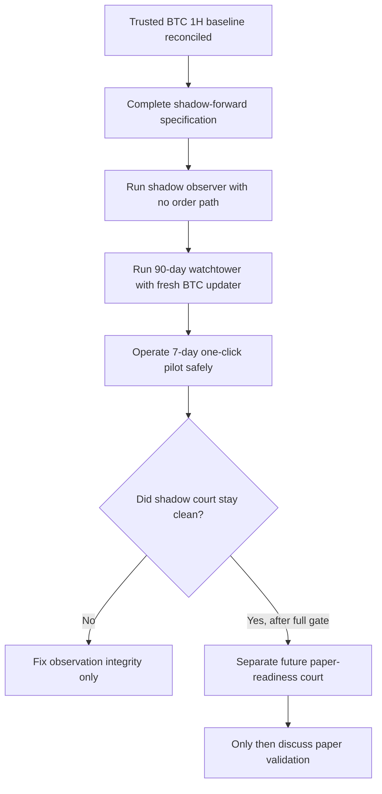
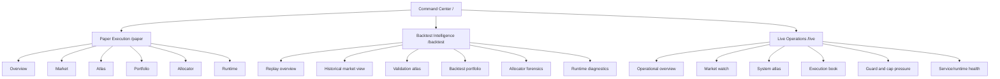
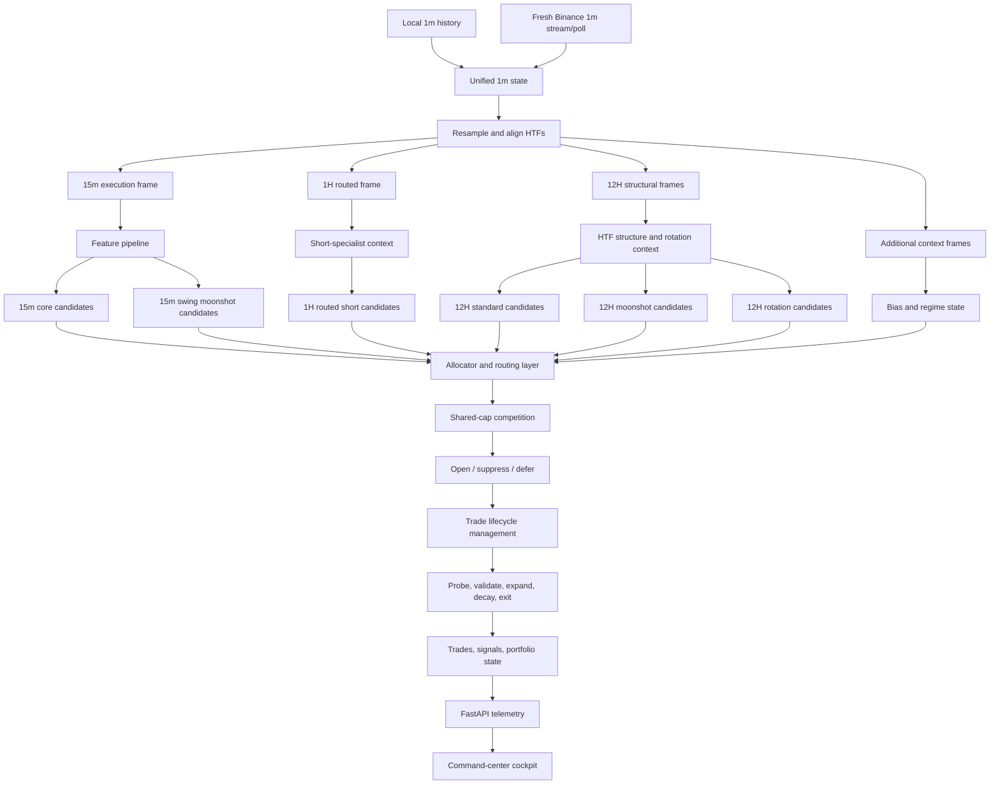
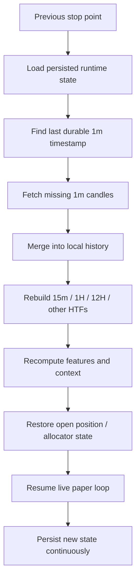

# Retail Trading System

Retail Trading System is a modular research, backtest, live-paper, and cockpit
framework for Binance-style OHLCV trading. The system is intentionally built as
multi-asset, multi-timeframe, and multi-role rather than treating one signal as
the answer to every market condition.

The operating idea is simple:

- let fast execution layers keep opportunity flow alive
- let higher-timeframe layers capture structural moves and convexity
- let a shared-cap allocator decide which sleeve, symbol, and direction deserve
  risk right now
- preserve enough telemetry that every important decision can be inspected later

This repository is therefore not just a signal script. It is a full pipeline:
historical data coverage, `1m` ingestion, higher-timeframe rebuilding, feature
generation, context detection, candidate formation, risk routing, trade
lifecycle management, historical replay, live paper execution, and a modern
dashboard stack that exposes what the engine is doing.

The codebase now has two equally important surfaces:

- the trading engine itself
- the command-center cockpit used to observe research, paper execution, and
  future live operations in a unified layout

## Table of Contents

- [Current Mission](#current-mission)
- [Current Production-Like Stack](#current-production-like-stack)
- [System Roles At A Glance](#system-roles-at-a-glance)
- [Validation Ladder](#validation-ladder)
- [Research Validation Ladder](#research-validation-ladder)
- [Promotion Status](#promotion-status)
- [Future Market-Structure Refactor Scaffold](#future-market-structure-refactor-scaffold)
- [Structural Compounding Lab](#structural-compounding-lab)
- [Validation Philosophy: Research Windows vs Proof Windows](#validation-philosophy-research-windows-vs-proof-windows)
- [Command Center Modes](#command-center-modes)
- [Cockpit Surface Map](#cockpit-surface-map)
- [Repository Map](#repository-map)
- [System Overview](#system-overview)
- [Architectural Philosophy](#architectural-philosophy)
- [High-Level Operating Model](#high-level-operating-model)
- [Timeframe Hierarchy](#timeframe-hierarchy)
- [Configuration Model](#configuration-model)
- [Data Layer](#data-layer)
- [Feature Layer](#feature-layer)
- [Context Layer](#context-layer)
- [Entry Layer](#entry-layer)
- [Risk And Trade Management](#risk-and-trade-management)
- [Simulation Core](#simulation-core)
- [Trade Lifecycle Refactor Layer](#trade-lifecycle-refactor-layer)
- [What Happens Each Engine Cycle](#what-happens-each-engine-cycle)
- [Live Continuity And Catch-Up Model](#live-continuity-and-catch-up-model)
- [Operational Workflow](#operational-workflow)
- [Current Research Conclusions](#current-research-conclusions)
- [Outputs And Telemetry](#outputs-and-telemetry)
- [Backtest / Paper / Runtime Artifacts](#backtest--paper--runtime-artifacts)
- [Backtest Mode](#backtest-mode)
- [Live Simulation Mode](#live-simulation-mode)
- [Testing And Verification](#testing-and-verification)
- [Design Invariants](#design-invariants)
- [Known Constraints And Current Boundaries](#known-constraints-and-current-boundaries)
- [Extension Guide](#extension-guide)
- [Quick Start](#quick-start)
- [Dependencies](#dependencies)

## Current Mission

The immediate priority is not adding more strategy cleverness. The immediate
priority is making the existing routed stack more operationally complete:

| Area | Current state | Why it matters | Next focus |
| --- | --- | --- | --- |
| Core strategy sleeves | Active and validated enough for continued paper work | Edge is already specialized by role | Keep stable |
| `1H` routed sleeve | Promoted as short-specialist branch | Adds differentiated downside exploitation | Monitor and protect |
| `6H` sleeves | Research only | Useful for future study, not production routing | Keep separate |
| Shared-cap allocator | Active | Capital competition is real | Improve observability and coordination |
| Live paper cockpit | Active foundation | Needed to see what the engine is doing in real time | Expand visibility and polish |
| Live continuity | Operationally hardened for paper | Engine must resume from prior state cleanly | Keep proving restart safety through soak evidence |
| Dashboard UX | Multi-mode and telemetry-backed | Must show activity even when no trade fires | Keep improving density and elegance |
| Capital-expression refactor | Scaffolded plus Phase 1 diagnostics and evidence review | Future allocator/capital research needs structure without contaminating runtime behavior | Keep passive until an explicit Phase 2 promotion |
| Structural Compounding Lab | Research-only, Mac-portable, net-cost-corrected, and now running a local forward scheduler | The trusted BTC `1H` research engine is under continuous public-data shadow observation without paper/live/order/broker permissions | Accumulate real scheduler continuity evidence before any future paper-readiness discussion |

### Latest Operational State — 2026-06-30

The project is currently in a research/demo execution-readiness phase, not a
real-money phase. The important operational split is now:

1. the multi-symbol forward scheduler collects and catches up public `1m`
   candles, rebuilds complete `15m` and `1H` bars, and appends closed `1H`
   decision slots once
2. the Binance Spot Testnet demo runner reads eligible research signals and
   tests whether the system can talk to Binance testnet safely

Current safety truth:

| Field | Current value |
| --- | --- |
| `paper_validation_ready` | `false` |
| `live_allowed` | `false` |
| `real_money_allowed` | `false` |
| Production/mainnet Binance endpoint | blocked |
| Demo exchange path | Binance Spot Testnet only |
| Real broker/order path | not enabled |
| Strategy tuning during demo | not allowed |

The active multi-symbol scheduler is installed as a macOS LaunchAgent:

`com.retail_trading_system.multi_symbol_earned_parallel_slots_research_forward_shadow`

Its output folder is intentionally separate:

`structural_compounding_lab/output/multi_symbol_forward_runtime_earned_parallel_slots/`

The active earned-slot scheduler uses the frozen research candidate:

`user_literal_1pct_each_slot`

That means:

- below `EUR 100,000`: max `1` open trade
- from `EUR 100,000`: max `2` open trades
- from `EUR 300,000`: max `3` open trades
- from `EUR 500,000`: max `5` open trades
- each earned slot risks `1%`
- slots unlock from closed equity only, not floating PnL
- no paper/live/order/broker behavior is enabled

It runs every `300` seconds. It is expected to show `not running` between
interval executions because each invocation is a short `run_once` job. The
latest verified scheduler state was:

| Field | Latest verified value |
| --- | ---: |
| Runtime status | `GREEN` |
| Symbols checked / clean | `9 / 9` after BTC-inclusive runtime reload |
| Latest safe `1m` timestamp | `2026-06-30T17:38:00` |
| Decision duplicate keys | `0` |
| Recorded decision keys | `896` |
| Public data only | `true` |

The scheduler is the component responsible for outage/resume/catch-up. If the
Mac sleeps or loses internet, the next successful scheduler run fetches missing
public `1m` candles up to the latest safe closed minute, rebuilds complete
higher-timeframe bars, and records only new decision slots. It does not rely on
VS Code, Terminal, or Codex being open. It does require the Mac user session,
network, and LaunchAgent to be available.

The Binance Spot Testnet demo runner is installed under a separate demo-only
LaunchAgent:

`com.retail_trading_system.binance_demo_walk_forward_six_month_court`

The active run is configured for:

| Field | Current value |
| --- | ---: |
| Duration | `15552000` seconds / `180` days |
| Interval | `300` seconds |
| Adapter | `binance_spot_testnet_demo_only` |
| Entry sizing | tiny exchange-minimum demo sizing |
| Open demo entries seen at latest check | `0` |
| Demo exits triggered at latest check | `0` |

The demo runner now has its own resume and duplicate-protection layer:

- `walk_forward_demo_activation_state.json` prevents historical backlog replay
  after restart
- `walk_forward_demo_execution_ledger.csv` prevents duplicate entries, exits,
  short-signal emails, and order-event emails
- the runner loads only demo/email-safe keys from `.env`:
  - `BINANCE_DEMO_*`
  - `RTS_ALERT_*`
  - `TRADING_SYSTEM_CONFIG`
- live-looking key names such as `BINANCE_API_KEY`, `BINANCE_API_SECRET`,
  `BINANCE_SECRET`, `LIVE_API_KEY`, and `LIVE_API_SECRET` remain blocked for
  demo execution

Email behavior is now explicit:

| Event | Email behavior |
| --- | --- |
| Long signal executable on Spot Testnet | sends `RTS 6-MONTH BINANCE SPOT TESTNET DEMO ENTRY: ... BUY FILLED` after a demo BUY fills |
| Long exit target/stop reached | sends `RTS 6-MONTH BINANCE SPOT TESTNET DEMO EXIT ...` after a demo SELL close fills |
| Profitable long exit | subject includes `CONGRATULATIONS PROFIT` and net PnL |
| Losing long exit | subject includes `LOSS CONTROL` and net PnL |
| Short signal generated by the system | sends `RTS 6-MONTH BINANCE SPOT TESTNET DEMO SHORT SIGNAL: ... SHORT NOT EXECUTED ON SPOT TESTNET` |
| No trade/order event during completed Germany-local day | sends one daily no-trade digest after the first scheduler run after midnight |
| Trade/order event occurred during the day | suppresses the no-trade digest for that day |

Short-signal emails are signal-observation emails, not fake executions. Binance
Spot Testnet does not create a true short spot position. Therefore the current
demo adapter preserves and reports short signals but does not fabricate a fill.
Any future true short execution adapter would require a separate safely-gated
court and must not be inferred from the current Spot Testnet runner.

Current key artifact folders:

| Purpose | Path |
| --- | --- |
| Active earned-slot runtime status/checkpoints | `structural_compounding_lab/output/multi_symbol_forward_runtime_earned_parallel_slots/` |
| Active earned-slot daily no-trade digests | `structural_compounding_lab/output/multi_symbol_forward_runtime_earned_parallel_slots/alerts/daily_no_trade_digest/` |
| Earned-slot entry/exit trigger emails | `structural_compounding_lab/output/multi_symbol_forward_runtime_earned_parallel_slots/alerts/multi_asset_trade_events/` |
| Demo runner status | `structural_compounding_lab/output/binance_demo_walk_forward_six_month_court_001/` |
| Demo entry/exit/short-signal emails | `structural_compounding_lab/output/binance_demo_walk_forward_six_month_court_001/execution_bridge/alerts/order_events/` |
| Demo execution ledger | `structural_compounding_lab/output/binance_demo_walk_forward_six_month_court_001/execution_bridge/walk_forward_demo_execution_ledger.csv` |

Useful status commands:

```bash
python -m structural_compounding_lab.shadow_forward.multi_symbol_forward_runtime --mode status

python -m structural_compounding_lab.shadow_forward.multi_symbol_forward_runtime \
  --mode status \
  --output-dir structural_compounding_lab/output/multi_symbol_forward_runtime_earned_parallel_slots

python -m json.tool \
  structural_compounding_lab/output/binance_demo_walk_forward_six_month_court_001/latest_status.json | sed -n '1,160p'

launchctl list | grep -E "multi_symbol_earned_parallel_slots_research_forward_shadow|binance_demo_walk_forward_six_month_court"
```

Useful stop command for the demo runner:

```bash
launchctl bootout gui/$(id -u) \
  ~/Library/LaunchAgents/com.retail_trading_system.binance_demo_walk_forward_six_month_court.plist
```

## Current Production-Like Stack

The current production-like stack is role-specialized:

| Sleeve | Timeframe | Current status | Role |
| --- | --- | --- | --- |
| Core | `15m` | Active | Tactical long/short execution flow |
| Swing moonshot | `15m` | Active | Tactical convexity participation |
| Standard HTF | `12H` | Active | Structural higher-timeframe participation |
| HTF moonshot | `12H` | Active | Larger structural expansion attempts |
| HTF rotation | `12H` | Active | Cross-sectional leader reinforcement |
| Routed `1H` | `1H` | Active | Specialized short-side execution sleeve |
| Standard `6H` | `6H` | Research only | Mid-timeframe candidate study |
| Moonshot `6H` | `6H` | Research only | Mid-timeframe convexity study |

The stack is deliberately asymmetric. Every timeframe is not forced to do the
same job.

## System Roles At A Glance

| Layer | What it is supposed to do | What it should not do |
| --- | --- | --- |
| `15m` core | Keep opportunity flow alive, handle tactical long/short execution, react to local momentum | Pretend it is the only source of edge |
| `12H` layers | Capture structural trend, slow leadership, and larger profit geometry | Chase dense intraday noise |
| `1H` routed sleeve | Exploit downside imbalance and context-backed short edge | Be forced into symmetric long participation |
| `6H` research sleeves | Expand research coverage and future candidate discovery | Be treated as production sleeves prematurely |
| Allocator | Route scarce shared risk toward the strongest opportunities | Assume every valid signal deserves capital |
| Cockpit | Make internal engine activity visible and interpretable | Be mistaken for the execution engine itself |

## Validation Ladder

| Stage | Question answered | Status |
| --- | --- | --- |
| Unit tests | Does the code behave mechanically? | Passing |
| Curated multi-asset validation | Does selective breadth help more than naive breadth? | Completed |
| `12H` sleeve promotion | Do structural sleeves deserve live-paper routing? | Completed |
| `1H` specialization work | Is `1H` better as a short-specialist sleeve? | Completed |
| `6H` research | Does `6H` show standalone edge worth future study? | Completed as research |
| Routed portfolio stack validation | Do active sleeves work better together than alone? | Completed enough for continued paper work |
| Production validation gate | Does the exact routed stack survive refreshed full-history and trailing unseen holdout? | Completed |
| Operational hardening | Are SSL, readiness, and real-money blockers enforced correctly? | Completed |
| Clean paper startup proof | Does paper start only from the validated boundary without importing backtest trades? | Completed |
| Forward-paper soak monitoring | Are runtime evidence, heartbeats, and restart logs being collected? | Completed |
| Cockpit truth alignment | Does the dashboard show artifact truth without mutating state? | Completed |
| Capital-expression scaffold | Is the next capital refactor represented structurally without changing behavior? | Completed as dormant scaffold |
| Capital Phase 1 diagnostics | Are rejection, winner, bucket, and opportunity-cost reports available without behavior change? | Completed |
| Capital Phase 1 evidence review | Has diagnostics output been converted into a passive Phase 2 decision memo? | Completed |
| Full paper-runtime maturation | Is the system ready for prolonged 24/7 paper ops? | Current routed-stack gate |
| Structural evidence court | Did the BTC `1H` strict SR-aware engine earn forward observation rather than another premature promotion? | Completed research-only |
| Shadow-forward validation spec | Is the forward court defined tightly enough to block accidental promotion and accidental execution? | Completed |
| Shadow-forward observer | Can the trusted BTC `1H` engine reproduce forward decisions with `6H` context and no order path? | Completed |
| `90`-day shadow watchtower | Can the observer survive append-only forward observation with heartbeat, readiness, and safety artifacts? | Active structural gate |
| Fresh BTCUSDT updater + catch-up | Can stale BTC `1m` history be extended to the latest safe closed minute without duplication? | Completed |
| `7`-day shadow pilot automation | Can the operator self-check, run once, generate a scheduler command, and inspect daily status safely? | Completed |
| Outage/resume/catch-up court | Can the operator fall asleep, lose internet, wake up, fetch missed candles, process once, and continue honestly? | Completed research-only |
| Binance reconnect + alerting court | Can public-fetch failures retry, self-heal, and produce RED alert/draft behavior without secrets? | Completed research-only |
| Court 002 EUR25k sealed holdout | Does the sealed six-month holdout survive with the frozen engine and diagnostic EUR25k scaling? | Passed research-only, later net-cost interpretation corrected |
| Court 002 net-cost correction | Were the Court 002 headline equities gross or net after execution costs? | Corrected: headline was gross; net-cost cockpit is now primary |
| Continuous scheduler forward validation | Can a Mac LaunchAgent run the research-only runtime hourly, catch up, and stay idempotent without VS Code/Codex open? | `CONTINUOUS_SCHEDULER_FORWARD_VALIDATION_READY_RESEARCH_ONLY` |

## Research Validation Ladder

The production validation gate is not the same thing as the default research
loop. Future allocator and structural refactors should not blindly replay the
entire `2018-2026` archive for every small hypothesis. The default ladder is
now formalized under:

`backtest/output/research_validation_ladder/`

The intended sequence is:

1. `smoke`
2. `diagnostic_fast`
3. `stress_windows`
4. `holdout_recent`
5. `full_history_confirmation`
6. `robustness`

The philosophy is strict:

- fast windows can justify continued research
- fast windows cannot justify promotion
- curated stress windows reduce one-regime overfitting
- trailing holdout must be supportive before full-history confirmation
- full-history replay is the final expensive gate, not the default loop
- no runtime promotion is allowed without full-history confirmation and paper soak

For Retail Phase 3 capital-refactor work, this means the next candidate should
hit trailing holdout and curated stress windows first, and only earn a
full-history replay if those earlier stages remain supportive. For the
Structural Compounding Lab, the same philosophy applies even more conservatively:
`BTCUSDT` first, checkpointed baseline first, recent holdout next, stress
windows next, and only then full-history or multi-symbol expansion.

## Promotion Status

The current operational truth is intentionally conservative.

| Field | Current value | Meaning |
| --- | --- | --- |
| Classification | `paper-only` | Runtime is allowed for paper execution and observation only |
| `paper_runtime_allowed` | `true` | Forward paper runtime may continue |
| `real_money_allowed` | `false` | Real-money startup must refuse |
| `ssl_verify` | `true` | Binance TLS verification is enforced |
| Validated boundary | `2026-06-13T00:00:00+00:00` | Clean paper restarts must bootstrap from this validated point and only process fresh closed candles after it |
| `6H` sleeves | disabled for routing | Preserved for research, not active capital deployment |
| `1H` side policy | short override active | `1H` remains a specialized short engine even while the global paper default is long-only |

This means the repo is in a serious paper-readiness phase, not a real-money
promotion phase. The system is expected to keep collecting forward-paper
evidence while preserving restart cleanliness, operator truth, and policy
discipline.

## Future Market-Structure Refactor Scaffold

The repository now also carries a dormant scaffold for a possible future
support/resistance and liquidity-driven research path. This is not a live
strategy layer and it is not part of the active Phase 2 capital-lane replay.

The scaffold is intended to support future visualization and diagnostics around:

- support and resistance levels and zones
- range highs, range lows, and midpoints
- swing highs and swing lows
- equal highs, equal lows, and liquidity pools
- liquidity sweeps, failed breakouts, failed breakdowns, and retest zones
- higher-timeframe structure context that could later be inspected alongside the
  existing signal stack

Current boundaries are strict:

- it is disabled by default
- it is display-only and research-only
- it does not influence trades
- it does not change allocator, risk, sizing, entry, exit, or threshold logic
- it does not change real-money permissions
- it is isolated from the current Phase 2 capital-lane backtest

The dormant defaults live in:

`config/market_structure_scaffold.json`

and the passive inventory artifact is written to:

`backtest/output/market_structure/scaffold_inventory.json`

Any future attempt to make market-structure context authoritative must go
through its own backtest, holdout, Monte Carlo, and paper-soak validation
before it is allowed anywhere near promotion.

## Structural Compounding Lab

The repository also includes a fully isolated structural research surface under:

`structural_compounding_lab/`

This is not a branch of the active routed engine. It is a separate
research-only lab for a future support/resistance + liquidity + EMA +
pyramiding + cooldown + profit-vault compounding concept. The routed system
can consume telemetry and summaries from it, but the lab does not inherit
paper state, live state, allocator authority, or broker permissions.

Current boundaries are strict:

- it is read-only from the dashboard side
- it does not share runtime state with paper or live execution
- it does not modify allocator, risk, sizing, entry, exit, threshold, or sleeve behavior
- it does not depend on the active Phase 2 capital-lane replay
- it reads only future structural artifacts written under `structural_compounding_lab/output/`

The first frontend shell is available through the dashboard route family:

- `/structural-lab`
- `/structural-lab/market-replay`
- `/structural-lab/structure-map`
- `/structural-lab/profit-vault`
- `/structural-lab/trade-review`
- `/structural-lab/settings`

This gives the lab a future-ready cockpit surface now, while keeping the active
production-like cockpit routes unchanged.

### Current Shadow-Forward Milestone

The Structural Compounding Lab remains research-only, but it has crossed an
important milestone: the court is no longer only replaying old ledgers. It can
now keep the trusted BTC `1H` research engine under forward observation with
fresh public `1m` data, append-only watchtower artifacts, and a one-click pilot
layer plus a local Mac scheduler that never creates paper trades, live trades,
or broker orders.

The current shadow-forward court truth is:

| Layer | Current artifact truth | Why it matters |
| --- | --- | --- |
| Validation specification | `SHADOW_SPEC_READY_WITH_6H_CONTEXT_RESEARCH_ONLY` | The forward court is defined before any future paper discussion |
| Historical-forward observer | `SHADOW_OBSERVER_READY_RESEARCH_ONLY` | The trusted BTC `1H` engine can be replayed forward with `6H` context annotations and no order path |
| Watchtower | `WATCHTOWER_READY_BUT_WAITING_FOR_FORWARD_DAYS` | The append-only readiness / heartbeat layer exists and is recording evidence |
| Fresh BTC updater | `FRESH_DATA_READY_AND_WATCHTOWER_STARTED` after successful catch-up | BTC `1m` continuity resumes cleanly from the last stored timestamp without duplication |
| Pilot automation | `AUTOMATION_READY_FOR_MANUAL_APPROVAL` | The operator can self-check, run once, generate a scheduler command, and inspect daily status safely |
| Continuous Mac scheduler | `CONTINUOUS_SCHEDULER_FORWARD_VALIDATION_READY_RESEARCH_ONLY` | A user LaunchAgent runs the research-only runtime hourly at minute `5`, with lock-file overlap protection and public klines only |

The concrete current state from the latest artifacts is:

| Field | Current reading | Interpretation |
| --- | --- | --- |
| Trusted BTC `1H` baseline, normal cost rolling `5Y` average | `EUR 792,824.56` | Current realistic mission anchor |
| Trusted BTC `1H` baseline, normal cost rolling `5Y` median | `EUR 786,049.45` | The median path is still below `EUR 1M`, so paper/live remains blocked |
| `1M` hit windows under normal cost | `12` | Edge exists, but not strongly enough to skip forward observation |
| Canonical BTC `1m` shadow tape | `structural_compounding_lab/data_storage/BTCUSDT/1m/btcusdt_1m_canonical_shadow_forward.csv` | Single dedupe-safe source of forward BTC data |
| Latest canonical BTC timestamp | `2026-06-26T21:59:00+00:00` | The Mac scheduler appended the latest safe closed hour and stayed gap-free |
| Runtime forward decisions | `144` | Forward runtime decisions are persisted once and dedupe-checked |
| Scheduler LaunchAgent | `/Users/mac/Library/LaunchAgents/com.retail_trading_system.research_forward_shadow.plist` | Runs independently of VS Code, Terminal, or Codex while the Mac user session is active |
| Scheduler cadence | minute `5` of every hour | Runs after hourly candle close; catches up missed candles after sleep/offline periods |
| Court cockpit status | `GREEN` | Scheduler installed/loaded and smoke/idempotency passed |
| Runtime status color | `YELLOW` | Runtime itself still reports `scheduler_installed=false`; the court independently verified LaunchAgent installation through `launchctl` |
| Future capital anchor | `EUR 25,000` planning number only | Diagnostic planning aid only; not used for shadow, paper, live, order, account, or broker sizing |

The future capital anchor is intentionally only a planning reference. The
current target wording is stricter than earlier drafts:

`EUR25k -> EUR1M over five years remains a Strong target based mainly on old
rolling 5Y normal-cost evidence, but Court 002 net-cost holdout does not
independently confirm the required pace.`

The exact `EUR20k` versus `EUR25k` mission comparison is:

| Evidence basis | EUR20k result | EUR25k result / projection | Interpretation |
| --- | ---: | ---: | --- |
| Strict rolling `5Y` average, normal cost | `EUR 792,824.56` | `EUR 991,030.70` | Scaling to `EUR25k` brings the strict average to the edge of `EUR1M`, but still slightly below it |
| Strict rolling `5Y` median, normal cost | `EUR 786,049.45` | `EUR 982,561.81` | Median also scales near `EUR1M`, but does not independently cross it |
| `6H`-context rolling `5Y` average | `EUR 881,465.53` | `EUR 1,101,831.91` | The `6H`-context projection crosses `EUR1M` on average |
| `6H`-context rolling `5Y` median | `EUR 878,431.05` | `EUR 1,098,038.81` | The `6H`-context projection also crosses `EUR1M` on median |
| Same-window sealed holdout, gross | `EUR 29,025.26` | `EUR 36,281.58` | Same return multiple; `EUR25k` ends `1.25x` the `EUR20k` counterfactual because starting capital is `1.25x` larger |
| Same-window sealed holdout, net-cost | `EUR 24,583.71` | `EUR 30,729.64` | Profitable after costs, but below the monthly pace required for `EUR25k -> EUR1M` by itself |

The old exact `EUR20k` full-history artifact ended at `EUR 35,431,111.82`,
while Court 002 `EUR25k` full-history gross ended at `EUR 91,063,043.03`.
Those full-history headline figures are kept as historical compounding
context, not as the cleanest apples-to-apples target evidence, because the
Court 002 full-history construction used the later sealed-court dataset and
gross accounting. The cleaner mission comparison is the rolling `5Y` table
above.

This is **not** a guarantee, **not** an active capital rule, **not** paper
sizing, **not** live sizing, and **not** permission to bypass the forward court.
The cockpit must use net-cost diagnostic equity as the primary truth. Gross
equity can appear only as secondary/reference context.

This is the milestone achieved: the lab stopped chasing endless new wolves and
built a clean forward observation court around the proven animal. The broker
still sleeps, the ledger stays awake, and every guard remains pointed at
blocking accidental promotion.

The hard safety boundaries remain unchanged:

- `research_only=true`
- `paper_allowed=false`
- `live_allowed=false`
- `real_money_allowed=false`
- `behavior_change_allowed=false`
- no order path exists
- no account endpoint is used
- no private or signed Binance endpoint is used
- no paper trades are created
- no live trades are created
- no broker execution is possible

### June 2026 Mac Rebuild, Court 002, Net-Cost Correction, And Scheduler Evolution

The most important recent change is that the Structural Compounding Lab moved
from Windows-oriented artifact rebuilding into a Mac-local, project-root
relative, continuous forward-observation workflow.

#### Mac portability and artifact rebuild

The Mac clone runs from the real repository root:

`/Users/mac/Documents/Retail-Trading-System`

Runnable code must not depend on old Windows paths, OneDrive paths, drive
letters, or the old Windows username. Mac execution now resolves paths through
the current working directory, Git root discovery, pathlib parent discovery,
and the optional `STRUCTURAL_COMPOUNDING_LAB_ROOT` environment variable.

Operational path rules:

- canonical BTCUSDT shadow-forward CSV lives under
  `structural_compounding_lab/data_storage/BTCUSDT/1m/btcusdt_1m_canonical_shadow_forward.csv`
- generated artifacts live under `structural_compounding_lab/output/`
- generated output folders, runtime checkpoints, canonical CSVs, `.env`,
  `.venv311`, credentials, alert drafts, and local data are not staged by
  default
- historical reports may still mention Windows paths for provenance, but
  runnable Mac code must not use those paths

#### Sealed six-month Court 002

Court 002 used the full historical archive for pre-holdout research and a
sealed final six-month holdout for validation. Historical research-side Binance
no-candle intervals were documented explicitly as exchange no-candle /
maintenance intervals, not hidden or synthetically filled. The sealed holdout
remained mechanically clean.

Key Court 002 result:

| Field | Value |
| --- | --- |
| Classification | `EUR25K_FULL_HISTORY_SEALED_6M_HOLDOUT_VALIDATION_PASSED_RESEARCH_ONLY` |
| Holdout window | `2025-12-21T00:00:00+00:00` through `2026-06-21T17:59:00+00:00` |
| Holdout gaps / duplicates / OHLC failures | `0 / 0 / 0` |
| Historical research gaps | `31` documented Binance no-candle intervals |
| Synthetic candles inserted | `false` |
| Gross EUR25k holdout ending equity | `EUR 36,281.58` |
| Gross EUR25k full-history ending equity | `EUR 91,063,043.03` |
| Paper/live/order/broker behavior | not enabled |

The word “gross” matters. A later forensic cost-model check found that the
Court 002 headline equity used accepted trade `r_multiple` compounding without
deducting execution fees, spread, or slippage. Therefore the Court 002 gross
numbers are signal-survival evidence, not net-cost execution proof.

#### Net-cost restatement and zero-stop accounting

The primary normal-cost model is:

| Cost field | Value |
| --- | --- |
| Band | `NORMAL_MIXED_MAKER_TAKER_COST` |
| Fee | `3.5` bps per side |
| Spread/slippage | `4.0` bps per side |
| Total round trip | `15.0` bps |

The first net-cost restatement was blocked by one accepted full-history trade
with zero stop distance:

| Field | Value |
| --- | --- |
| Trade ID | `BTCUSDT-5066` |
| Entry time | `2025-09-04T05:00:00` |
| Entry / stop / exit | all `110917.45` |
| `r_multiple` / PnL | `0.0 / 0.0` |

The zero-stop resolution court treated this as an accounting artifact, not a
strategy problem. It kept the trade documented, excluded only that zero-R /
zero-PnL artifact from bps-to-R cost conversion under the primary policy, and
also reported `-1R` and `-2R` sensitivities.

Current net-cost interpretation:

| Field | Value | Meaning |
| --- | --- | --- |
| Net-cost zero-stop court | `COURT_002_NET_COST_ZERO_STOP_RESOLUTION_WARNING_RESEARCH_ONLY` | Accounting resolved; target interpretation weakened |
| Target impact | `TARGET_ANALYSIS_SLIGHTLY_DOWNGRADED_AFTER_ZERO_STOP_RESOLUTION` | EUR1M target remains Strong, not validated |
| EUR25k holdout net-cost equity | `EUR 30,729.64` | Profitable after costs |
| Holdout net monthly growth | `3.4965%` | Below required EUR25k -> EUR1M monthly pace |
| Required monthly pace | `6.3411%` | Approximate five-year target requirement |
| Holdout net PF / win rate / max DD | `4.487401 / 77.7778% / 3.1239%` | Signal survives costs, but slower than mission pace |
| Full-history primary net-cost equity | `EUR 403,248.46` | Positive but far below the gross fantasy result |
| Full-history primary net max DD | `90.6242%` | Explicit danger gate; not hidden |

The practical conclusion is deliberately conservative:

- the wolf survived recent-regime and net-cost signal-survival checks
- the gross EUR91M and EUR36k headlines must not be used as primary truth
- the cockpit must lead with net-cost equity
- the old rolling `5Y` normal-cost evidence remains the main EUR1M mission
  anchor
- scheduler evidence must now accumulate in real time before any paper-readiness
  court

#### Continuous Mac scheduler

The local Mac scheduler is now installed as a user LaunchAgent:

`/Users/mac/Library/LaunchAgents/com.retail_trading_system.research_forward_shadow.plist`

It runs this research-only command from the repo root:

`BINANCE_API_KEY='' BINANCE_API_SECRET='' .venv311/bin/python -m structural_compounding_lab.shadow_forward.forward_validation_runtime --mode run_once`

Scheduler facts:

- scheduler type: macOS user LaunchAgent
- cadence: `StartCalendarInterval` at minute `5` every hour
- `RunAtLoad=true`
- `KeepAlive=false`
- working directory: `/Users/mac/Documents/Retail-Trading-System`
- lock path: `structural_compounding_lab/output/forward_validation_runtime/scheduler.lock`
- stdout/stderr logs:
  `~/Library/Logs/retail_trading_system_forward_shadow/`
- runs without VS Code, Terminal, or Codex being open
- does not run while the Mac is asleep or powered off
- after wake/reconnect, the next run catches up from the last canonical
  timestamp using public klines

Latest scheduler court:

| Field | Value |
| --- | --- |
| Classification | `CONTINUOUS_SCHEDULER_FORWARD_VALIDATION_READY_RESEARCH_ONLY` |
| LaunchAgent installed / loaded | `true / true` |
| Rows before scheduler court update | `274,680` |
| Rows after update | `281,820`, later `281,880` after the first real scheduled hour |
| Latest canonical timestamp after first real scheduled run | `2026-06-26T17:59:00` |
| Gaps / duplicates / OHLC failures | `0 / 0 / 0` |
| Smoke/idempotency duplicate data / decisions | `0 / 0` |
| Court cockpit status | `GREEN` |
| Runtime status caveat | runtime still labels `YELLOW` because its internal `scheduler_installed` flag does not yet recognize the LaunchAgent |
| `paper_validation_ready` | `false` |

The next proof is elapsed time, not another backtest: a `24H` scheduler
continuity observation, then weekly checks, then six-month forward validation
gates if the operator remains honest.

#### Multi-asset transfer, scanner replay, and capped compounding realism

After the BTC scheduler was proven operationally safe, the next research
question was not "can one frozen BTC result be admired harder?" The next
question was whether the same frozen structural logic transfers to other
liquid crypto symbols without tuning.

Eight non-BTC public Binance symbols were downloaded and tested first through
the same research-only discipline:

- `ETHUSDT`
- `BNBUSDT`
- `XRPUSDT`
- `ADAUSDT`
- `LINKUSDT`
- `DOGEUSDT`
- `SOLUSDT`
- `AVAXUSDT`

The transfer court used public data only. Historical exchange no-candle
intervals were documented; no synthetic candles, forward-filled bars, private
endpoints, account endpoints, order endpoints, broker connectors, paper
trading, or live trading were introduced.

The single-symbol transfer results were strong, especially on ADA, LINK, BNB,
DOGE, and AVAX. The important lesson, however, was not "pick the most explosive
asset and declare victory." The stronger lesson was that multiple assets
provide more independent opportunity flow than BTC alone, while still needing
one shared capital rule so the system does not double-count overlapping crypto
risk.

That first transfer candidate intentionally excluded BTC so the new symbols
could be judged separately from the original BTC baseline. A later BTC
inclusion court compared the eight-symbol control against a nine-symbol
candidate using identical earned-slot allocator rules. BTC improved both the
research replay and the sealed holdout, so the active multi-symbol research
freeze is now the BTC-inclusive nine-symbol universe.

The current multi-asset scanner specification is:

| Field | Current research spec |
| --- | --- |
| Universe | `ADAUSDT`, `LINKUSDT`, `BNBUSDT`, `XRPUSDT`, `AVAXUSDT`, `DOGEUSDT`, `ETHUSDT`, `BTCUSDT`, `SOLUSDT` |
| Priority | fixed from pre-holdout research rank |
| Selection rule | choose the highest-priority non-overlapping accepted setup |
| Max active trades | `1` shared-pool trade at a time |
| Timeframe | completed `1H` decision slots |
| Cost model | normal net-cost model already embedded in selected trade `R` |
| Tuning after holdout | `false` |
| Paper/live/order/broker behavior | `false` |

The fixed-priority scanner replay result:

| Period | Result |
| --- | ---: |
| Sealed holdout | `EUR 25,000 -> EUR 134,917.30` |
| Sealed holdout selected trades | `237` |
| Sealed holdout win rate | `74.68%` |
| Sealed holdout profit factor | `7.843393` |
| Sealed holdout max drawdown | `5.3057%` |
| Research selected trades | `3,008` |

The uncapped research replay produced mathematically absurd compounding numbers
because it allowed profits to compound without a realistic active-cap or
liquidity ceiling. That output is intentionally **not** treated as a cash
forecast. It is retained only as a warning that unlimited compounding can turn
a real edge into a fantasy projection.

The realism repair is called capped compounding.

In simple terms, capped compounding means:

- the engine may start from `EUR 25,000`
- it may grow the active trading account
- once the active account reaches a chosen cap, excess profit is moved into a
  vault
- future trade risk is calculated only from the capped active amount, not from
  every euro ever made
- yearly tax reserve can be withdrawn from profits
- symbol-level notional caps prevent the model from pretending small books can
  absorb unlimited size

This is much more realistic because real execution does not scale forever. A
system that trades cleanly at `EUR 25,000` may not trade the same way at
`EUR 25,000,000`, especially on thinner symbols or during fast candles. Capped
compounding keeps the good part of compounding while stopping the model from
lying about infinite liquidity.

Current capped-compounding court:

| Field | Value |
| --- | ---: |
| Classification | `MULTI_ASSET_CAPITAL_CAP_REALISM_VALIDATED_RESEARCH_ONLY` |
| Starting capital | `EUR 25,000` |
| Selected planning active cap | `EUR 250,000` |
| Ending total after cost + yearly tax reserve | `EUR 4,391,717.30` |
| Active capital after tax | `EUR 250,000.00` |
| Profit vault after tax | `EUR 4,141,717.30` |
| Tax reserve / withdrawal modeled | `EUR 3,946,880.60` |
| Active-cap drawdown | `3.7172%` |
| Notional-limited trades | `283` |

The same court showed how the result changes by active cap:

| Active cap | Ending total after tax reserve |
| ---: | ---: |
| `EUR 25,000` | `EUR 489,841.48` |
| `EUR 50,000` | `EUR 949,161.20` |
| `EUR 100,000` | `EUR 1,849,606.77` |
| `EUR 250,000` | `EUR 4,391,717.30` |
| `EUR 500,000` | `EUR 5,129,038.34` |
| `EUR 1,000,000` | `EUR 5,129,513.73` |
| `EUR 2,000,000` | `EUR 5,129,513.73` |

The plateau around `EUR 5.13M` is intentional. It means the notional caps start
to dominate, so raising the active cap no longer produces fantasy growth.

Cost stress at the `EUR 250,000` planning cap:

| Round-trip cost | Ending total after tax reserve | Interpretation |
| ---: | ---: | --- |
| `15` bps | `EUR 4,391,717.30` | baseline normal-cost plan |
| `25` bps | `EUR 3,588,343.28` | still strong |
| `50` bps | `EUR 1,539,118.82` | survives but drawdown becomes severe |
| `100` bps | failed | too expensive |

The tax model is a planning reserve, not tax advice. It exists so research does
not pretend yearly tax cash never leaves the system. A German Steuerberater is
still required before real declarations or real capital decisions.

The next court after capped compounding checked whether the active-cap idea is
compatible with current public Binance depth. It produced:

`MULTI_SYMBOL_SCHEDULER_CAPACITY_LIQUIDITY_WARNING_RESEARCH_ONLY`

The warning was useful and specific: current 24H volume was sufficient across
the tested symbols, but current `25` bps order-book depth was weaker than the
assumed `EUR 200k-250k` notional on `ADAUSDT`, `LINKUSDT`, and `AVAXUSDT`.
Therefore the next operational version must not assume equal `EUR 250k`
capacity on every asset. It must either lower per-symbol notional caps, slice
orders, or run a deeper fill-simulation court before any real-money discussion.

The follow-on realtime scheduler shadow dry-run then tested the operator
mechanics without installing or replacing any scheduler. It used the latest
local historical tail for each of the then-approved eight non-BTC symbols as a
simulated missed-candle window.

Result:

| Field | Value |
| --- | ---: |
| Classification | `MULTI_SYMBOL_REALTIME_SCHEDULER_SHADOW_DRY_RUN_PASSED_RESEARCH_ONLY` |
| Symbols checked | `8 / 8` |
| Simulated missed `1m` candles processed | `5,760` |
| Complete `15m` bars formed | `376` |
| Closed `1H` decision slots processed | `88` |
| Immediate rerun new rows | `0` |
| Immediate rerun new decisions | `0` |
| Duplicate decisions after rerun | `0` |
| Existing BTC scheduler replaced | `false` |
| Multi-symbol scheduler installed | `false` |

This proves the multi-symbol scheduler concept can catch up missed candles,
build higher timeframes, process closed `1H` decision slots once, and rerun
idempotently in a controlled dry-run. It does **not** yet prove public live
multi-symbol fetch, exact strategy evaluation per symbol in the runtime loop,
or real execution capacity.

The next public-fetch runtime prototype then performed real public Binance
catch-up for all then-approved eight non-BTC symbols from the local checkpoint.
It wrote only output-local runtime copies and did not mutate `data_storage`.

| Field | Value |
| --- | ---: |
| Classification | `MULTI_SYMBOL_PUBLIC_FETCH_RUNTIME_PROTOTYPE_PASSED_RESEARCH_ONLY` |
| Symbols checked | `8 / 8` |
| Public `1m` candles fetched/appended into output runtime copies | `33,926` |
| Fetch errors | `0` |
| Runtime-copy gaps / duplicates / OHLC failures | `0 / 0 / 0` per symbol |
| Immediate rerun appendable rows | `0` |
| Existing BTC scheduler replaced | `false` |
| Multi-symbol scheduler installed | `false` |
| `data_storage` modified | `false` |

#### Earned capital gear ladder

After locking `EUR 250,000` as the honest base active cap, the next question
was whether the system can later accelerate toward higher million values
without lying. The answer is yes, but only through an earned-cap ladder.

The rule is deliberately strict:

`Higher active capital is not unlocked by profit alone. It is unlocked only by
profit plus operational evidence plus liquidity/fill evidence.`

Current gear design:

| Gear | Active cap | Purpose | Current status |
| ---: | ---: | --- | --- |
| `0` | `EUR 250,000` | locked base planning cap | completed base planning cap |
| `1` | `EUR 500,000` | first acceleration gear | unlocked in research by the public-fetch runtime prototype |
| `2` | `EUR 1,000,000` | stronger acceleration gear | blocked until six-month multi-symbol forward evidence and fill simulation pass |
| `3` | `EUR 2,000,000` | deep-capacity gear | blocked until all previous gates plus full symbol-depth liquidity pass |

The current earned-gear court result:

| Field | Value |
| --- | ---: |
| Classification | `EARNED_CAPITAL_GEAR_LADDER_READY_RESEARCH_ONLY` |
| Current evidence highest gear | `1` |
| Current evidence active cap | `EUR 500,000` |
| Gear 1 before exact-fill cap reduction | `EUR 6,368,901.16` |
| Gear 1 after exact-fill cap reduction | `EUR 5,017,411.26` |
| Future all-gates-pass sensitivity ending | `EUR 18,251,542.15` |
| Future sensitivity highest gear | `3` |
| Future sensitivity active cap | `EUR 2,000,000` |
| Future sensitivity is current permission | `false` |

The exact-fill calibration court used current public Binance order-book depth
and simulated market buy and sell fills against the book. It did not use any
private, account, signed, order, or broker endpoint.

Result:

| Field | Value |
| --- | ---: |
| Classification | `MULTI_SYMBOL_EXACT_FILL_SYMBOL_CAP_CALIBRATION_WARNING_RESEARCH_ONLY` |
| Original Gear 1 cap pass at strict `25` bps | `false` |
| Exact-fill reduced-cap restatement | `MULTI_SYMBOL_REDUCED_CAP_GEAR_LADDER_RESTATEMENT_PASSED_RESEARCH_ONLY` |
| Fill-calibrated Gear 1 research ending after tax | `EUR 5,017,411.26` |
| Fill-calibrated Gear 1 holdout ending, no tax | `EUR 119,978.81` |
| Active-cap drawdown | `3.3962%` |

Current exact-fill recommended symbol caps:

| Symbol | Original Gear 1 cap | Fill-calibrated cap |
| --- | ---: | ---: |
| `ADAUSDT` | `EUR 250,000` | `EUR 75,000` |
| `LINKUSDT` | `EUR 250,000` | `EUR 100,000` |
| `BNBUSDT` | `EUR 700,000` | `EUR 475,000` |
| `XRPUSDT` | `EUR 500,000` | `EUR 500,000` |
| `AVAXUSDT` | `EUR 250,000` | `EUR 25,000` |
| `DOGEUSDT` | `EUR 400,000` | `EUR 400,000` |
| `ETHUSDT` | `EUR 1,000,000` | `EUR 1,000,000` |
| `SOLUSDT` | `EUR 700,000` | `EUR 575,000` |

Current blockers:

- `EUR 1M` gear: public-fetch runtime, six-month multi-symbol forward evidence,
  and exact fill simulation have not passed
- `EUR 2M` gear: the above plus all-symbol liquidity-depth pass have not passed

This gives the project a clean path toward `EUR 10M+` without promoting fantasy
compounding. The previously locked base case was `EUR 4.39M`; after the
public-fetch runtime prototype and exact-fill cap calibration, the safer
current research-earned Gear 1 case is `EUR 5.02M`. The higher path exists
only if the machine earns more capital through future courts.

Current decision:

- keep the BTC evidence artifacts, but make the BTC-inclusive nine-symbol
  scheduler the active multi-symbol research observation machine
- do not freeze ADA alone, despite its strong standalone research result
- freeze only the multi-asset scanner **research specification** and runtime
  observation universe, not paper or live execution
- the nine-symbol runtime still writes output-only telemetry and does not
  create broker/order paths
- keep `paper_validation_ready=false`

#### Earned parallel-slot research freeze

The next allocation question was whether the one-shared-trade scanner was too
conservative after the system had already earned capital. The tested idea was
not to change entries, exits, indicators, filters, or trade logic. It changed
only the portfolio allocator after closed equity milestones.

The first earned-slot court tested three variants:

| Variant | Rule summary | Research after cost + tax reserve | Holdout after cost + tax reserve | Verdict |
| --- | --- | ---: | ---: | --- |
| Current one-slot baseline | max `1` shared-pool trade | `EUR 4,976,940.19` | `EUR 74,339.30` | reference |
| Risk-compressed slots | more slots, lower per-slot risk | `EUR 3,601,005.67` | `EUR 73,140.85` | rejected |
| Moderate slots | more slots, modest total-risk expansion | `EUR 3,716,771.06` | `EUR 73,779.61` | rejected |
| User literal `1%` each slot | `1%` risk per earned slot | `EUR 6,796,470.63` | `EUR 76,810.37` | freeze candidate |

The winning candidate is now the frozen **research candidate** for the next
multi-asset allocator court:

| Closed active equity | Max simultaneous trades | Risk rule |
| ---: | ---: | --- |
| `< EUR 100,000` | `1` | `1%` risk |
| `>= EUR 100,000` | `2` | `1%` risk per slot, `2%` total open risk |
| `>= EUR 300,000` | `3` | `1%` risk per slot, `3%` total open risk |
| `>= EUR 500,000` | `5` | `1%` risk per slot, `5%` total open risk |

Important constraints:

- slots unlock only from **closed** equity, not floating PnL
- one symbol can have only one open trade at a time
- fill-calibrated symbol caps remain active
- the `EUR 500,000` active-cap realism ceiling remains active
- yearly German tax-reserve planning remains modeled
- strategy entries, exits, thresholds, and indicators remain unchanged
- this is still research-only and does not enable paper/live trading

Robustness court result:

| Field | Value |
| --- | ---: |
| Classification | `MULTI_ASSET_EARNED_PARALLEL_SLOT_ROBUSTNESS_PASSED_RESEARCH_ONLY` |
| Research improvement over one-slot baseline | `+36.559218%` |
| Holdout improvement over one-slot baseline | `+3.324044%` |
| Rolling `5Y` windows tested | `12` |
| Rolling `5Y` windows beating baseline | `12 / 12` |
| Worst rolling `5Y` improvement | `+33.380524%` |
| Median rolling `5Y` improvement | `+35.759978%` |
| Best rolling `5Y` improvement | `+40.894735%` |
| Worst research open-risk cluster | `1.9601%` nearby equity |
| Worst holdout open-risk cluster | `1.9925%` nearby equity |
| Max concurrent positions in research | `5` |
| Max concurrent positions in holdout | `2` |

This was the first multi-asset allocator variant that both improved the
full-research path materially and kept the sealed holdout positive versus the
one-slot baseline. Therefore the allocator-level research freeze is:

`FROZEN_RESEARCH_CANDIDATE = user_literal_1pct_each_slot`

That freeze means "protect this allocator specification." It does **not** mean
deploy it to real money.

#### BTC-inclusive nine-symbol freeze

After the earned-slot allocator survived the robustness court, BTC was tested
as an additional symbol in a separate inclusion court instead of mutating the
eight-symbol candidate silently.

| Field | Eight-symbol control | Nine-symbol BTC-inclusive candidate |
| --- | ---: | ---: |
| Court | `multi_asset_earned_parallel_slot_court_001` / robustness control | `multi_asset_earned_parallel_slot_btc_inclusion_court_001` |
| Classification | `MULTI_ASSET_EARNED_PARALLEL_SLOT_ROBUSTNESS_PASSED_RESEARCH_ONLY` | `MULTI_ASSET_9_SYMBOL_BTC_INCLUSION_FREEZE_CANDIDATE_RESEARCH_ONLY` |
| Research ending after cost + yearly tax reserve | `EUR 6,796,470.63` | `EUR 7,973,114.87` |
| Sealed holdout ending after cost + yearly tax reserve | `EUR 76,810.37` | `EUR 87,951.93` |
| Research selected trades | `3,738` | `4,236` |
| Holdout selected trades | `244` | `261` |
| Holdout profit factor | `7.769062` | `8.071555` |
| Holdout max drawdown | `38.8419%` | `39.7792%` |
| Research delta vs eight-symbol control | n/a | `+17.312578%` |
| Holdout delta vs eight-symbol control | n/a | `+14.505281%` |

BTC contribution inside the nine-symbol candidate:

- research: `499` selected BTC trades, about `EUR 2,059,854.62` net PnL
- sealed holdout: `17` selected BTC trades, about `EUR 10,198.16` net PnL

The active runtime freeze is therefore:

| Field | Value |
| --- | --- |
| Active universe id | `btc_research_ranked_9_symbol` |
| Active symbol order | `ADAUSDT`, `LINKUSDT`, `BNBUSDT`, `XRPUSDT`, `AVAXUSDT`, `DOGEUSDT`, `ETHUSDT`, `BTCUSDT`, `SOLUSDT` |
| Active allocator spec | `user_literal_1pct_each_slot` |
| Active freeze court | `multi_asset_earned_parallel_slot_btc_inclusion_court_001` |
| BTC exact-fill cap court | `multi_symbol_btc_exact_fill_cap_calibration_court_001` |
| Paper/live/order/broker behavior | `false` |
| `paper_validation_ready` | `false` |

This freezes the nine-symbol research observation stack only. It does not
enable paper trading, live trading, broker routing, order submission, signed
requests, or real-money behavior.

#### USDT signal → USDC execution freeze

Binance EEA execution availability forced a separate production-route question:
keep the long-history `USDT` research signal source, but validate whether the
same nine-symbol decisions can be executed through matching `USDC` spot pairs.

The frozen production-route candidate is now:

| Field | Value |
| --- | --- |
| Freeze manifest | `structural_compounding_lab/output/usdt_signal_usdc_execution_freeze_manifest_001/usdt_signal_usdc_execution_freeze_manifest.json` |
| Classification | `USDT_SIGNAL_USDC_EXECUTION_2PCT_GUARDED_CANDIDATE_FROZEN_RESEARCH_ONLY` |
| Signal source | `USDT` candles/signals |
| Execution route | matching `USDC` spot pairs |
| Frozen allocator | `early_two_1pct_each_total_2pct` |
| Starting max simultaneous positions | `2` |
| Max risk per trade | `1%` |
| Starting max total open portfolio risk | `2%` |
| Research after cost + yearly tax reserve | `EUR 5,393,682.06` |
| Sealed holdout after cost + yearly tax reserve | `EUR 110,226.24` |
| Holdout profit factor | `6.067311` |
| Holdout max drawdown | `41.2812%` |

The raw `3%` open-risk candidate produced a slightly higher holdout, but it is
not the recommended freeze. The `2%` candidate keeps nearly the same research
equity while avoiding an immediate jump from `1%` to `3%` total open portfolio
risk.

The mandatory live guard is:

`structural_compounding_lab/execution/usdt_usdc_execution_guard.py`

It must pass before any order adapter receives an order request. It checks:

- the signal symbol is one of the frozen nine `USDT` symbols
- the execution symbol is the matching frozen `USDC` pair
- spot long-only `BUY` entry; no short selling
- fresh closed `USDT` and `USDC` `1m` candles
- `USDT`/`USDC` close deviation within threshold
- `USDC` spread within threshold
- `USDC` order-book depth sufficient for the order size
- tiny-smoke notional cap before real-money expansion

This freeze still does **not** enable paper trading, live trading, real-money
scheduler orders, broker routing, account endpoints, signed requests, or order
endpoints. It freezes the research candidate and the required execution guard
for the next Docker/Hetzner deployment step.

#### BTCUSDT exact-fill cap calibration

BTC was added after the original eight-symbol exact-fill court, so it needed a
separate cap calibration before the nine-symbol runtime could be considered
complete from an execution-cap metadata point of view.

The BTC cap court used public unsigned Binance order-book depth only. It did
not use private, account, signed, order, broker, paper, live, or real-money
endpoints.

| Field | Value |
| --- | ---: |
| Classification | `MULTI_SYMBOL_BTC_EXACT_FILL_CAP_CALIBRATION_PASSED_RESEARCH_ONLY` |
| Strict slippage gate | `25` bps two-sided |
| Warning slippage gate | `50` bps two-sided |
| Observed strict BTC cap | `EUR 4,075,000` |
| Frozen BTC cap for the nine-symbol artifact | `EUR 2,000,000` |
| Current active cap covered | `true` |
| Future deep-capacity ceiling covered | `true` |
| `EUR 2M` BTC worst-side simulated slippage | `7.524274` bps |

The active nine-symbol cap table is now:

| Symbol | Fill-calibrated research cap |
| --- | ---: |
| `ADAUSDT` | `EUR 75,000` |
| `AVAXUSDT` | `EUR 25,000` |
| `BNBUSDT` | `EUR 475,000` |
| `BTCUSDT` | `EUR 2,000,000` |
| `DOGEUSDT` | `EUR 400,000` |
| `ETHUSDT` | `EUR 1,000,000` |
| `LINKUSDT` | `EUR 100,000` |
| `SOLUSDT` | `EUR 575,000` |
| `XRPUSDT` | `EUR 500,000` |

The runtime now reads this nine-symbol cap artifact from:

`structural_compounding_lab/output/multi_symbol_btc_exact_fill_cap_calibration_court_001/`

This removes the prior BTC cap caveat for research observation. It still does
not make the system paper-ready or live-ready.

#### Historical warm-start for live observation memory

The first multi-symbol runtime copies were intentionally small output-local
tails. That was enough to prove public 1m ingestion, resampling, idempotency,
and scheduler recovery, but it was not enough context for a future first
strategy decision. A professional runtime should not start with a blank chart.

The warm-start court therefore rebuilt the active output-local runtime copies
from historical context plus the already-running forward tape. The rule is:

- historical candles may warm indicators, levels, structure, and HTF context
- historical warm-up candles must remain context only
- warm-up bars must not become fake forward evidence
- decision ledger rows may continue only from the explicit per-symbol cutoff
- no source `data_storage` file is mutated
- no paper/live/order/broker path is enabled

| Field | Value |
| --- | --- |
| Court | `multi_symbol_runtime_historical_warm_start_court_001` |
| Classification | `MULTI_SYMBOL_HISTORICAL_WARM_START_READY_RESEARCH_ONLY` |
| Active symbols | `9 / 9` |
| Warm-up memory per symbol | `43,200` closed `1m` rows, about `30` days |
| Quality | gaps `0`, duplicates `0`, OHLC failures `0` |
| Complete `1H` bars per symbol after warm-start | `719` |
| Complete `12H` bars per symbol | `59` |
| Complete `1D` bars per symbol | `29` |
| Complete `1W` bars per symbol | `3` |
| Warm-up treatment | context only |
| Decision cutoff after warm-start | `2026-07-02T17:00:00` UTC per symbol |
| First-trade authorization | `false` |
| `paper_validation_ready` | `false` |

After the warm-start, the runtime status was `GREEN`, `9 / 9` clean, with
`0` duplicate decision keys and no fake historical decision rows added. This
freezes the current scheduler as a stronger **observation/data-ingestion
runtime**. It still does not freeze a paper/live strategy-decision runtime,
because the active runtime currently records closed `1H` decision slots but
does not yet evaluate the full frozen strategy.

The remaining blocker before any first paper/live strategy decision is:

`STRATEGY_EVALUATOR_INTEGRATION_AND_WARMUP_GATE_RESEARCH_ONLY`

Current freeze gate:

| Gate | Status |
| --- | --- |
| May unfreeze current runtime automatically | `false` |
| May observe nine-symbol earned-slot runtime | `true` |
| Requires separate user approval before any execution path | `true` |
| May enable paper trading | `false` |
| May enable live trading | `false` |
| May create broker/order path | `false` |
| `paper_validation_ready` | `false` |

#### Six-month multi-symbol forward evidence court

The next court exists because the multi-asset scanner cannot be promoted just
because historical replay and a short public-fetch prototype worked. It must
prove the operator over elapsed forward time.

The six-month court is now initialized as a research-only evidence contract:

| Field | Value |
| --- | ---: |
| Classification | `MULTI_SYMBOL_SIX_MONTH_FORWARD_EVIDENCE_READY_RESEARCH_ONLY` |
| Observation status | `ready_waiting_for_elapsed_forward_time` |
| Target elapsed evidence | `180` calendar days |
| Target complete hourly slots | `4,320` |
| Symbols checked / clean | `8 / 8` |
| Current minimum complete `1H` slots | `96` |
| Remaining `1H` slots before six-month gate | `4,224` |
| Current runtime-copy window | `2026-06-26T00:01:00+00:00` through `2026-06-30T01:04:00+00:00` |

This court deliberately cannot pass until time has actually elapsed. It also
does not install a multi-symbol scheduler, does not replace the BTC scheduler,
does not mutate `data_storage`, and does not create any paper/live/order/broker
path. It writes the evidence contract and current quality snapshot under:

`structural_compounding_lab/output/multi_symbol_six_month_forward_evidence_court_001/`

Current gate:

- multi-symbol forward evidence contract: ready
- six-month forward evidence: not complete
- multi-symbol scheduler installation: still not approved by this court
- BTC scheduler replacement: forbidden
- paper/live/order/broker behavior: forbidden
- `paper_validation_ready=false`

#### Multi-symbol forward runtime

The six-month evidence court now reads from a real research-only multi-symbol
forward runtime:

`structural_compounding_lab.shadow_forward.multi_symbol_forward_runtime`

This runtime is intentionally narrower than a trading engine. It does the
operator work only:

- seed each symbol from local public historical CSVs into output-only runtime
  copies
- fetch new closed public Binance `1m` candles
- append only candles newer than the previous runtime checkpoint
- keep runtime copies under `structural_compounding_lab/output/`
- resample complete `15m` and `1H` bars
- append closed `1H` decision slots once
- maintain checkpoints, latest status, data-quality reports, and duplicate-key
  checks
- never modify `data_storage`
- never install a scheduler
- never replace the BTC scheduler
- never create paper/live/order/broker behavior

Current runtime result:

| Field | Value |
| --- | ---: |
| Runtime status | `GREEN` |
| Symbols checked / clean | `8 / 8` |
| First run appended public `1m` rows | `35,056` |
| First run closed `1H` decision rows | `768` |
| Follow-up run appended newly closed public `1m` rows | `16` |
| Follow-up run new `1H` decision rows | `0` |
| Decision duplicate keys | `0` |
| Latest safe runtime timestamp | `2026-06-30T01:04:00` |

Manual commands:

```bash
python -m structural_compounding_lab.shadow_forward.multi_symbol_forward_runtime --mode run_once
python -m structural_compounding_lab.shadow_forward.multi_symbol_forward_runtime --mode status
python -m structural_compounding_lab.shadow_forward.multi_symbol_forward_runtime --mode evidence_check
```

This is still research-only runtime evidence. It is not a multi-symbol
scheduler installation and not a paper/live trading system.

#### Multi-symbol scheduler installation court

The next court prepares the scheduler installation path without installing it.
It produces a LaunchAgent plist draft and manifest under ignored output, then
stops for manual approval.

| Field | Value |
| --- | --- |
| Classification | `MULTI_SYMBOL_SCHEDULER_INSTALLATION_READY_FOR_MANUAL_APPROVAL_RESEARCH_ONLY` |
| Scheduler label | `com.retail_trading_system.multi_symbol_earned_parallel_slots_research_forward_shadow` |
| Proposed cadence | every `300` seconds |
| Draft plist path | `structural_compounding_lab/output/multi_symbol_scheduler_installation_court_001/com.retail_trading_system.multi_symbol_earned_parallel_slots_research_forward_shadow.plist` |
| Proposed installed plist path | `/Users/mac/Library/LaunchAgents/com.retail_trading_system.multi_symbol_earned_parallel_slots_research_forward_shadow.plist` |
| Runtime preflight | `GREEN`, `9/9` symbols clean after BTC-inclusive freeze reload |
| Decision duplicate keys | `0` |
| Scheduler installed after manual approval | `true` |
| BTC scheduler replaced | `false` |
| Paper/live/order/broker behavior | `false` |

The proposed command is:

```bash
BINANCE_API_KEY='' BINANCE_API_SECRET='' .venv311/bin/python -m structural_compounding_lab.shadow_forward.multi_symbol_forward_runtime --mode run_once
```

After explicit manual approval, the draft was copied to the user LaunchAgents
folder and loaded as a separate research-only scheduler:

`/Users/mac/Library/LaunchAgents/com.retail_trading_system.multi_symbol_earned_parallel_slots_research_forward_shadow.plist`

Installed state:

| Field | Value |
| --- | --- |
| Loaded label | `com.retail_trading_system.multi_symbol_earned_parallel_slots_research_forward_shadow` |
| LaunchAgent state | `not running` between interval runs |
| Runs observed | `1` |
| Last exit code | `0` |
| Run interval | `300` seconds |
| Latest runtime timestamp after scheduler start | `2026-06-30T01:15:00+00:00` |
| Symbols clean | `9 / 9` after BTC-inclusive freeze reload |
| Decision duplicate keys | `0` |

The BTC scheduler remains installed and loaded separately:

`com.retail_trading_system.research_forward_shadow`

The multi-symbol scheduler did not replace BTC. It only runs the
research-only multi-symbol runtime alongside the BTC baseline evidence machine.

#### Execution-control scaffold and dashboard visibility

The project now includes an execution-control scaffold, but it is deliberately
not an execution engine yet. It exists so the UI and future paper/live workflow
have a clear gated contract instead of ad-hoc switches.

The scaffold writes ignored readiness artifacts under:

`structural_compounding_lab/output/execution_readiness/`

Current state:

| Field | Value |
| --- | --- |
| Court name | `EXECUTION_CONTROL_SCAFFOLD_RESEARCH_ONLY` |
| Paper scaffold exists | `true` |
| Live scaffold exists | `true` |
| Paper ready | `false` |
| Live ready | `false` |
| Paper validation ready | `false` |
| Broker adapter | `not_implemented` |
| Order sender | `not_implemented` |
| Private/signed exchange requests | `forbidden` |
| Real-money behavior | `false` |

Paper mode is blocked until all required gates pass, including completed
six-month multi-symbol forward evidence, a separate paper-readiness court, and
an explicit environment opt-in. Live mode remains blocked even harder: it also
requires explicit live/real-money acknowledgements and still has no broker
adapter or order sender.

The dashboard now reads:

- BTC shadow-forward status
- multi-symbol runtime status
- multi-symbol scheduler/evidence state
- fill-calibrated reduced-cap research results
- execution readiness and paper/live blockers

This makes the frontend operationally useful without changing trading behavior.
It surfaces what the schedulers are doing and why execution remains blocked.

Commands:

```bash
python -m structural_compounding_lab.execution.execution_control --mode status
python -m structural_compounding_lab.execution.execution_control --mode evaluate-intent
```

#### Retail Trading System legacy cleanup boundary

The active system identity is now the Structural Compounding Lab / compounding
engine. The old root-level Retail Trading System code is treated as legacy
unless a current scheduler, downloader, dashboard, or court still imports it.

A surgical cleanup boundary is documented here:

`migration_audit/retail_to_compounding_cleanup_boundary.md`

Current cleanup rule:

- `structural_compounding_lab/` must not import old root RTS packages through
  absolute imports.
- dashboard/API/downloader dependencies must be migrated before deleting old
  root folders.
- no legacy folder should be removed just because its name looks old.
- deletion requires an import scan, scheduler check, dashboard build, and
  explicit reviewed removal list.

### Historical Early Compounding Snapshot

This block is retained as historical context from the earlier compounding
discovery phase. It is no longer the primary court state.

The Structural Compounding Lab remains research-only. It now has two meaningful
read-only evidence layers on top of the base backtest artifacts:

1. a daily structural opportunity refinement layer that asks whether the lab is
   becoming too tight or too noisy
2. a five-year full-active-capital compounding audit that asks whether the
   observed long/short trade sequence can actually carry aggressive compounding
   geometry without withdrawals

The current five-year audit is written under:

`structural_compounding_lab/output/five_year_compounding_audit_001/`

and is intentionally framed as extrapolation rather than proof. The current
artifact truth is:

| Field | Current reading | Interpretation |
| --- | --- | --- |
| Starting capital | `€20,000` | Fixed research base for the audit |
| Observed ending capital | `€26,286.93` | Raw structural output over the observed sample |
| Ending capital under full-active model | `€26,071.97` | Capital path after compounding each trade at `1%` active-capital risk |
| Drawdown | `20.65%` / `€6,489.29` | Aggressive enough to matter, not catastrophic, but still too meaningful to ignore |
| Trade count | `1093` | The engine is active enough; more entry logic is not the current problem |
| Long total `R` | `-27.12R` | Long side is currently a drag in this audit |
| Short total `R` | `+28.51R` | Short side is carrying the observed edge |
| Win rate | `37.69%` | Low raw hit rate is acceptable only if payoff asymmetry is real |
| Profit factor | `1.0037` | Barely above flat after sequence compounding |
| High-`R` wins | `18` | Large winners do exist |
| Moonshot `5R+` | `6` | Convex winners are present but sparse |
| Classification | `READY_FOR_SMALL_COMPOUNDING` | Research-positive, promotion-negative |

The important interpretation is not that aggressive compounding is now
"approved." It is not. The important interpretation is that the current
structural engine survives the observed long/short sequence, but it does so
with thin margin and heavy dependence on asymmetric winners, especially on the
short side. That means the right next step is still research tightening around
structural opportunity quality, participation routing, and directional
contribution, not a runtime promotion.

The audit also makes two strategic facts explicit:

- the lab is no longer suffering from "too few trades"
- compounding quality is currently more constrained by expectancy shape than by
  raw opportunity flow

### 1. Project Mission

The Structural Compounding Lab starts from a simple but demanding mission:
prove whether structural BTC trading can reasonably grow a shared mission
account from `EUR 20,000` to `EUR 1,000,000` inside many rolling five-year
windows rather than only on one beautiful long backtest. Higher ambitions such
as `EUR 3,000,000` or `EUR 5,000,000` are allowed only if the evidence becomes
materially stronger. The lab assumes no external withdrawals during the mission
test, because the compounding question is specifically about what the engine
could do if capital is left intact and risk is stepped up only through rules
that survive court-grade validation.

This is not a "make the equity curve pretty" project. It is a structural
compounding research program that tries to answer whether a hard BTC mission is
possible under realistic constraints rather than under fantasy conditions.

> [!WARNING]
> Research-only.
> Not financial advice.
> Not live-ready.
> Not paper-ready unless explicitly promoted by future audits.
> No real-money trading is allowed from these results.
> The current work is evidence-gathering, not deployment.

| Target | Meaning | Current Evidence Level | Status |
| --- | --- | --- | --- |
| 1M in 5Y | Base mission | promising but fragile | research-only |
| 3M in 5Y | stronger compounding target | requires materially stronger redundancy or cleaner capital deployment than the current trusted BTC `1H` core alone | not proven |
| 5M in 5Y | optimistic moonshot | requires second engine and robust allocation | not proven |

### 2. Research Philosophy

The lab uses a court-test methodology rather than a beauty-backtest
methodology. A stunning full-sequence equity curve is interesting, but it is
not enough. Rolling five-year windows matter more than one favorable start
date. Monte Carlo matters because sequence luck matters. Cost stress matters
because many structural systems die once fee drag, spread, and slippage are
inserted. Missed trades matter because no real operator captures every single
signal. Top-winner dependency matters because a strategy that lives on a few
miracle trades is not yet robust. No-leakage checks matter because a profitable
rule built on future information is worthless.

Native replay also matters. Artifact-only accounting can create illusions.
Shadow or paper infrastructure comes much later and is used to test operational
reality, not to bypass weak research evidence.

| Gate | What It Checks | Why It Matters |
| --- | --- | --- |
| No-leakage gate | No future or outcome fields are used for deployable rules | prevents fake edge |
| Rolling 5Y gate | Can the system hit the mission from many start dates? | avoids one lucky history path |
| Cost gate | Does edge survive realistic fees, spread, and slippage? | prevents fantasy backtests |
| Missed-trade gate | Does the system survive downtime or missed entries? | tests operational robustness |
| Top-winner gate | Does performance depend on a few miracle trades? | tests fragility |
| Native replay gate | Can results be reproduced from candles end-to-end? | avoids artifact-only illusions |
| Shadow-forward gate | Does live data behave like research data? | tests operational reality |

### 3. Major Research Updates and Why They Happened

The lab did not move in a straight line. Each audit existed because the
previous result left a structural doubt unresolved.

| Stage | Update / Audit | Why It Happened | What Changed | Key Result | Status / Lesson |
| --- | --- | --- | --- | --- | --- |
| 0 | `evidence_review_001` | Establish whether the original pullback and compounding idea deserved continuation | reviewed early opportunity evidence | pullback geometry looked interesting but not yet tradeable | continue research only |
| 1 | `evidence_refinement_001` | Early detector was too loose and mixed signal with noise | tightened evidence framing | promising geometry remained, but tiny-stop pollution became obvious | useful but not enough |
| 2 | `detector_tightening_001` | Stage 1 still allowed junk | hard detector tightening | junk reduced, but sample size collapsed | tighter is not automatically better |
| 3 | `detector_tightening_002` | Thresholds still needed calibration | additional detector tightening and threshold work | quality improved, but tradability stayed weak | more tightening risked starving the engine |
| 4 | `pullback_archetype_redesign_001` | Need to understand pullback types, not just scores | redesigned pullback archetypes | understanding improved, but live tradability did not yet improve | better taxonomy is not enough |
| 5 | `participation_routing_001` | Hard rejection was becoming too blunt | participation routing overlay | reduced over-tight rejection, but still not mission-valid | routing helps, but not enough |
| 6 | `daily_structural_opportunity_001` and `daily_opportunity_definition_refinement_001` | The project needed a broader Daily Structural Opportunity layer | opportunity logic moved away from narrow wiggle-chasing | direction improved toward structural quality instead of micro tightness | correct next abstraction |
| 7 | `broad_historical_structural_replay_001` | Needed a broad native baseline from `2018-01-01` to `2026-06-13` | full BTC historical replay generated | raw broad history was informative but not mission-ready by itself | broad replay is baseline truth, not promotion proof |
| 8 | `frozen_patch_validation_audit_001` | A frozen patch looked strong and needed retrospective validation | validated `BAD_LONGS_DISABLED_ONLY_PROVEN_SHORTS_KEPT` over available windows | looked promising and not obviously overfit, but true unseen proof was still unavailable | encouraging, still research-only |
| 9 | `broad_patch_accounting_and_short_rescue_audit_001` | The broad patch result looked too large and needed accounting reconciliation | reconciled patched equity and short-rescue logic | removed-short rescue mattered, but theoretical compounding could mislead without native-style accounting | accounting discipline became mandatory |
| 10 | `rolling_five_year_mission_viability_audit_001` | Needed direct five-year mission framing instead of raw end-equity admiration | computed rolling 5Y windows and variant comparisons | mission looked promising in some variants, but native-style and cost realism still mattered | 5Y windows became primary court |
| 11 | `equal_highs_liquidity_sweep_rescue_forensic_audit_001` | Equal-highs short rescue looked attractive | forensic replay on rescue prototype | optimistic reconstruction collapsed under forensic treatment | winner-biased rescue logic was exposed |
| 12 | `support_room_short_rescue_repair_audit_001` | Needed to test whether downside room was the real missing ingredient | added support-room style repair diagnostics | downside room clearly mattered, but not enough to move the 5Y mission | useful feature, not full solution |
| 13 | `native_pre_entry_sr_feature_enrichment_audit_001` | Rescue logic needed native pre-entry SR fields instead of post-hoc intuition | enriched native pre-entry SR and room fields | signal quality improved materially, but still no 1M hit windows | feature enrichment helped, not mission-proof |
| 14 | `native_sr_aware_structural_replay_reproduction_audit_001` | Enriched SR logic needed full native replay reproduction | reproduced SR-aware variants from candles | best native strict variant improved quality but still missed 1M in rolling 5Y windows | real edge existed, but mission still not proven |
| 15 | `native_sr_aware_strict_stress_monte_carlo_audit_001` | Best strict native engine needed stress and Monte Carlo court testing | froze `NATIVE_SR_AWARE_STRICT` and stress-tested it | full sequence reached `EUR 3.30M`, but rolling 5Y averaged only `EUR 505.6k` with `0` 1M windows | the engine was strong but late |
| 16 | `native_sr_aware_5y_mission_gap_audit_001` | Needed to explain why a strong full sequence still failed 5Y mission | decomposed timing and bridge options | gap was mainly late compounding timing, not absence of edge | capital deployment repair became the next direction |
| 17 | `strict_sr_aware_milestone_bridge_monte_carlo_audit_001` | Tested whether simple milestone step-up could bridge the mission gap | applied frozen milestone bridge overlay | rolling 5Y average rose to `EUR 1.089M`, median to `EUR 1.015M`, with `21` 1M windows | powerful but fragile |
| 18 | `milestone_bridge_fragility_driver_repair_audit_001` | Needed to find what actually made the bridge fragile | compared repair overlays around the base bridge | cost drag and low trade redundancy were the main fragility drivers; no repair beat the base bridge | fragility identified, not solved |
| 19 | `execution_cost_realism_and_trade_redundancy_audit_001` | Bridge needed a harder operational reality test | enforced realistic cost and missed-trade framing | zero-cost survived, but normal costs and `1%` missed-trade tolerance weakened the mission | operational realism became the blocker |
| 20 | `cost_resilient_trade_redundancy_expansion_audit_001` | Searched for clean non-oracle BTC-only redundancy | tested additional short and low-correlation sleeve ideas | best BTC-only expansion still failed to restore mission robustness | BTC-only redundancy remains insufficient |
| 21 | `native_12h_execution_sleeve_discovery_audit_001` and shadow-forward court | Needed to test whether another sleeve was better than watching the trusted `1H` engine in the wild | `12H` execution failed to beat the repaired baseline, so the roadmap pivoted into non-executing forward observation | `12H` retired from execution role; shadow-forward became the next court | evidence, not sleeve hope, decides the throne |

### 4. Current Best Candidate

The current best proven engine is no longer described as "the most explosive
thing we ever found." It is the trusted BTC `1H` strict SR-aware baseline under
the repaired prior cost model. That baseline is not glamorous, but it is the
most honest engine still standing after the redundancy, `12H`, multi-asset,
bridge-fragility, execution-cost, and shadow-spec courts.

The main blocker is no longer "does any edge exist?" Edge clearly exists. The
main blockers are cost realism, missed-trade sensitivity, low redundancy, and
whether the engine reproduces cleanly on fresh forward data without any hidden
runtime divergence.

| Candidate | Strength | Weakness | Current Verdict |
| --- | --- | --- | --- |
| Trusted BTC `1H` strict SR-aware baseline | best reconciled rolling `5Y` normal-cost mission profile; reproducible; suitable for shadow observation | still below fully robust `EUR 1M` mission and sensitive to missed-trade / cost drag | accepted as shadow-forward core, not paper/live-ready |
| Milestone bridge overlays | can push rolling `5Y` above `EUR 1M` in some research runs | fragility remains too high to treat as deployable capital logic | research-only comparison branch |
| BTC-only redundancy sleeves | attempted extra filler and low-correlation sleeves | did not beat the trusted BTC `1H` baseline under realistic cost | rejected for promotion |
| Native `12H` execution | independently audited after baseline repair | failed to beat the repaired BTC `1H` baseline | retired from execution role for now |
| Multi-asset structural redundancy | first-pass non-BTC expansion audited | too weak to move the mission meaningfully | not current promotion path |
| Multi-asset fixed-priority scanner | transfers the frozen structural logic across the BTC-inclusive nine-symbol universe with max-one-active shared capital | still research-only; liquidity/capacity must be respected and execution remains disabled | active research observation candidate; freeze the research spec, not live execution |
| Capped compounding realism | converts explosive uncapped curves into active-cap, vault, tax-reserve, and notional-cap planning | not tax advice and not exact fill simulation | current realistic planning layer |

### 5. Current Known Metrics

The table below summarizes the latest known headline metrics from the core
Structural Compounding Lab court reports. Full-sequence equity is included for
context, but mission decisions are driven primarily by rolling five-year
metrics.

| Audit | Full Sequence Ending Equity | Rolling 5Y Avg | Rolling 5Y Median | 1M Hit Windows | Final Classification |
| --- | ---: | ---: | ---: | ---: | --- |
| `execution_cost_realism_and_trade_redundancy_audit_001` baseline row `NORMAL_MIXED_MAKER_TAKER_COST` | `EUR 35,431,111.82` | `EUR 792,824.56` | `EUR 786,049.45` | `12` | trusted normal-cost mission anchor |
| EUR25k strict rolling `5Y` projection from the same EUR20k baseline | n/a | `EUR 991,030.70` | `EUR 982,561.81` | proportional projection from `12` EUR20k hit windows | near-`EUR1M`, but slightly below on average and median |
| EUR25k `6H`-context rolling `5Y` projection | n/a | `EUR 1,101,831.91` | `EUR 1,098,038.81` | proportional projection from `18` EUR20k context hit windows | crosses `EUR1M`, but remains research-only context evidence |
| `cost_resilient_trade_redundancy_expansion_audit_001` best BTC-only redundancy candidate | not available | `EUR 755,296.77` | `EUR 780,002.07` | `8` | `REDUNDANCY_EXPANSION_NEEDS_MULTI_ASSET_OR_NEW_SLEEVE` |
| `native_12h_execution_sleeve_discovery_audit_001` repaired `1H + 12H` test | not available | `EUR 738,703.60` | `EUR 730,036.23` | not stated | `NATIVE_12H_EXECUTION_REJECTED` |
| `multi_asset_structural_redundancy_discovery_audit_001` best portfolio variant | baseline held | `EUR 792,824.56` | `EUR 786,049.45` | `12` | `MULTI_ASSET_REDUNDANCY_WEAK` |
| `shadow_forward_validation_spec_audit_001` | n/a | n/a | n/a | n/a | `SHADOW_SPEC_READY_WITH_6H_CONTEXT_RESEARCH_ONLY` |
| `shadow_forward_observer_001` | n/a | n/a | n/a | n/a | `SHADOW_OBSERVER_READY_RESEARCH_ONLY` |
| `shadow_forward_watchtower_001` | n/a | n/a | n/a | n/a | `WATCHTOWER_READY_BUT_WAITING_FOR_FORWARD_DAYS` |
| `fresh_btcusdt_data_updater_001` latest scheduler-era rerun | n/a | n/a | n/a | n/a | `FRESH_DATA_READY_AND_WATCHTOWER_STARTED` |
| `shadow_forward_pilot_automation_001` | n/a | n/a | n/a | n/a | `AUTOMATION_READY_FOR_MANUAL_APPROVAL` |
| `eur25k_sealed_6m_holdout_court_002` gross headline | `EUR 91,063,043.03` gross | n/a | n/a | n/a | `EUR25K_FULL_HISTORY_SEALED_6M_HOLDOUT_VALIDATION_PASSED_RESEARCH_ONLY` |
| `court_002_net_cost_zero_stop_resolution_court_001` primary net-cost restatement | `EUR 403,248.46` net-cost | n/a | n/a | n/a | `COURT_002_NET_COST_ZERO_STOP_RESOLUTION_WARNING_RESEARCH_ONLY` |
| `continuous_scheduler_forward_validation_court_001` | n/a | n/a | n/a | n/a | `CONTINUOUS_SCHEDULER_FORWARD_VALIDATION_READY_RESEARCH_ONLY` |
| `multi_asset_execution_feasibility_scanner_replay_court_001` sealed holdout | `EUR 134,917.30` from `EUR25k` | n/a | n/a | n/a | `MULTI_ASSET_SCANNER_REPLAY_VALIDATED_RESEARCH_ONLY` |
| `multi_asset_capital_cap_liquidity_realism_court_001` selected cap | `EUR 4,391,717.30` after cost + yearly tax reserve + active-cap realism | n/a | n/a | n/a | `MULTI_ASSET_CAPITAL_CAP_REALISM_VALIDATED_RESEARCH_ONLY` |
| `multi_symbol_scheduler_capacity_liquidity_court_001` | n/a | n/a | n/a | n/a | `MULTI_SYMBOL_SCHEDULER_CAPACITY_LIQUIDITY_WARNING_RESEARCH_ONLY` |
| `multi_symbol_realtime_scheduler_shadow_dry_run_court_001` | n/a | n/a | n/a | n/a | `MULTI_SYMBOL_REALTIME_SCHEDULER_SHADOW_DRY_RUN_PASSED_RESEARCH_ONLY` |
| `multi_symbol_public_fetch_runtime_prototype_court_001` | n/a | n/a | n/a | n/a | `MULTI_SYMBOL_PUBLIC_FETCH_RUNTIME_PROTOTYPE_PASSED_RESEARCH_ONLY` |
| `earned_capital_gear_ladder_court_001` current evidence | `EUR 6,368,901.16` after cost + tax reserve with research-earned `EUR500k` cap | n/a | n/a | n/a | `EARNED_CAPITAL_GEAR_LADDER_READY_RESEARCH_ONLY` |
| `earned_capital_gear_ladder_court_001` future all-gates sensitivity | `EUR 18,251,542.15` after cost + tax reserve if all future gates pass | n/a | n/a | n/a | sensitivity only, not current permission |
| `multi_symbol_exact_fill_symbol_cap_calibration_court_001` | n/a | n/a | n/a | n/a | `MULTI_SYMBOL_EXACT_FILL_SYMBOL_CAP_CALIBRATION_WARNING_RESEARCH_ONLY`; original Gear 1 caps require reduction |
| `multi_symbol_reduced_cap_gear_ladder_restatement_court_001` | `EUR 5,017,411.26` after cost + yearly tax reserve + fill-calibrated symbol caps | n/a | n/a | n/a | `MULTI_SYMBOL_REDUCED_CAP_GEAR_LADDER_RESTATEMENT_PASSED_RESEARCH_ONLY` |
| `multi_asset_earned_parallel_slot_court_001` best candidate | `EUR 6,796,470.63` after cost + yearly tax reserve + fill-calibrated symbol caps | n/a | n/a | n/a | `MULTI_ASSET_EARNED_PARALLEL_SLOT_FREEZE_CANDIDATE_RESEARCH_ONLY`; sealed holdout improved from `EUR 74,339.30` to `EUR 76,810.37` |
| `multi_asset_earned_parallel_slot_robustness_court_001` | n/a | n/a | n/a | `12 / 12` rolling `5Y` windows beat one-slot baseline | `MULTI_ASSET_EARNED_PARALLEL_SLOT_ROBUSTNESS_PASSED_RESEARCH_ONLY`; freezes `user_literal_1pct_each_slot` as research candidate only |
| `multi_symbol_forward_runtime` | n/a | n/a | n/a | n/a | `GREEN`; 9/9 symbols clean after BTC-inclusive freeze reload, output-only runtime copies, 0 duplicate decision keys |
| `multi_symbol_six_month_forward_evidence_court_001` | n/a | n/a | n/a | n/a | `MULTI_SYMBOL_SIX_MONTH_FORWARD_EVIDENCE_READY_RESEARCH_ONLY`; waiting for elapsed forward time |
| `multi_symbol_scheduler_installation_court_001` | n/a | n/a | n/a | n/a | `MULTI_SYMBOL_SCHEDULER_INSTALLATION_READY_FOR_MANUAL_APPROVAL_RESEARCH_ONLY`; draft only, not installed |

The most important interpretive rule is simple: full-sequence equity is
secondary. A variant that looks stunning over one full sequence but weak across
many rolling five-year windows does not yet own the mission.

### 6. Cost and Operational Reality

Normal cost assumptions matter more than zero-cost fantasy because the mission
fails in the real world if it survives only in ideal fills. The current
research state says the bridge family remains highly sensitive to realistic
execution drag and to missed signals. The latest hardened audit also showed
that missed-trade tolerance was only around `1%`, which is operationally
severe. That means any future shadow-forward or paper infrastructure must be
treated as server-grade monitoring and uptime work, not as a casual
laptop-open-sometimes workflow.

| Operational Risk | Current Finding | Implication |
| --- | --- | --- |
| Normal execution cost | drags rolling 5Y below the clean bridge mission level | cost model must be realistic |
| 5x cost | punitive collapse case | stress-only, not the normal gate |
| Missed trades | `1%` tolerance only | redundancy must improve |
| Step-up transition months | mission-sensitive | uptime around key periods matters |
| Top and high-volatility months | mission-sensitive | system cannot miss major windows |
| Manual or laptop operation | likely insufficient | server-grade forward validation is required later |

### 7. Why Shadow-Forward Matters More Than Another Sleeve Right Now

Earlier versions of this README still pointed toward `12H` execution as the
obvious next mission branch. That is no longer the correct sequence. The
repaired `12H` court did not beat the trusted BTC `1H` baseline, and
first-pass multi-asset redundancy also failed to move the mission enough.

That means the next valuable truth is no longer "invent another sleeve first."
The next valuable truth is "watch the proven engine behave on fresh data
without letting it trade."

Shadow-forward now matters because it answers four operational questions that
backtests alone cannot settle:

| Question | Why It Matters |
| --- | --- |
| Does the trusted `1H` engine reproduce forward decisions exactly from fresh public data? | verifies research-to-runtime integrity |
| Can fresh BTC `1m` history be extended continuously without gaps or duplicate decision pollution? | verifies market-data continuity |
| Can the observation stack survive operator reality, restarts, and scheduler workflows? | verifies operational discipline |
| Can all of this stay strictly non-executing while still being useful? | prevents accidental paper/live contamination |

### 8. Future Capital Routing Vision

The lab should not solve its capital problem by building an overfit optimizer.
The future routing vision is intentionally simple: one shared mission account,
sleeve-level risk budgets, milestone step-up only after equity progress,
drawdown brakes, and overlap checks so the engine does not blindly take the
same BTC move twice.

| Capital Rule | Purpose |
| --- | --- |
| Shared mission equity | lets compounding work across sleeves |
| Sleeve allocation caps | prevents one sleeve dominating blindly |
| Equity milestone step-up | increases risk only after progress |
| Drawdown brake | protects the compounding engine |
| Open-risk cap | prevents overlapping risk explosions |
| Correlation and overlap check | avoids taking the same BTC move twice |
| Simple fixed rules | avoids overfitting and allocator madness |

The capital engine should route capital intelligently, but it should not become
so "smart" that it suffocates the edge. The goal is simple compounding
discipline, not a complex optimizer that curve-fits historical winners.

### 9. Current Roadmap

The current roadmap is research-only and sequential. The next headline is no
longer "invent more pullback filters" and it is no longer "promote another
sleeve quickly." The next headline is "complete the forward court around the
trusted BTC `1H` engine without allowing a single accidental trading pathway."



| Step | Research Task | Condition to Run | Expected Decision |
| --- | --- | --- | --- |
| 1 | Keep the trusted BTC `1H` baseline frozen as the forward reference engine | already true | preserve one source of truth |
| 2 | Extend canonical BTC `1m` data with the fresh updater when needed | whenever the local tape is stale | keep forward observation current without duplication |
| 3 | Let the watchtower accumulate real forward days and reproduced `1H` decisions | current active structural gate | decide whether observation integrity survives time |
| 4 | Use the one-click pilot layer for self-check, run-once, scheduler-command, and daily-status workflows | current operational path | prove real usage discipline |
| 5 | Finish the `90`-day shadow court and minimum signal requirements | requires elapsed time, not more theory | decide whether a future paper-readiness court is even justified |
| 6 | If the shadow court stays clean, write a separate paper-readiness court for the lab | only after shadow completion | decide whether paper becomes discussable |
| 7 | Real money remains explicitly out of scope | always | keep `real_money_allowed=false` |

### 10. Current Status Summary

Father Court Verdict, stated without hype:

- Edge exists.
- The trusted BTC `1H` strict SR-aware baseline remains the only proven core
  engine worthy of forward observation.
- `1M` in five years is still alive as a research mission, but not yet robust
  enough for paper/live promotion.
- `12H` execution did not earn the throne.
- First-pass multi-asset redundancy did not earn the throne.
- Shadow-forward infrastructure now exists and is active, but remains strictly
  non-executing.
- The next real decision is not another sleeve promotion. It is whether the
  watchtower completes a clean `90`-day forward court.

### 11. Artifact Map

The core Structural Compounding Lab outputs currently live under
`structural_compounding_lab/output/`.

| Artifact Folder | Purpose |
| --- | --- |
| `broad_historical_structural_replay_001/` | broad native BTC replay baseline |
| `frozen_patch_validation_audit_001/` | frozen patch retrospective validation |
| `broad_patch_accounting_and_short_rescue_audit_001/` | accounting reconciliation and removed-short rescue review |
| `rolling_five_year_mission_viability_audit_001/` | five-year mission window court |
| `equal_highs_liquidity_sweep_rescue_forensic_audit_001/` | forensic check on equal-highs rescue |
| `support_room_short_rescue_repair_audit_001/` | downside-room repair diagnostics |
| `native_pre_entry_sr_feature_enrichment_audit_001/` | native pre-entry SR feature enrichment |
| `native_sr_aware_structural_replay_reproduction_audit_001/` | native SR-aware replay reproduction |
| `native_sr_aware_strict_stress_monte_carlo_audit_001/` | strict SR-aware stress plus Monte Carlo court |
| `native_sr_aware_5y_mission_gap_audit_001/` | five-year mission gap diagnosis |
| `strict_sr_aware_milestone_bridge_monte_carlo_audit_001/` | milestone bridge Monte Carlo retest |
| `milestone_bridge_fragility_driver_repair_audit_001/` | fragility-driver analysis around the bridge |
| `execution_cost_realism_and_trade_redundancy_audit_001/` | cost realism and missed-trade audit |
| `cost_resilient_trade_redundancy_expansion_audit_001/` | BTC-only redundancy expansion court |
| `native_12h_execution_sleeve_discovery_audit_001/` | repaired `12H` execution court versus the trusted BTC `1H` baseline |
| `multi_asset_structural_redundancy_discovery_audit_001/` | first-pass non-BTC redundancy court |
| `shadow_forward_validation_spec_audit_001/` | explicit forward observation gate and reporting contract |
| `shadow_forward_observer_001/` | non-executing observer over the trusted BTC `1H` engine |
| `shadow_forward_watchtower_001/` | append-only readiness, heartbeat, safety, and `90`-day progress court |
| `fresh_btcusdt_data_updater_001/` | public BTC `1m` updater with dedupe-safe catch-up and watchtower kickoff |
| `shadow_forward_pilot_automation_001/` | self-check, run-once, scheduler-command, and daily-status operator layer |
| `continuous_scheduler_forward_validation_court_001/` | Mac LaunchAgent scheduler court for BTC shadow-forward runtime |
| `multi_asset_public_data_quality_manifest_001/` | multi-asset public-data quality and documented Binance no-candle interval manifests |
| `multi_asset_frozen_transfer_court_001/` | frozen BTC logic transferred across the approved crypto symbols |
| `multi_asset_portfolio_selection_court_001/` | research-rank and shared-pool portfolio selection diagnostics |
| `multi_asset_execution_feasibility_scanner_replay_court_001/` | fixed-priority max-one-active scanner replay |
| `multi_asset_capital_cap_liquidity_realism_court_001/` | capped compounding, tax reserve, cost stress, and notional-cap realism |
| `multi_symbol_scheduler_capacity_liquidity_court_001/` | scheduler/capacity/liquidity readiness check before multi-symbol runtime dry-run |
| `multi_symbol_realtime_scheduler_shadow_dry_run_court_001/` | controlled multi-symbol catch-up, resampling, closed-`1H` decision-slot, and rerun-idempotency court |
| `multi_symbol_public_fetch_runtime_prototype_court_001/` | public Binance multi-symbol catch-up into output-only runtime copies with symbol caps |
| `earned_capital_gear_ladder_court_001/` | `EUR250k` base cap, research-earned `EUR500k` Gear 1, and future earned-cap ladder sensitivity |
| `multi_symbol_exact_fill_symbol_cap_calibration_court_001/` | public order-book exact-fill check that showed original Gear 1 symbol caps were too high at strict `25` bps depth |
| `multi_symbol_reduced_cap_gear_ladder_restatement_court_001/` | fill-calibrated Gear 1 restatement using reduced symbol caps, cost model, tax reserve, and capped compounding |
| `multi_asset_earned_parallel_slot_court_001/` | earned parallel-slot allocator court comparing one-slot, risk-compressed, moderate, and `1%`-per-earned-slot variants |
| `multi_asset_earned_parallel_slot_robustness_court_001/` | robustness court for the earned-slot freeze candidate, including rolling `5Y`, priority-order, and cluster-risk stress |
| `multi_symbol_btc_exact_fill_cap_calibration_court_001/` | BTCUSDT exact-fill cap calibration and nine-symbol cap manifest with BTC capped at `EUR 2,000,000` |
| `multi_symbol_forward_runtime_earned_parallel_slots/` | active research-only earned-slot output runtime copies, checkpoints, closed-`1H` decision ledger, status, and email artifacts for nine-symbol BTC-inclusive forward observation |
| `multi_symbol_six_month_forward_evidence_court_001/` | research-only six-month multi-symbol forward evidence contract and current runtime-copy quality snapshot |
| `multi_symbol_scheduler_installation_court_001/` | approval-gated LaunchAgent draft, scheduler manifest, and installation preflight for multi-symbol runtime |
| `execution_readiness/` | ignored paper/live execution scaffold readiness artifacts; paper/live/order/broker gates remain blocked |
| `project_direction_review_001/` | plain-English research direction recap |

### 12. Developer Notes

The lab is only useful if its research discipline stays strict.

- All new audits must write to new output folders.
- Previous artifacts must not be overwritten.
- Every audit must include `research_only` flags.
- Any stochastic audit must report its repeat budget.
- Low-repeat runs must be labeled scout-mode when applicable.
- Future prompts should include the implementation quality contract.
- Any timestamp logic must use robust fallback resolution.
- Any mission decision must use rolling 5Y metrics, not only full-sequence metrics.
- Any future 12H sleeve research must remain isolated from live, paper, and
  production defaults until it passes its own court.

### Latest README Update

This README reflects the current state after the Mac migration/rebuild, Court
002 full-history sealed holdout, net-cost restatement, zero-stop accounting
resolution, continuous Mac scheduler court, multi-asset transfer court,
fixed-priority scanner replay, capped-compounding realism court, and
multi-symbol capacity/liquidity warning court, plus the controlled
multi-symbol realtime scheduler dry-run/idempotency court, public-fetch
runtime prototype court, earned capital gear ladder court, exact-fill symbol
cap calibration court, reduced-cap Gear 1 restatement, initialized six-month
multi-symbol forward evidence court, and the research-only multi-symbol
forward runtime, plus the guarded execution-control scaffold and expanded
multi-symbol/dashboard telemetry panels. The trusted BTC `1H` research engine remains frozen and
research-only. The BTC operator layer now runs through a local macOS
LaunchAgent, catches up missed public candles, processes forward decisions
once, and reports net-cost diagnostic equity as the primary cockpit truth. The
multi-asset path is now the BTC-inclusive nine-symbol research observation
candidate, not a paper/live execution stack. The `EUR250k` base cap remains the safety
floor; the safer fill-calibrated `EUR500k` Gear 1 case now ends at
`EUR 5,017,411.26` after cost, tax reserve, and reduced per-symbol caps, while
`EUR1M+` gears remain future evidence states only. The six-month multi-symbol
court is ready, but not passed, because elapsed forward time cannot be
simulated. The new multi-symbol runtime is `GREEN` on output-only public-data
catch-up with `9/9` symbols clean after BTC-inclusive freeze reload and `0`
duplicate decision keys. The
multi-symbol scheduler installation court is ready for manual approval but has
not installed or loaded anything. No paper/live/order/broker path has been
enabled.

## Validation Philosophy: Research Windows vs Proof Windows

The Structural Compounding Lab is not allowed to treat a profitable short window
as proof of a million-euro edge. Short and recent samples are used to discover,
separate, and diagnose candidate behavior. Long and multi-regime windows are
used to decide whether that behavior is durable enough to deserve trust.

In practical terms:

- small and recent windows are research windows
- large and multi-year windows are proof windows
- a strategy idea may be discovered in a research window, but it is not trusted
  until it survives proof windows, walk-forward validation, and paper/live-small
  execution

The current Structural Compounding Lab is researching an aggressive
full-active-capital compounding model with the following working assumptions:

- starting capital: `EUR 20,000`
- target: long-term path toward `EUR 1,000,000`
- withdrawals: `0` for five years in the research model
- position model: full active capital per approved trade
- fixed BTC stop-loss: `1%` price movement
- profits reinvested: `true`
- profit vault: internal protection rather than external withdrawal
- cooldown: drawdown and chop protection
- long and short both evaluated
- moonshot contribution explicitly measured

The `EUR 1,000,000` target is a research objective, not a promise, guarantee,
or promotion signal. No result is treated as deployment-ready until it passes
the validation ladder.

### Validation Ladder

1. Research Window
   - Usually recent `6-12` months of data.
   - Used to discover patterns, bugs, edge candidates, long/short asymmetry,
     moonshot dependency, failure modes, and bad archetypes.
   - A strong result here is only a hypothesis.
2. Broad Historical Proof Window
   - Multi-year data, ideally `5-8+` years where available.
   - Used to test whether the hypothesis survives different BTC regimes: bull
     trend, bear trend, sideways chop, high volatility, low volatility,
     liquidation cascades, and slow grind.
   - If the edge fails here, it is not discarded blindly; it is diagnosed as
     regime-specific, overfit, or incomplete.
3. Walk-Forward Validation
   - Rules are frozen before testing unseen periods.
   - No retuning after seeing the result.
   - Used to test whether the edge generalizes outside the research window.
4. Stress / Robustness Testing
   - Fee/slippage sensitivity.
   - Moonshot-capped results.
   - Moonshot-removed results.
   - Long-only and short-only breakdowns.
   - Worst-month and worst-day analysis.
   - Loss-streak survival.
   - Full-active-capital drawdown survival.
   - Profit-vault and cooldown impact.
5. Paper Trading
   - `3-6` months minimum.
   - Confirms live market timing, order assumptions, spread/slippage, missed
     signals, execution delay, and operational reliability.
   - Still not real-money proof.
6. Live-Small Capital Trial
   - Only after backtest, multi-year validation, walk-forward, stress tests,
     and paper trading are acceptable.
   - Starts with small capital, not full aggressive deployment.
   - Scaling happens only if live-small results match the validated edge.

### Refactor Rule

Each refactor must improve evidence quality, not simply improve a short-window
metric. A refactor is not considered successful because it increases profit on
the research window. A refactor is considered useful only if it also improves
at least some of:

- out-of-sample stability
- long/short expectancy clarity
- drawdown control
- moonshot dependency quality
- regime robustness
- trade frequency stability
- profit factor
- max drawdown
- cooldown effectiveness
- full-active-capital survival

### Failure Is Useful

If a promising research-window edge fails on `5-8` years of data, that is not
wasted work. It usually means the edge was regime-specific, overfit,
structurally incomplete, or dependent on rare outliers. The lab then either:

- narrows the edge to the regime where it works
- adds a regime filter
- disables the weak archetype
- preserves only the proven side
- adds a missing diagnostic layer
- rejects the idea

The current audits already support that framing. Recent structural reviews
showed:

- the system is active enough
- short-side edge is stronger than long-side edge
- longs currently damage the curve
- moonshot dependency is high
- profit vault and cooldown matter
- full-active-capital compounding survives the current observed sequence but is
  not yet a promotion signal

### Promotion Rule

The system may not be promoted toward aggressive compounding unless:

- multi-year proof windows remain profitable
- walk-forward validation remains profitable
- paper trading confirms the edge
- max drawdown remains survivable
- long/short contribution is understood
- moonshot dependency is measured and acceptable
- bad archetypes are disabled or controlled
- full-active-capital replay survives loss clusters

The Structural Compounding Lab must also remain explicit about its current
safety state:

- `research_only=true`
- `paper_allowed=false` unless explicitly enabled in a future controlled stage
- `live_allowed=false`
- `real_money_allowed=false`
- `behavior_change_allowed=false`

### Capital Refactor Status

The capital refactor is still deliberately non-invasive. Phase 0 remains the
dormant structural scaffold, and Phase 1 now exists as a passive evidence layer
only. No allocator, sizing, sleeve, threshold, entry, or exit behavior is
changed by this work.

Phase 1 diagnostics are written under:

`backtest/output/capital_refactor/diagnostics/`

Current Phase 1 artifacts:

| Artifact | Purpose |
| --- | --- |
| `rejection_shadow_book.csv` | Ledger of rejected allocator and signal candidates |
| `capital_blocked_winners.csv` | Capital/risk-suppressed candidates tracked as research evidence |
| `top_winner_forensics.csv` | Passive inspection of historical top winners |
| `strategy_bucket_capital_efficiency.json` | Aggregated performance by strategy, bucket, side, and regime |
| `opportunity_cost_report.json` | Read-only comparison of blocked candidates versus competing allocations |
| `diagnostics_summary.json` | Phase 1 truth artifact proving diagnostics-only behavior |

The cockpit reads these files as operator evidence only. They do not grant
runtime authority, alter routing, or relax the `paper-only` classification.

Phase 1 also now includes a passive evidence review under:

`backtest/output/capital_refactor/diagnostics/review/`

These review artifacts summarize what the diagnostics actually support and what
they still do not prove. They are a decision memo only. They do not authorize
Phase 2 by themselves, and they do not change live or paper behavior.

Phase 2 has now completed and failed promotion. Its holdout improvement was
useful research, but the full-history profile was not supportive enough to make
the candidate authoritative. Phase 3 therefore starts as a narrow backtest-only
research iteration under the validation ladder rather than as a broad allocator
rewrite. The Phase 3 hypothesis is guarded `12H` structural relief while
protecting `core` and `swing_moonshot`, and it does not begin with a fresh
full-history replay. No runtime behavior is changed by this planning layer.

The capital-refactor house is also now scaffolded as a full research
architecture under `capital/`, with candidate registry, validation ladder,
promotion governance, rollback contracts, and execution-realism artifacts. This
extends the refactor from diagnostics-only thinking into a controlled research
framework, but it is still disabled by default: `real_money_allowed=false`,
`behavior_change_allowed=false`, `capital_refactor.enabled=false`, `6H`
disabled, and `1H` short override preserved.

## Command Center Modes

The dashboard is no longer intended to be a single live page. It is now a
command-center surface with a stable spatial layout and separate operating
modes.

| Route | Purpose | Operator framing |
| --- | --- | --- |
| `/` | Command-center landing page | Main mode selector and high-level system entry |
| `/paper` | Paper Execution Cockpit | Active paper trading and telemetry |
| `/backtest` | Backtest Intelligence Lab | Historical replay, research, and validation inspection |
| `/live` | Live Operations Deck | Runtime-oriented operational framing for future live deployment |

### Command-center route model



## Cockpit Surface Map

The cockpit is designed around a persistent top command header and a lower
region that changes by module.

| Module | Main purpose | What should be visible |
| --- | --- | --- |
| `Overview` | System pulse | Equity, PF, sleeve contributions, daily rhythm |
| `Market` | Price and execution theater | Candles, levels, trade markers, live/replay feed state |
| `Atlas` | Multi-asset status map | Symbol-by-symbol and timeframe-by-timeframe state |
| `Portfolio` | Execution book | Open positions, recent exits, sleeve attribution |
| `Allocator` | Scarce-risk routing | Cap pressure, suppressions, selection reasons |
| `Runtime` | Engine state | Heartbeats, cycle count, data freshness, guard status |

The dashboard is not a broker. It visualizes what the engine and telemetry
layer are actually writing.

## Repository Map

| Path | Responsibility |
| --- | --- |
| `backtest/` | Historical runner, validation helpers, reporting, checkpoints |
| `bias/` | Directional context logic |
| `capital/` | Dormant capital-expression scaffold for future allocation research |
| `common/` | Shared runtime helpers, telemetry loading, audit utilities |
| `config/` | Configuration loader, settings, branch and baseline definitions |
| `dashboard/` | Next.js command-center frontend |
| `dashboard_api/` | FastAPI + websocket telemetry backend |
| `data/` | Binance client, history downloading, resampling |
| `entry/` | Entry logic, scoring, breakout/retest handling |
| `exit/` | Hard-exit logic |
| `features/` | Feature pipeline, candle metrics, indicators |
| `live_sim/` | Live-paper runner, cycle loop, logging, portfolio state writes |
| `market_structure/` | Dormant support/resistance and liquidity scaffold for future visualization/research |
| `position/` | Risk-based sizing |
| `pyramiding/` | Add-to-winner and convexity controls |
| `regime/` | Higher-timeframe regime evaluation |
| `simulation/` | Trade/account/simulator core |
| `sniffing/` | Trend-health and trail-state logic |
| `tests/` | Unit and regression coverage |
| `main_download.py` | Historical `1m` downloader |
| `main_resample.py` | Manual HTF rebuild utility |
| `main_backtest.py` | Historical replay entry point |
| `main_live.py` | Paper/live-style runtime entry point |
| `main_walkforward.py` | Walk-forward validation entry point |
| `main_monte_carlo.py` | Robustness/stress entry point |
| `main_calibrate.py` | Opportunity calibration reports |
| `main_edge_lab.py` | Isolated edge-family diagnostics |
| `run_live_cockpit.py` | One-command live paper cockpit launcher |
| `run_backtest_cockpit.py` | One-command backtest cockpit launcher |

## System Overview

At a high level, the system ingests `1m` candles, rebuilds all required higher
timeframes from that canonical base, computes features and context, forms
sleeve-specific candidates, and then asks the allocator which opportunities
deserve shared risk. That sequence matters because the project is designed
around the idea that market observation, signal creation, capital routing, and
trade management are separate economic jobs.

The reason the system is multi-timeframe is not aesthetic complexity. It comes
from a specific research conclusion: different time horizons expose different
types of edge. The `15m` layer is good at finding frequent tactical setups and
keeping opportunity flow alive. The `12H` sleeves are good at capturing slow
structural moves where a small move on the higher timeframe can represent days
or weeks of lower-timeframe work. The `1H` sleeve turned out not to be a
general-purpose execution layer, but a specialized short-side engine. The
allocator exists because these edges compete for the same capital.

This repo is therefore best understood as a coordinated portfolio machine. A
signal is not promoted just because it exists. It must survive context,
quality, and capital competition.

## Architectural Philosophy

The architectural philosophy is to prefer specialization over forced symmetry,
and coordination over blind breadth.

That leads to a few practical decisions:

- each sleeve is allowed to have a different job
- higher-timeframe structure is not reduced to a decorative filter
- capital can stay idle when the current opportunity set is weak
- telemetry is treated as a core system requirement, not an optional dashboard
  extra

The repo deliberately avoids the common mistake of making every layer do
everything. When a system tries to make `15m`, `1H`, `6H`, and `12H` all trade
the same market move in the same way, it often creates duplication, hidden
correlation, and allocator dilution. The current architecture instead tries to
create division of labor:

- `15m` handles tactical flow
- `12H` handles structural participation and leader capture
- `1H` handles a narrower downside-exploitation role
- `6H` remains a research surface until it proves it deserves shared capital

The philosophy behind this is empirical, not ideological. The system reached
this structure through repeated validation and elimination, not because symmetry
was considered bad in the abstract. Longs were tested on `1H`; they did not
earn their place. Broad universe expansion was tested naively; it diluted the
system. The present design is the result of observed edge, not preference.

## High-Level Operating Model



The key idea is that the repo is not just a trigger engine. It is a
capital-routing engine.

## Timeframe Hierarchy

The timeframes are chosen because they solve different problems, not because
more timeframes automatically improve the system.

| Timeframe | Why it exists | Current role |
| --- | --- | --- |
| `1m` | Canonical market data source and live continuity substrate | Base ingestion layer |
| `15m` | Main execution clock and tactical opportunity discovery | Core trading layer |
| `1H` | Intermediate execution/context surface where downside asymmetry appeared | Routed short-specialist sleeve |
| `6H` | Mid-timeframe bridge between tactical and structural behavior | Research-only sleeve family |
| `12H` | Structural trend and convexity capture | Standard, moonshot, and rotation sleeves |

### Why the hierarchy matters

The higher timeframe is not just a slower chart. It changes the economic meaning
of a move. A `1R` move on `12H` can represent a much larger market regime shift
than a `1R` move on `15m`, which is why the system must allow higher-timeframe
sleeves to execute real trades rather than acting only as filters. At the same
time, relying only on `12H` would make the system too sparse, so the `15m` core
remains essential for flow.

### Candle alignment and lookahead control

All higher-timeframe views are rebuilt from `1m` data and sliced only through
the timestamp that would already be known at that point in the run. This is a
basic but essential design rule. Without it, backtests become optimistic and
live behavior stops matching historical logic.

## Configuration Model

Configuration is intentionally centralized so that behavior changes can be made
without scattering strategic assumptions across the codebase.

| Area | Typical contents |
| --- | --- |
| `config/settings.json` | Core runtime, account, history, strategy, and allocator settings |
| `config/baselines/` | Named baseline configurations |
| `config/branches/` | Research branch and candidate branch definitions |

In practice, the configuration model controls:

- history range and storage behavior
- per-sleeve enablement
- risk budgets and sizing assumptions
- side policies and filters
- allocator behavior
- runtime debug and telemetry behavior

The important principle is that threshold or policy changes should generally be
expressed in configuration first. Hardcoding a research decision into strategy
logic too early makes later validation harder and more error-prone.

## Data Layer

The data layer exists to make `1m` history durable, resumable, and suitable for
rebuilding every higher timeframe the engine needs.

### Main responsibilities

| Component area | Responsibility |
| --- | --- |
| Binance client | Fetch recent and historical candles |
| Historical downloader | Build local `1m` coverage with checkpoint safety |
| Resampler | Rebuild `15m`, `1H`, `6H`, `12H`, and other HTFs from `1m` |
| Continuity merge | Append fresh candles onto persisted local history |

The design choice to make `1m` the canonical base series is deliberate. It
avoids drift between prebuilt timeframe files and keeps backtest/live behavior
aligned. It also means the same raw series can support future refactors around
restart continuity and real-time dashboard streaming.

## Feature Layer

The feature layer converts raw candles into a state that the strategy can
reason about without mixing raw data handling into the simulator itself.

### Feature pipeline responsibilities

- trend and EMA structure
- range and compression logic
- breakout and breakdown event marking
- VWAP-related context
- ATR and volatility state
- candle-body and wick metrics
- momentum and pressure-style diagnostics

The system prefers event-based information where timing matters. For example,
breakout behavior is treated as a transition event, not just a condition of
remaining above a level. That design reduces late, noisy, or repeated entries.

## Context Layer

The context layer answers a different question from the entry layer. It asks
what kind of environment the market is currently in, rather than whether a
single setup exists.

### Main context jobs

| Context type | Purpose |
| --- | --- |
| Bias | Directional backdrop and side-aware orientation |
| Regime | Higher-timeframe environment strength and quality |
| HTF structure | Structural trend and rotation alignment |

The project has progressively moved away from using context only as a binary
permission switch. In several places, context is now closer to a weighting,
gating, or capital-shaping influence. That reflects how the research evolved:
the most useful role for context is often to improve trade quality and routing,
not merely to say yes or no.

## Entry Layer

The entry layer is where the system turns prepared state into candidate trades.
It is deliberately separated from allocator logic so that "candidate quality"
and "deserves capital right now" remain distinct questions.

### Entry responsibilities

| Component idea | Role |
| --- | --- |
| Breakout logic | Detect event-based transitions |
| Scoring logic | Convert setup structure into comparable strength |
| Sleeve-specific policy | Decide how each sleeve expresses its opportunity set |
| Candidate formation | Produce a trade candidate the allocator can rank |

This is also why different sleeves are allowed to use different behavior. The
project is no longer trying to make every timeframe share one identical entry
personality.

## Risk And Trade Management

The project’s edge is not only about entry logic. Risk and trade management are
explicit parts of the architecture.

### Core responsibilities

| Component | Purpose |
| --- | --- |
| Position sizing | Normalize exposure to account risk |
| Pyramiding | Add to proven winners rather than averaging hope |
| Trend sniffer | Decide whether the trade is still behaviorally healthy |
| Exit engine | Enforce hard risk control and final exit behavior |

The convexity idea in the system is important: a trade does not automatically
deserve full exposure at birth. It can begin as a probe, earn validation, and
only then justify expansion or an add. This keeps the project aligned with a
"proof first, size later" philosophy.

## Simulation Core

The simulation core is where all of the above layers are orchestrated.

The important architectural choice is that historical replay and live paper
execution use the same decision machinery once the current market state has been
assembled. That means the engine is not maintaining one hidden strategy for
backtests and another for live paper. Differences between the two should come
primarily from data timing and market reality, not divergent logic branches.

### Simulation sequence

1. Assemble market state.
2. Build aligned HTFs.
3. Compute features and context.
4. Generate candidates by sleeve.
5. Run allocator routing and suppression.
6. Open, manage, or close trades.
7. Persist outputs and telemetry.

## Trade Lifecycle Refactor Layer

The repo now includes a first structural refactor layer that moves trade state
beyond plain open/closed behavior.

| Refactor element | Purpose |
| --- | --- |
| `candidate -> allocated -> probe -> validated -> expanded -> decaying -> exited` | Explicit trade lifecycle vocabulary |
| `request_type` | Makes capital demand classifiable |
| `capital_lane` | Makes routing origin inspectable |
| `lineage_id` | Enables future re-entry/recycle logic |
| allocator decision logs | Allows forensic review of why capital was deployed or denied |
| persisted runtime state | Supports continuity and restart logic |

This layer exists because the next phase of the project is less about "new
entry tricks" and more about cleaner routing, lifecycle awareness, and
observability.

## What Happens Each Engine Cycle

For each actionable step, the engine conceptually does the following:

1. Read the current local `1m` state and append fresh Binance `1m` candles.
2. Deduplicate and order the unified `1m` timeline.
3. Rebuild all required higher timeframes from that base series.
4. Compute features and context using only candles that would already be known.
5. Generate sleeve-specific candidates rather than one monolithic signal.
6. Apply side policies, quality filters, regime gates, and symbol restrictions.
7. Run allocator selection under shared-cap and suppression logic.
8. Either open a new lifecycle state or leave capital idle.
9. Manage open trades through convexity, adds, trail-state logic, and exits.
10. Persist portfolio state, signals, decisions, heartbeat rows, and trade data.
11. Expose those artifacts to the telemetry API and cockpit.

The system should therefore look alive even when no trade is firing, because
the work is broader than entry execution alone.

## Live Continuity And Catch-Up Model

The intended live/paper operating model is:

1. remember the last durable point processed by the engine
2. on restart, backfill missing `1m` candles from that point to "now"
3. rebuild all higher timeframes from the unified `1m` base
4. recompute context, candidates, allocator state, and open-position logic
5. only then continue real-time operation

### Continuity architecture target



The repo has foundations for continuity, but this remains an active area of
hardening. The README intentionally states the target model clearly because the
dashboard and engine should eventually reflect this behavior explicitly.

## Operational Workflow

| Step | Command | Purpose |
| --- | --- | --- |
| `1` | `python main_download.py` | Download or extend local `1m` history |
| `2` | `python main_resample.py` | Optional manual HTF rebuild for inspection |
| `3` | `python main_backtest.py` | Run historical replay |
| `4` | `python main_walkforward.py` | Run walk-forward validation |
| `5` | `python main_monte_carlo.py` | Stress completed trade paths |
| `6` | `python main_calibrate.py` | Build opportunity and execution calibration reports |
| `7` | `python main_edge_lab.py` | Run isolated edge-family diagnostics |
| `8` | `python main_live.py` | Run the paper/live runtime loop directly |
| `9` | `python run_backtest_cockpit.py` | Launch backtest cockpit stack |
| `10` | `python run_live_cockpit.py` | Launch live paper cockpit stack |
| `11` | `python -m structural_compounding_lab.shadow_forward.fresh_btcusdt_data_updater --mode update_and_catchup` | Extend canonical BTC shadow data and hand fresh candles to the watchtower |
| `12` | `python -m structural_compounding_lab.shadow_forward.shadow_forward_pilot_automation --mode self_check` | Verify the research-only structural shadow pilot guard rails |
| `13` | `python -m structural_compounding_lab.shadow_forward.shadow_forward_pilot_automation --mode manual_test_run` | Run one safe structural updater + watchtower cycle |
| `14` | `python -m structural_compounding_lab.shadow_forward.shadow_forward_pilot_automation --mode daily_status` | Write current G/Y/R operator status for the structural shadow pilot |
| `15` | `python -m structural_compounding_lab.shadow_forward.forward_validation_runtime --mode status` | Inspect the continuous scheduler runtime status |
| `16` | `launchctl print gui/$(id -u)/com.retail_trading_system.research_forward_shadow` | Inspect the local Mac LaunchAgent scheduler |

### One-command cockpit launch

```powershell
python run_live_cockpit.py
```

The launcher is intended to:

- start the live-paper engine
- start or validate the FastAPI telemetry backend
- start or validate the dashboard frontend runtime
- open the cockpit in the default browser
- monitor child-process health
- shut services down cleanly

### Structural shadow pilot workflow

The Structural Compounding Lab has a separate forward-observation workflow. It
is not a paper-trading launcher and it is not a broker launcher.

```powershell
python -m structural_compounding_lab.shadow_forward.shadow_forward_pilot_automation --mode self_check
python -m structural_compounding_lab.shadow_forward.shadow_forward_pilot_automation --mode manual_test_run
python -m structural_compounding_lab.shadow_forward.shadow_forward_pilot_automation --mode generate_scheduler_command
python -m structural_compounding_lab.shadow_forward.shadow_forward_pilot_automation --mode daily_status
python -m structural_compounding_lab.shadow_forward.shadow_forward_pilot_automation --mode status
```

This workflow currently proves:

- fresh BTC `1m` history can be extended to the latest safe closed minute
- the trusted BTC `1H` engine can be observed forward with `6H` context
- the watchtower can append evidence without creating orders
- the operator can inspect daily health and runtime status
- the approved Mac LaunchAgent scheduler can run without VS Code, Terminal, or
  Codex being open
- if the laptop sleeps, shuts down, or loses internet, no run occurs during the
  outage, but the next active run catches up from the last canonical timestamp

The currently installed scheduler can be inspected with:

```bash
launchctl print gui/$(id -u)/com.retail_trading_system.research_forward_shadow
python -m structural_compounding_lab.shadow_forward.forward_validation_runtime --mode status
```

Expected healthy behavior:

- LaunchAgent loaded and watching
- last exit code `0`
- latest canonical timestamp advances only through closed candles
- gaps, duplicate candles, OHLC failures, and duplicate decisions remain zero
- `paper_validation_ready=false`
- no paper/live/order/broker/account/private/signed path appears

## Current Research Conclusions

The current research state is materially different from the older "more
symbols must be better" assumption.

| Topic | Current conclusion |
| --- | --- |
| Naive broad breadth | Harmful as a production universe |
| Selective breadth | Useful when symbols earn inclusion |
| `1H` design | Best treated as a short-specialist execution sleeve |
| `1H` long reintroduction | Not justified by current evidence |
| Trusted structural engine | BTC `1H` strict SR-aware baseline remains the accepted research core |
| `12H` role | Execution promotion failed in the structural lab; remain retired from the structural execution throne for now |
| `6H` role | Valuable as research, not yet as routed production exposure |
| Allocator interaction | Cross-sleeve capital competition matters more than adding raw signals |
| Structural lab next step | Finish `90` shadow-forward days before any future paper-readiness court |
| System architecture | Specialization + coordination is better than forcing symmetry across layers |

The broad 26-symbol expansion was not wasted. It established a durable local
research base and demonstrated that selective breadth is superior to naive
breadth.

## Outputs And Telemetry

The system writes artifacts that the cockpit consumes and that research can
audit later.

| Artifact type | Typical examples |
| --- | --- |
| Portfolio state | `portfolio_status.json` |
| Trades | `trades.csv` |
| Signals | `signals.csv` |
| Daily summaries | `daily_summary.csv` |
| Score-bucket summaries | `score_bucket_summary.csv` |
| Allocator audit | `allocator_decisions.csv` |
| Runtime policy | runtime policy rows |
| Engine heartbeat | cycle count, status, completed-at fields |
| Symbol pipeline | per-symbol processing state |

The important design principle is that the engine should remain observable even
when no trade exists. That means ingestion, evaluation, filtering, routing, and
heartbeat state are first-class telemetry, not hidden implementation details.

## Backtest / Paper / Runtime Artifacts

| Surface | Main artifacts |
| --- | --- |
| Backtest | `backtest/output/...` trade logs, equity, summaries, calibration inputs |
| Paper runtime | `live_sim/output/...` trades, signals, portfolio state, heartbeats, startup reports, soak evidence |
| Cockpit backend | API snapshots + websocket payloads derived from those artifacts |
| Command center | Multi-mode views over the same underlying state |

### Typical live-paper outputs

```text
live_sim/output/trades.csv
live_sim/output/signals.csv
live_sim/output/score_bucket_summary.csv
live_sim/output/portfolio_status.json
live_sim/output/paper_runtime_startup_report.json
live_sim/output/paper_soak_status.json
live_sim/output/paper_soak_daily_report.json
live_sim/output/paper_soak_review.json
live_sim/output/paper_runtime_events.jsonl
live_sim/output/baseline_freeze_snapshot.json
live_sim/output/capital_refactor/scaffold_inventory.json
```

### Production-gate and readiness artifacts

```text
backtest/output/production_validation_gate_current/status.json
backtest/output/production_validation_gate_current/summary.json
backtest/output/production_validation_gate_current/promotion_readiness_report.json
backtest/output/production_validation_gate_current/...scenario_manifest.json
```

These files are the authority for the current paper-only classification. The
runtime and cockpit should read them, not invent a better answer.

## Backtest Mode

Backtesting is not just a convenience wrapper in this repo. It is the primary
research surface used to decide which sleeves and policies deserve promotion.

### What backtest mode does

- rebuilds higher timeframes from local `1m` history
- computes features and context using closed-candle logic
- runs the same routed decision machinery used by paper execution
- writes trade logs, state logs, and summaries that can be audited later

The reason this matters is that the system is explicitly trying to prevent the
common split where "research code" and "runtime code" silently diverge. The
more these paths share logic, the more trustworthy the promotion workflow
becomes.

## Live Simulation Mode

Live simulation exists to answer a different question from backtesting. The
question is not only "did the logic work historically?" but also "can the
system stay operationally coherent while processing live-ish data over time?"

### Live loop responsibilities

- bootstrap from local `1m` history
- fetch recent Binance `1m` candles
- merge and rebuild all required HTFs
- detect whether a new actionable candle is available
- run the decision engine
- persist telemetry continuously so the cockpit can display internal state

This is why the dashboard must eventually show more than candles and PnL. The
runtime loop is doing real work even when it is not trading: ingestion,
rebuilding, context evaluation, candidate rejection, allocator suppression, and
heartbeat progression all matter operationally.

## Testing And Verification

The repository includes a large `unittest` suite under [`tests/`](tests/).

### What is covered

| Test area | Purpose |
| --- | --- |
| Breakout logic | Event-based timing verification |
| Bias and regime logic | Context correctness and side-aware behavior |
| Feature pipeline | Transition logic and cleanup |
| Trend sniffer | Trail-state and decay behavior |
| Pyramiding | Event-based add logic and gating |
| Position sizing | Risk floors and caps |
| Trade metrics | `R` accounting and lifecycle bookkeeping |
| Simulator management | Candidate routing, exits, and open-position flow |
| Backtest resume | Checkpoint restoration behavior |
| Downloader continuity | Resumable history coverage logic |
| Live simulation | Runtime merge/bootstrap behavior |
| Dashboard telemetry | Snapshot loading and API-facing state |
| Validation helpers | Research workflow correctness |

### Main test command

```powershell
python -m unittest discover -s tests -v
```

## Design Invariants

| Invariant | Why it matters |
| --- | --- |
| Decisions use closed candles only | Prevents lookahead leakage |
| HTF slices stop at the current actionable timestamp | Preserves historical realism |
| `1m` is the canonical base series | Keeps every HTF rebuild consistent |
| Trade routing is allocator-aware | Prevents sleeves from behaving as isolated silos |
| Lifecycle state is explicit | Supports auditability and future recycle logic |
| Telemetry is not optional | Makes no-trade periods interpretable instead of opaque |
| Research sleeves do not become production sleeves without validation | Prevents hidden scope creep |
| The dashboard visualizes state; it does not create state | Preserves truthfulness of operations |

## Known Constraints And Current Boundaries

### Strategy boundaries

- `6H` sleeves remain research-only.
- `1H` is intentionally asymmetric and specialized.
- Capital competition is only partially solved; it is visible and managed, but
  still an active optimization frontier.
- The system is still in paper/research maturation, not brokerage-connected
  production deployment.

### Execution realism boundaries

- No full fee/slippage/partial-fill realism stack is implemented yet.
- Equity is still primarily realized-PnL based rather than a full mark-to-market
  portfolio accounting engine.
- The current priority is state correctness and observability before micro-fill
  realism.

### Operational boundaries

- Real money is intentionally blocked. The current classification is
  `paper-only`, even though the routed stack passed the refreshed gate well
  enough for continued paper execution.
- Live continuity and restart catch-up are now implemented for the paper path,
  but they still need continued soak evidence rather than blind trust.
- The cockpit UX is materially improved, but still under refinement toward the
  denser institutional-grade experience intended for the project.
- The dashboard currently depends on telemetry artifacts; if the engine is not
  writing them correctly, the UI cannot invent missing truth.
- The capital-expression refactor is still behaviorally dormant. Phase 1
  diagnostics and the follow-on evidence review now exist, but they remain
  passive evidence only and do not change allocator behavior, sizing, lane
  budgets, or promotion rules.

## Extension Guide

The safest way to extend the system is to preserve its current separation of
concerns.

| Goal | Best extension point |
| --- | --- |
| Adjust sleeve or allocator policy | `config/` |
| Add or refine features | `features/` |
| Change context logic | `bias/` or `regime/` |
| Extend entry behavior | `entry/` |
| Modify sizing or capital behavior | `position/` and allocator logic |
| Refine convexity or adds | `pyramiding/` |
| Refine trail/hold logic | `sniffing/` |
| Improve hard exits | `exit/` |
| Expand telemetry | `common/`, `dashboard_api/`, and `dashboard/` |

The main practical rule is this: if a change affects market observation, keep
it in data/features/context; if it affects opportunity formation, keep it in
entry; if it affects capital competition, keep it in allocator/risk logic; if
it affects visibility, keep it in telemetry and cockpit layers. Do not hide a
capital decision inside a signal module or a signal decision inside the UI.

## Quick Start

### 1. Install Python dependencies

```powershell
pip install -r requirements.txt
```

### 2. Install dashboard dependencies

```powershell
cd dashboard
npm install
```

### 3. Create a local environment file

```powershell
Copy-Item .env.example .env
```

### 4. Download or extend local `1m` history

```powershell
python main_download.py
```

### 5. Run a backtest

```powershell
python main_backtest.py
```

### 6. Generate passive capital diagnostics

```powershell
python backtest/run_capital_phase1_diagnostics.py
```

### 7. Generate the passive Phase 1 evidence review

```powershell
python backtest/review_capital_phase1_diagnostics.py
```

### 8. Launch the live paper cockpit

```powershell
python run_live_cockpit.py
```

### 9. Run the structural full-capital compounding audit

```powershell
python -m structural_compounding_lab.diagnostics.five_year_compounding_audit
```

### 10. Run the structural shadow pilot self-check

```powershell
python -m structural_compounding_lab.shadow_forward.shadow_forward_pilot_automation --mode self_check
```

### 11. Run one structural shadow pilot cycle

```powershell
python -m structural_compounding_lab.shadow_forward.shadow_forward_pilot_automation --mode manual_test_run
```

### 12. Check structural shadow pilot daily status

```powershell
python -m structural_compounding_lab.shadow_forward.shadow_forward_pilot_automation --mode daily_status
```

### 13. Open the main command center

```text
http://127.0.0.1:3000/
```

From there, use:

- `/paper`
- `/backtest`
- `/live`
- `/structural-lab`

## Dependencies

| Package | Role |
| --- | --- |
| `pandas` | Time-series handling, joins, resampling, rolling operations |
| `numpy` | Numerical helpers |
| `requests` | Binance HTTP access |
| `fastapi` | Telemetry API layer |
| `uvicorn` | API runtime |
| `next` / `react` | Dashboard frontend |
| `framer-motion` | Dashboard motion and transitions |
| `tailwindcss` | Cockpit styling and layout primitives |
| `rich` | Terminal dashboards and progress reporting |

## Closing Note

The correct way to think about this project is not "a single strategy that
must catch everything." It is a coordinated multi-layer system where each
timeframe and sleeve has a job, the allocator arbitrates scarce capital, and
the cockpit exposes what the machine is doing. The long-term edge comes from
specialization, coordination, continuity, and observability together, not from
forcing every module to trade every move.

## 2026-06-30 Update: Walk-Forward Demo Execution Bridge

The project now has a Binance Spot Testnet-only bridge that can mirror eligible
walk-forward research signals into the Binance demo account without changing
the frozen strategy logic.

What changed:

- The forward scheduler still produces research decisions and simulated trade
  observations from public market data.
- The new bridge reads the existing walk-forward simulated trade ledger:
  `structural_compounding_lab/output/forward_validation_runtime/ledger/forward_simulated_trade_ledger.csv`.
- Eligible long-side BTCUSDT observations can be mirrored as tiny Binance Spot
  Testnet market orders.
- Short-side observations are skipped in Spot Testnet mode because spot testnet
  cannot honestly represent a short without using a separate futures-testnet
  court.
- The bridge has its own idempotency ledger under:
  `structural_compounding_lab/output/walk_forward_demo_execution_bridge/`.
- Generated bridge ledgers, summaries, and alert drafts remain ignored by git
  because `structural_compounding_lab/output/*` is ignored.

Safety state:

| Gate | State |
| --- | --- |
| Binance endpoint | Spot Testnet only: `https://testnet.binance.vision/api` |
| Live/mainnet orders | blocked |
| Real money | blocked |
| Withdrawals/deposits/transfers | blocked |
| Margin borrow | blocked |
| Strategy mutation | false |
| Scheduler mutation | false |
| `paper_validation_ready` | false |
| Order sizing | tiny exchange-minimum demo sizing, not EUR 25k strategy sizing |
| Secrets logging | blocked/redacted |

The successful demo execution check confirmed:

- Binance Spot Testnet credentials were accepted.
- A demo/testnet order path works.
- Order ID/status reconciliation works.
- Email alerting to `nneupane1@gmail.com` works through the configured
  `RTS_ALERT_*` environment variables.
- The bridge sent one BTCUSDT Spot Testnet walk-forward demo order from source
  trade `SIM-BTCUSDT-2026-06-28T22:00:00`.
- The activation checkpoint was then initialized at
  `2026-06-28T22:00:00+00:00` so future runs do not replay older backlog
  signals by default.
- The existing BTC research scheduler LaunchAgent was not modified. The bridge
  is ready to run manually or from a separate future demo-only LaunchAgent after
  that operational choice is made.

Run a no-order dry run:

```bash
source .venv311/bin/activate
RTS_ALERT_EMAIL_DRY_RUN=true \
python -m structural_compounding_lab.execution.walk_forward_demo_execution_bridge --mode dry_run
```

Run one gated Spot Testnet bridge execution:

```bash
source .venv311/bin/activate
set -a
source .env
set +a
unset BINANCE_API_KEY BINANCE_API_SECRET BINANCE_SECRET LIVE_API_KEY LIVE_API_SECRET

WALK_FORWARD_DEMO_EXECUTION_ENABLED=true \
WALK_FORWARD_DEMO_MAX_ORDERS_PER_RUN=1 \
WALK_FORWARD_DEMO_PROCESS_ORDER=latest \
BINANCE_DEMO_MODE="spot_testnet" \
BINANCE_DEMO_API_TEST_CONFIRM="YES_TESTNET_ONLY" \
python -m structural_compounding_lab.execution.walk_forward_demo_execution_bridge --mode execute_once
```

Important: backlog replay is off by default. If the bridge is installed on a
recurring schedule, it will only act on source rows newer than the activation
checkpoint. Historical replay requires the explicit override
`WALK_FORWARD_DEMO_ALLOW_BACKLOG_REPLAY=true`, which should not be used for
normal scheduler operation.

Test coverage added:

```bash
source .venv311/bin/activate
python -m unittest \
  structural_compounding_lab.tests.test_walk_forward_demo_execution_bridge \
  structural_compounding_lab.tests.test_binance_demo_api_execution_reliability -v
```

### Six-month demo walk-forward runtime court

For longer demo observation, the system now has a dedicated six-month supervisor:

```text
structural_compounding_lab/output/binance_demo_walk_forward_six_month_court_001/
```

That folder is intentionally separate from the research scheduler output and
from the lower-level bridge output. It contains:

- `run.pid` — background process id
- `latest_status.json` — live status snapshot
- `heartbeat.csv` — one row per supervisor iteration
- `bridge_iteration_summaries/` — raw bridge result per poll
- `execution_bridge/` — the bridge ledger and safety manifest for demo orders
- `execution_bridge/alerts/order_events/` — one detailed email draft per submitted demo entry/exit order
- `final_summary.json` — completion result after the six-month run
- `alerts/latest_six_month_demo_completion_email.txt` — completion email draft

This folder shape is the template for any future real-account execution court:
same operational artifacts, different adapter, and only after separate approval.

Every submitted demo order emits its own detailed order-event email:

- entry event emails are sent for every demo entry order;
- exit event emails use the same artifact/email path when a future exit adapter
  submits a demo exit order;
- each email includes source signal id, source timestamp, symbol, side, quantity,
  client order id, exchange order id, fill status, executed quantity, quote
  filled, and safety flags;
- the latest order-event email draft is also written to
  `execution_bridge/alerts/order_events/latest_order_event_email.txt`.
- demo order-event subjects use the prefix `RTS 6-MONTH BINANCE SPOT TESTNET DEMO ...` so they are
  clearly distinguishable from multi-asset scheduler alerts.

### Multi-asset scheduler trigger emails

The multi-asset research scheduler now has a separate trigger-email path:

```text
structural_compounding_lab/output/multi_symbol_forward_runtime_earned_parallel_slots/alerts/multi_asset_trade_events/
```

The subject prefix is:

```text
RTS MULTI-ASSET SCHEDULER TRADE TRIGGER
```

The email is intentionally trigger-only. It does not email every normal
`no trade` / decision-slot row. A multi-asset email is produced only when the
runtime records an actionable trigger row, for example a row with a selected
scanner setup, accepted signal, trade trigger flag, or a non-empty strategy
signal reason. Each email includes:

- symbol;
- decision slot;
- closed 1H candle start/end;
- 1m source candle count;
- trigger reason;
- strategy/scanner fields;
- direction and entry/stop/target references when present;
- paper/live/order/broker safety flags.

Current scheduler state remains research-only:

- `paper_validation_ready=false`
- `live_allowed=false`
- `real_money_allowed=false`
- `order_path_created=false`
- `broker_path_created=false`

As of the first verification run after adding this logic, the multi-asset
runtime was still slot-only:

- `strategy_signal_evaluated=false`
- `order_created=false`
- trigger rows this run: `0`
- trigger emails this run: `0`

That is expected until the multi-asset runtime records a real actionable
trigger row.

For an unattended six-month run on macOS, prefer a separate LaunchAgent rather
than a terminal-owned background process. Because LaunchAgents may not be
allowed to read `.env` directly, first load only the required demo/testnet and
SMTP values into the user launchd environment from an interactive terminal.
Values are not printed by this command:

```bash
source .venv311/bin/activate
set -a
source .env
set +a

for name in \
  BINANCE_DEMO_API_KEY BINANCE_DEMO_API_SECRET \
  RTS_ALERT_EMAIL_ENABLED RTS_ALERT_EMAIL_TO RTS_ALERT_EMAIL_FROM \
  RTS_ALERT_SMTP_HOST RTS_ALERT_SMTP_PORT RTS_ALERT_SMTP_USERNAME RTS_ALERT_SMTP_PASSWORD \
  RTS_ALERT_EMAIL_DRY_RUN; do
  value="${(P)name}"
  if [ -n "$value" ]; then
    launchctl setenv "$name" "$value"
  fi
done

for name in BINANCE_API_KEY BINANCE_API_SECRET BINANCE_SECRET LIVE_API_KEY LIVE_API_SECRET; do
  launchctl unsetenv "$name" 2>/dev/null || true
done
```

The active one-shot LaunchAgent is:

```text
~/Library/LaunchAgents/com.retail_trading_system.binance_demo_walk_forward_six_month_court.plist
```

It runs:

```bash
.venv311/bin/python \
  -m structural_compounding_lab.execution.demo_walk_forward_six_hour_supervisor \
  --duration-seconds 15552000 \
  --interval-seconds 300
```

Check progress:

```bash
launchctl print gui/$(id -u)/com.retail_trading_system.binance_demo_walk_forward_six_month_court
cat structural_compounding_lab/output/binance_demo_walk_forward_six_month_court_001/latest_status.json
tail -f structural_compounding_lab/output/binance_demo_walk_forward_six_month_court_001/heartbeat.csv
```

On completion, the supervisor sends a summary email using the configured
`RTS_ALERT_*` environment variables. If SMTP is unavailable, it still writes
the local draft under the court `alerts/` folder.

After the six-month court completes, remove the temporary launchd secrets from
the user environment:

```bash
for name in \
  BINANCE_DEMO_API_KEY BINANCE_DEMO_API_SECRET \
  RTS_ALERT_EMAIL_ENABLED RTS_ALERT_EMAIL_TO RTS_ALERT_EMAIL_FROM \
  RTS_ALERT_SMTP_HOST RTS_ALERT_SMTP_PORT RTS_ALERT_SMTP_USERNAME RTS_ALERT_SMTP_PASSWORD \
  RTS_ALERT_EMAIL_DRY_RUN; do
  launchctl unsetenv "$name" 2>/dev/null || true
done
```
