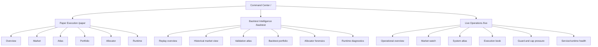
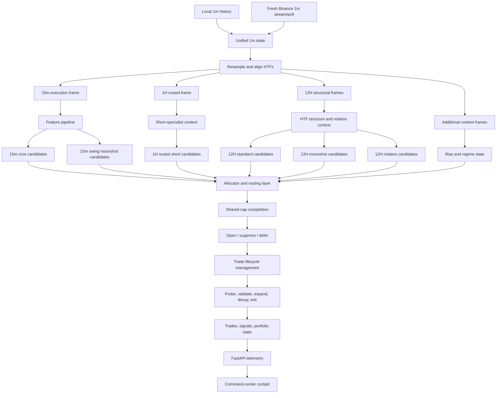
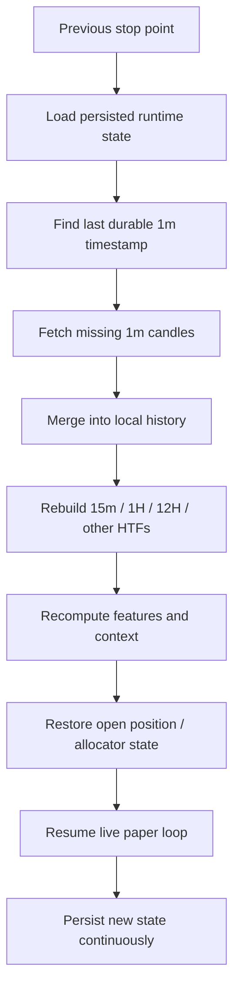

# Retail Trading System

Retail Trading System is a modular research, backtest, live-paper, and cockpit
framework for Binance-style OHLCV trading. The system is intentionally built as
multi-asset, multi-timeframe, and multi-role rather than treating one signal as
the answer to every market condition.

The operating idea is simple:

- let fast execution layers keep opportunity flow alive
- let higher-timeframe layers capture structural moves and convexity
- let a shared-cap allocator decide which sleeve, symbol, and direction deserve
  risk right now
- preserve enough telemetry that every important decision can be inspected later

This repository is therefore not just a signal script. It is a full pipeline:
historical data coverage, `1m` ingestion, higher-timeframe rebuilding, feature
generation, context detection, candidate formation, risk routing, trade
lifecycle management, historical replay, live paper execution, and a modern
dashboard stack that exposes what the engine is doing.

The codebase now has two equally important surfaces:

- the trading engine itself
- the command-center cockpit used to observe research, paper execution, and
  future live operations in a unified layout

## Table of Contents

- [Current Mission](#current-mission)
- [Current Production-Like Stack](#current-production-like-stack)
- [System Roles At A Glance](#system-roles-at-a-glance)
- [Validation Ladder](#validation-ladder)
- [Research Validation Ladder](#research-validation-ladder)
- [Promotion Status](#promotion-status)
- [Future Market-Structure Refactor Scaffold](#future-market-structure-refactor-scaffold)
- [Structural Compounding Research Lab](#structural-compounding-research-lab)
- [Command Center Modes](#command-center-modes)
- [Cockpit Surface Map](#cockpit-surface-map)
- [Repository Map](#repository-map)
- [System Overview](#system-overview)
- [Architectural Philosophy](#architectural-philosophy)
- [High-Level Operating Model](#high-level-operating-model)
- [Timeframe Hierarchy](#timeframe-hierarchy)
- [Configuration Model](#configuration-model)
- [Data Layer](#data-layer)
- [Feature Layer](#feature-layer)
- [Context Layer](#context-layer)
- [Entry Layer](#entry-layer)
- [Risk And Trade Management](#risk-and-trade-management)
- [Simulation Core](#simulation-core)
- [Trade Lifecycle Refactor Layer](#trade-lifecycle-refactor-layer)
- [What Happens Each Engine Cycle](#what-happens-each-engine-cycle)
- [Live Continuity And Catch-Up Model](#live-continuity-and-catch-up-model)
- [Operational Workflow](#operational-workflow)
- [Current Research Conclusions](#current-research-conclusions)
- [Outputs And Telemetry](#outputs-and-telemetry)
- [Backtest / Paper / Runtime Artifacts](#backtest--paper--runtime-artifacts)
- [Backtest Mode](#backtest-mode)
- [Live Simulation Mode](#live-simulation-mode)
- [Testing And Verification](#testing-and-verification)
- [Design Invariants](#design-invariants)
- [Known Constraints And Current Boundaries](#known-constraints-and-current-boundaries)
- [Extension Guide](#extension-guide)
- [Quick Start](#quick-start)
- [Dependencies](#dependencies)

## Current Mission

The immediate priority is not adding more strategy cleverness. The immediate
priority is making the existing routed stack more operationally complete:

| Area | Current state | Why it matters | Next focus |
| --- | --- | --- | --- |
| Core strategy sleeves | Active and validated enough for continued paper work | Edge is already specialized by role | Keep stable |
| `1H` routed sleeve | Promoted as short-specialist branch | Adds differentiated downside exploitation | Monitor and protect |
| `6H` sleeves | Research only | Useful for future study, not production routing | Keep separate |
| Shared-cap allocator | Active | Capital competition is real | Improve observability and coordination |
| Live paper cockpit | Active foundation | Needed to see what the engine is doing in real time | Expand visibility and polish |
| Live continuity | Operationally hardened for paper | Engine must resume from prior state cleanly | Keep proving restart safety through soak evidence |
| Dashboard UX | Multi-mode and telemetry-backed | Must show activity even when no trade fires | Keep improving density and elegance |
| Capital-expression refactor | Scaffolded plus Phase 1 diagnostics and evidence review | Future allocator/capital research needs structure without contaminating runtime behavior | Keep passive until an explicit Phase 2 promotion |

## Current Production-Like Stack

The current production-like stack is role-specialized:

| Sleeve | Timeframe | Current status | Role |
| --- | --- | --- | --- |
| Core | `15m` | Active | Tactical long/short execution flow |
| Swing moonshot | `15m` | Active | Tactical convexity participation |
| Standard HTF | `12H` | Active | Structural higher-timeframe participation |
| HTF moonshot | `12H` | Active | Larger structural expansion attempts |
| HTF rotation | `12H` | Active | Cross-sectional leader reinforcement |
| Routed `1H` | `1H` | Active | Specialized short-side execution sleeve |
| Standard `6H` | `6H` | Research only | Mid-timeframe candidate study |
| Moonshot `6H` | `6H` | Research only | Mid-timeframe convexity study |

The stack is deliberately asymmetric. Every timeframe is not forced to do the
same job.

## System Roles At A Glance

| Layer | What it is supposed to do | What it should not do |
| --- | --- | --- |
| `15m` core | Keep opportunity flow alive, handle tactical long/short execution, react to local momentum | Pretend it is the only source of edge |
| `12H` layers | Capture structural trend, slow leadership, and larger profit geometry | Chase dense intraday noise |
| `1H` routed sleeve | Exploit downside imbalance and context-backed short edge | Be forced into symmetric long participation |
| `6H` research sleeves | Expand research coverage and future candidate discovery | Be treated as production sleeves prematurely |
| Allocator | Route scarce shared risk toward the strongest opportunities | Assume every valid signal deserves capital |
| Cockpit | Make internal engine activity visible and interpretable | Be mistaken for the execution engine itself |

## Validation Ladder

| Stage | Question answered | Status |
| --- | --- | --- |
| Unit tests | Does the code behave mechanically? | Passing |
| Curated multi-asset validation | Does selective breadth help more than naive breadth? | Completed |
| `12H` sleeve promotion | Do structural sleeves deserve live-paper routing? | Completed |
| `1H` specialization work | Is `1H` better as a short-specialist sleeve? | Completed |
| `6H` research | Does `6H` show standalone edge worth future study? | Completed as research |
| Routed portfolio stack validation | Do active sleeves work better together than alone? | Completed enough for continued paper work |
| Production validation gate | Does the exact routed stack survive refreshed full-history and trailing unseen holdout? | Completed |
| Operational hardening | Are SSL, readiness, and real-money blockers enforced correctly? | Completed |
| Clean paper startup proof | Does paper start only from the validated boundary without importing backtest trades? | Completed |
| Forward-paper soak monitoring | Are runtime evidence, heartbeats, and restart logs being collected? | Completed |
| Cockpit truth alignment | Does the dashboard show artifact truth without mutating state? | Completed |
| Capital-expression scaffold | Is the next capital refactor represented structurally without changing behavior? | Completed as dormant scaffold |
| Capital Phase 1 diagnostics | Are rejection, winner, bucket, and opportunity-cost reports available without behavior change? | Completed |
| Capital Phase 1 evidence review | Has diagnostics output been converted into a passive Phase 2 decision memo? | Completed |
| Full paper-runtime maturation | Is the system ready for prolonged 24/7 paper ops? | Current active gate |

## Research Validation Ladder

The production validation gate is not the same thing as the default research
loop. Future allocator and structural refactors should not blindly replay the
entire `2018-2026` archive for every small hypothesis. The default ladder is
now formalized under:

`backtest/output/research_validation_ladder/`

The intended sequence is:

1. `smoke`
2. `diagnostic_fast`
3. `stress_windows`
4. `holdout_recent`
5. `full_history_confirmation`
6. `robustness`

The philosophy is strict:

- fast windows can justify continued research
- fast windows cannot justify promotion
- curated stress windows reduce one-regime overfitting
- trailing holdout must be supportive before full-history confirmation
- full-history replay is the final expensive gate, not the default loop
- no runtime promotion is allowed without full-history confirmation and paper soak

For Retail Phase 3 capital-refactor work, this means the next candidate should
hit trailing holdout and curated stress windows first, and only earn a
full-history replay if those earlier stages remain supportive. For the
Structural Compounding Lab, the same philosophy applies even more conservatively:
`BTCUSDT` first, checkpointed baseline first, recent holdout next, stress
windows next, and only then full-history or multi-symbol expansion.

## Promotion Status

The current operational truth is intentionally conservative.

| Field | Current value | Meaning |
| --- | --- | --- |
| Classification | `paper-only` | Runtime is allowed for paper execution and observation only |
| `paper_runtime_allowed` | `true` | Forward paper runtime may continue |
| `real_money_allowed` | `false` | Real-money startup must refuse |
| `ssl_verify` | `true` | Binance TLS verification is enforced |
| Validated boundary | `2026-06-13T00:00:00+00:00` | Clean paper restarts must bootstrap from this validated point and only process fresh closed candles after it |
| `6H` sleeves | disabled for routing | Preserved for research, not active capital deployment |
| `1H` side policy | short override active | `1H` remains a specialized short engine even while the global paper default is long-only |

This means the repo is in a serious paper-readiness phase, not a real-money
promotion phase. The system is expected to keep collecting forward-paper
evidence while preserving restart cleanliness, operator truth, and policy
discipline.

## Future Market-Structure Refactor Scaffold

The repository now also carries a dormant scaffold for a possible future
support/resistance and liquidity-driven research path. This is not a live
strategy layer and it is not part of the active Phase 2 capital-lane replay.

The scaffold is intended to support future visualization and diagnostics around:

- support and resistance levels and zones
- range highs, range lows, and midpoints
- swing highs and swing lows
- equal highs, equal lows, and liquidity pools
- liquidity sweeps, failed breakouts, failed breakdowns, and retest zones
- higher-timeframe structure context that could later be inspected alongside the
  existing signal stack

Current boundaries are strict:

- it is disabled by default
- it is display-only and research-only
- it does not influence trades
- it does not change allocator, risk, sizing, entry, exit, or threshold logic
- it does not change real-money permissions
- it is isolated from the current Phase 2 capital-lane backtest

The dormant defaults live in:

`config/market_structure_scaffold.json`

and the passive inventory artifact is written to:

`backtest/output/market_structure/scaffold_inventory.json`

Any future attempt to make market-structure context authoritative must go
through its own backtest, holdout, Monte Carlo, and paper-soak validation
before it is allowed anywhere near promotion.

## Structural Compounding Research Lab

The repository now also includes a separate experimental project root:

`C:\Users\v25946b\Structural-Compounding-Lab`

Retail Trading System now treats that external project root as the authoritative
structural research project. The main repo keeps only read-only telemetry and
cockpit bridges. This is not a branch of the active routed engine. It is a separate research lab
for a future support/resistance + liquidity + EMA + pyramiding + cooldown +
profit-vault compounding concept.

Current boundaries are strict:

- it is read-only from the dashboard side
- it does not share runtime state with paper or live execution
- it does not modify allocator, risk, sizing, entry, exit, threshold, or sleeve behavior
- it does not depend on the active Phase 2 capital-lane replay
- it reads only future structural artifacts written under `structural_compounding_lab/output/`

The first frontend shell is available through the dashboard route family:

- `/structural-lab`
- `/structural-lab/market-replay`
- `/structural-lab/structure-map`
- `/structural-lab/profit-vault`
- `/structural-lab/trade-review`
- `/structural-lab/settings`

This gives the lab a future-ready cockpit surface now, while keeping the active
production-like cockpit routes unchanged.

### Current Structural Research State

The Structural Compounding Lab remains research-only. It now has two meaningful
read-only evidence layers on top of the base backtest artifacts:

1. a daily structural opportunity refinement layer that asks whether the lab is
   becoming too tight or too noisy
2. a five-year full-active-capital compounding audit that asks whether the
   observed long/short trade sequence can actually carry aggressive compounding
   geometry without withdrawals

The current five-year audit is written under:

`structural_compounding_lab/output/five_year_compounding_audit_001/`

and is intentionally framed as extrapolation rather than proof. The current
artifact truth is:

| Field | Current reading | Interpretation |
| --- | --- | --- |
| Starting capital | `€20,000` | Fixed research base for the audit |
| Observed ending capital | `€26,286.93` | Raw structural output over the observed sample |
| Ending capital under full-active model | `€26,071.97` | Capital path after compounding each trade at `1%` active-capital risk |
| Drawdown | `20.65%` / `€6,489.29` | Aggressive enough to matter, not catastrophic, but still too meaningful to ignore |
| Trade count | `1093` | The engine is active enough; more entry logic is not the current problem |
| Long total `R` | `-27.12R` | Long side is currently a drag in this audit |
| Short total `R` | `+28.51R` | Short side is carrying the observed edge |
| Win rate | `37.69%` | Low raw hit rate is acceptable only if payoff asymmetry is real |
| Profit factor | `1.0037` | Barely above flat after sequence compounding |
| High-`R` wins | `18` | Large winners do exist |
| Moonshot `5R+` | `6` | Convex winners are present but sparse |
| Classification | `READY_FOR_SMALL_COMPOUNDING` | Research-positive, promotion-negative |

The important interpretation is not that aggressive compounding is now
"approved." It is not. The important interpretation is that the current
structural engine survives the observed long/short sequence, but it does so
with thin margin and heavy dependence on asymmetric winners, especially on the
short side. That means the right next step is still research tightening around
structural opportunity quality, participation routing, and directional
contribution, not a runtime promotion.

The audit also makes two strategic facts explicit:

- the lab is no longer suffering from "too few trades"
- compounding quality is currently more constrained by expectancy shape than by
  raw opportunity flow

### Capital Refactor Status

The capital refactor is still deliberately non-invasive. Phase 0 remains the
dormant structural scaffold, and Phase 1 now exists as a passive evidence layer
only. No allocator, sizing, sleeve, threshold, entry, or exit behavior is
changed by this work.

Phase 1 diagnostics are written under:

`backtest/output/capital_refactor/diagnostics/`

Current Phase 1 artifacts:

| Artifact | Purpose |
| --- | --- |
| `rejection_shadow_book.csv` | Ledger of rejected allocator and signal candidates |
| `capital_blocked_winners.csv` | Capital/risk-suppressed candidates tracked as research evidence |
| `top_winner_forensics.csv` | Passive inspection of historical top winners |
| `strategy_bucket_capital_efficiency.json` | Aggregated performance by strategy, bucket, side, and regime |
| `opportunity_cost_report.json` | Read-only comparison of blocked candidates versus competing allocations |
| `diagnostics_summary.json` | Phase 1 truth artifact proving diagnostics-only behavior |

The cockpit reads these files as operator evidence only. They do not grant
runtime authority, alter routing, or relax the `paper-only` classification.

Phase 1 also now includes a passive evidence review under:

`backtest/output/capital_refactor/diagnostics/review/`

These review artifacts summarize what the diagnostics actually support and what
they still do not prove. They are a decision memo only. They do not authorize
Phase 2 by themselves, and they do not change live or paper behavior.

Phase 2 has now completed and failed promotion. Its holdout improvement was
useful research, but the full-history profile was not supportive enough to make
the candidate authoritative. Phase 3 therefore starts as a narrow backtest-only
research iteration under the validation ladder rather than as a broad allocator
rewrite. The Phase 3 hypothesis is guarded `12H` structural relief while
protecting `core` and `swing_moonshot`, and it does not begin with a fresh
full-history replay. No runtime behavior is changed by this planning layer.

The capital-refactor house is also now scaffolded as a full research
architecture under `capital/`, with candidate registry, validation ladder,
promotion governance, rollback contracts, and execution-realism artifacts. This
extends the refactor from diagnostics-only thinking into a controlled research
framework, but it is still disabled by default: `real_money_allowed=false`,
`behavior_change_allowed=false`, `capital_refactor.enabled=false`, `6H`
disabled, and `1H` short override preserved.

## Command Center Modes

The dashboard is no longer intended to be a single live page. It is now a
command-center surface with a stable spatial layout and separate operating
modes.

| Route | Purpose | Operator framing |
| --- | --- | --- |
| `/` | Command-center landing page | Main mode selector and high-level system entry |
| `/paper` | Paper Execution Cockpit | Active paper trading and telemetry |
| `/backtest` | Backtest Intelligence Lab | Historical replay, research, and validation inspection |
| `/live` | Live Operations Deck | Runtime-oriented operational framing for future live deployment |

### Command-center route model



## Cockpit Surface Map

The cockpit is designed around a persistent top command header and a lower
region that changes by module.

| Module | Main purpose | What should be visible |
| --- | --- | --- |
| `Overview` | System pulse | Equity, PF, sleeve contributions, daily rhythm |
| `Market` | Price and execution theater | Candles, levels, trade markers, live/replay feed state |
| `Atlas` | Multi-asset status map | Symbol-by-symbol and timeframe-by-timeframe state |
| `Portfolio` | Execution book | Open positions, recent exits, sleeve attribution |
| `Allocator` | Scarce-risk routing | Cap pressure, suppressions, selection reasons |
| `Runtime` | Engine state | Heartbeats, cycle count, data freshness, guard status |

The dashboard is not a broker. It visualizes what the engine and telemetry
layer are actually writing.

## Repository Map

| Path | Responsibility |
| --- | --- |
| `backtest/` | Historical runner, validation helpers, reporting, checkpoints |
| `bias/` | Directional context logic |
| `capital/` | Dormant capital-expression scaffold for future allocation research |
| `common/` | Shared runtime helpers, telemetry loading, audit utilities |
| `config/` | Configuration loader, settings, branch and baseline definitions |
| `dashboard/` | Next.js command-center frontend |
| `dashboard_api/` | FastAPI + websocket telemetry backend |
| `data/` | Binance client, history downloading, resampling |
| `entry/` | Entry logic, scoring, breakout/retest handling |
| `exit/` | Hard-exit logic |
| `features/` | Feature pipeline, candle metrics, indicators |
| `live_sim/` | Live-paper runner, cycle loop, logging, portfolio state writes |
| `market_structure/` | Dormant support/resistance and liquidity scaffold for future visualization/research |
| `position/` | Risk-based sizing |
| `pyramiding/` | Add-to-winner and convexity controls |
| `regime/` | Higher-timeframe regime evaluation |
| `simulation/` | Trade/account/simulator core |
| `sniffing/` | Trend-health and trail-state logic |
| `tests/` | Unit and regression coverage |
| `main_download.py` | Historical `1m` downloader |
| `main_resample.py` | Manual HTF rebuild utility |
| `main_backtest.py` | Historical replay entry point |
| `main_live.py` | Paper/live-style runtime entry point |
| `main_walkforward.py` | Walk-forward validation entry point |
| `main_monte_carlo.py` | Robustness/stress entry point |
| `main_calibrate.py` | Opportunity calibration reports |
| `main_edge_lab.py` | Isolated edge-family diagnostics |
| `run_live_cockpit.py` | One-command live paper cockpit launcher |
| `run_backtest_cockpit.py` | One-command backtest cockpit launcher |

## System Overview

At a high level, the system ingests `1m` candles, rebuilds all required higher
timeframes from that canonical base, computes features and context, forms
sleeve-specific candidates, and then asks the allocator which opportunities
deserve shared risk. That sequence matters because the project is designed
around the idea that market observation, signal creation, capital routing, and
trade management are separate economic jobs.

The reason the system is multi-timeframe is not aesthetic complexity. It comes
from a specific research conclusion: different time horizons expose different
types of edge. The `15m` layer is good at finding frequent tactical setups and
keeping opportunity flow alive. The `12H` sleeves are good at capturing slow
structural moves where a small move on the higher timeframe can represent days
or weeks of lower-timeframe work. The `1H` sleeve turned out not to be a
general-purpose execution layer, but a specialized short-side engine. The
allocator exists because these edges compete for the same capital.

This repo is therefore best understood as a coordinated portfolio machine. A
signal is not promoted just because it exists. It must survive context,
quality, and capital competition.

## Architectural Philosophy

The architectural philosophy is to prefer specialization over forced symmetry,
and coordination over blind breadth.

That leads to a few practical decisions:

- each sleeve is allowed to have a different job
- higher-timeframe structure is not reduced to a decorative filter
- capital can stay idle when the current opportunity set is weak
- telemetry is treated as a core system requirement, not an optional dashboard
  extra

The repo deliberately avoids the common mistake of making every layer do
everything. When a system tries to make `15m`, `1H`, `6H`, and `12H` all trade
the same market move in the same way, it often creates duplication, hidden
correlation, and allocator dilution. The current architecture instead tries to
create division of labor:

- `15m` handles tactical flow
- `12H` handles structural participation and leader capture
- `1H` handles a narrower downside-exploitation role
- `6H` remains a research surface until it proves it deserves shared capital

The philosophy behind this is empirical, not ideological. The system reached
this structure through repeated validation and elimination, not because symmetry
was considered bad in the abstract. Longs were tested on `1H`; they did not
earn their place. Broad universe expansion was tested naively; it diluted the
system. The present design is the result of observed edge, not preference.

## High-Level Operating Model



The key idea is that the repo is not just a trigger engine. It is a
capital-routing engine.

## Timeframe Hierarchy

The timeframes are chosen because they solve different problems, not because
more timeframes automatically improve the system.

| Timeframe | Why it exists | Current role |
| --- | --- | --- |
| `1m` | Canonical market data source and live continuity substrate | Base ingestion layer |
| `15m` | Main execution clock and tactical opportunity discovery | Core trading layer |
| `1H` | Intermediate execution/context surface where downside asymmetry appeared | Routed short-specialist sleeve |
| `6H` | Mid-timeframe bridge between tactical and structural behavior | Research-only sleeve family |
| `12H` | Structural trend and convexity capture | Standard, moonshot, and rotation sleeves |

### Why the hierarchy matters

The higher timeframe is not just a slower chart. It changes the economic meaning
of a move. A `1R` move on `12H` can represent a much larger market regime shift
than a `1R` move on `15m`, which is why the system must allow higher-timeframe
sleeves to execute real trades rather than acting only as filters. At the same
time, relying only on `12H` would make the system too sparse, so the `15m` core
remains essential for flow.

### Candle alignment and lookahead control

All higher-timeframe views are rebuilt from `1m` data and sliced only through
the timestamp that would already be known at that point in the run. This is a
basic but essential design rule. Without it, backtests become optimistic and
live behavior stops matching historical logic.

## Configuration Model

Configuration is intentionally centralized so that behavior changes can be made
without scattering strategic assumptions across the codebase.

| Area | Typical contents |
| --- | --- |
| `config/settings.json` | Core runtime, account, history, strategy, and allocator settings |
| `config/baselines/` | Named baseline configurations |
| `config/branches/` | Research branch and candidate branch definitions |

In practice, the configuration model controls:

- history range and storage behavior
- per-sleeve enablement
- risk budgets and sizing assumptions
- side policies and filters
- allocator behavior
- runtime debug and telemetry behavior

The important principle is that threshold or policy changes should generally be
expressed in configuration first. Hardcoding a research decision into strategy
logic too early makes later validation harder and more error-prone.

## Data Layer

The data layer exists to make `1m` history durable, resumable, and suitable for
rebuilding every higher timeframe the engine needs.

### Main responsibilities

| Component area | Responsibility |
| --- | --- |
| Binance client | Fetch recent and historical candles |
| Historical downloader | Build local `1m` coverage with checkpoint safety |
| Resampler | Rebuild `15m`, `1H`, `6H`, `12H`, and other HTFs from `1m` |
| Continuity merge | Append fresh candles onto persisted local history |

The design choice to make `1m` the canonical base series is deliberate. It
avoids drift between prebuilt timeframe files and keeps backtest/live behavior
aligned. It also means the same raw series can support future refactors around
restart continuity and real-time dashboard streaming.

## Feature Layer

The feature layer converts raw candles into a state that the strategy can
reason about without mixing raw data handling into the simulator itself.

### Feature pipeline responsibilities

- trend and EMA structure
- range and compression logic
- breakout and breakdown event marking
- VWAP-related context
- ATR and volatility state
- candle-body and wick metrics
- momentum and pressure-style diagnostics

The system prefers event-based information where timing matters. For example,
breakout behavior is treated as a transition event, not just a condition of
remaining above a level. That design reduces late, noisy, or repeated entries.

## Context Layer

The context layer answers a different question from the entry layer. It asks
what kind of environment the market is currently in, rather than whether a
single setup exists.

### Main context jobs

| Context type | Purpose |
| --- | --- |
| Bias | Directional backdrop and side-aware orientation |
| Regime | Higher-timeframe environment strength and quality |
| HTF structure | Structural trend and rotation alignment |

The project has progressively moved away from using context only as a binary
permission switch. In several places, context is now closer to a weighting,
gating, or capital-shaping influence. That reflects how the research evolved:
the most useful role for context is often to improve trade quality and routing,
not merely to say yes or no.

## Entry Layer

The entry layer is where the system turns prepared state into candidate trades.
It is deliberately separated from allocator logic so that "candidate quality"
and "deserves capital right now" remain distinct questions.

### Entry responsibilities

| Component idea | Role |
| --- | --- |
| Breakout logic | Detect event-based transitions |
| Scoring logic | Convert setup structure into comparable strength |
| Sleeve-specific policy | Decide how each sleeve expresses its opportunity set |
| Candidate formation | Produce a trade candidate the allocator can rank |

This is also why different sleeves are allowed to use different behavior. The
project is no longer trying to make every timeframe share one identical entry
personality.

## Risk And Trade Management

The project’s edge is not only about entry logic. Risk and trade management are
explicit parts of the architecture.

### Core responsibilities

| Component | Purpose |
| --- | --- |
| Position sizing | Normalize exposure to account risk |
| Pyramiding | Add to proven winners rather than averaging hope |
| Trend sniffer | Decide whether the trade is still behaviorally healthy |
| Exit engine | Enforce hard risk control and final exit behavior |

The convexity idea in the system is important: a trade does not automatically
deserve full exposure at birth. It can begin as a probe, earn validation, and
only then justify expansion or an add. This keeps the project aligned with a
"proof first, size later" philosophy.

## Simulation Core

The simulation core is where all of the above layers are orchestrated.

The important architectural choice is that historical replay and live paper
execution use the same decision machinery once the current market state has been
assembled. That means the engine is not maintaining one hidden strategy for
backtests and another for live paper. Differences between the two should come
primarily from data timing and market reality, not divergent logic branches.

### Simulation sequence

1. Assemble market state.
2. Build aligned HTFs.
3. Compute features and context.
4. Generate candidates by sleeve.
5. Run allocator routing and suppression.
6. Open, manage, or close trades.
7. Persist outputs and telemetry.

## Trade Lifecycle Refactor Layer

The repo now includes a first structural refactor layer that moves trade state
beyond plain open/closed behavior.

| Refactor element | Purpose |
| --- | --- |
| `candidate -> allocated -> probe -> validated -> expanded -> decaying -> exited` | Explicit trade lifecycle vocabulary |
| `request_type` | Makes capital demand classifiable |
| `capital_lane` | Makes routing origin inspectable |
| `lineage_id` | Enables future re-entry/recycle logic |
| allocator decision logs | Allows forensic review of why capital was deployed or denied |
| persisted runtime state | Supports continuity and restart logic |

This layer exists because the next phase of the project is less about "new
entry tricks" and more about cleaner routing, lifecycle awareness, and
observability.

## What Happens Each Engine Cycle

For each actionable step, the engine conceptually does the following:

1. Read the current local `1m` state and append fresh Binance `1m` candles.
2. Deduplicate and order the unified `1m` timeline.
3. Rebuild all required higher timeframes from that base series.
4. Compute features and context using only candles that would already be known.
5. Generate sleeve-specific candidates rather than one monolithic signal.
6. Apply side policies, quality filters, regime gates, and symbol restrictions.
7. Run allocator selection under shared-cap and suppression logic.
8. Either open a new lifecycle state or leave capital idle.
9. Manage open trades through convexity, adds, trail-state logic, and exits.
10. Persist portfolio state, signals, decisions, heartbeat rows, and trade data.
11. Expose those artifacts to the telemetry API and cockpit.

The system should therefore look alive even when no trade is firing, because
the work is broader than entry execution alone.

## Live Continuity And Catch-Up Model

The intended live/paper operating model is:

1. remember the last durable point processed by the engine
2. on restart, backfill missing `1m` candles from that point to "now"
3. rebuild all higher timeframes from the unified `1m` base
4. recompute context, candidates, allocator state, and open-position logic
5. only then continue real-time operation

### Continuity architecture target



The repo has foundations for continuity, but this remains an active area of
hardening. The README intentionally states the target model clearly because the
dashboard and engine should eventually reflect this behavior explicitly.

## Operational Workflow

| Step | Command | Purpose |
| --- | --- | --- |
| `1` | `python main_download.py` | Download or extend local `1m` history |
| `2` | `python main_resample.py` | Optional manual HTF rebuild for inspection |
| `3` | `python main_backtest.py` | Run historical replay |
| `4` | `python main_walkforward.py` | Run walk-forward validation |
| `5` | `python main_monte_carlo.py` | Stress completed trade paths |
| `6` | `python main_calibrate.py` | Build opportunity and execution calibration reports |
| `7` | `python main_edge_lab.py` | Run isolated edge-family diagnostics |
| `8` | `python main_live.py` | Run the paper/live runtime loop directly |
| `9` | `python run_backtest_cockpit.py` | Launch backtest cockpit stack |
| `10` | `python run_live_cockpit.py` | Launch live paper cockpit stack |

### One-command cockpit launch

```powershell
python run_live_cockpit.py
```

The launcher is intended to:

- start the live-paper engine
- start or validate the FastAPI telemetry backend
- start or validate the dashboard frontend runtime
- open the cockpit in the default browser
- monitor child-process health
- shut services down cleanly

## Current Research Conclusions

The current research state is materially different from the older "more
symbols must be better" assumption.

| Topic | Current conclusion |
| --- | --- |
| Naive broad breadth | Harmful as a production universe |
| Selective breadth | Useful when symbols earn inclusion |
| `1H` design | Best treated as a short-specialist execution sleeve |
| `1H` long reintroduction | Not justified by current evidence |
| `12H` role | Must remain a real execution sleeve, not just a context filter |
| `6H` role | Valuable as research, not yet as routed production exposure |
| Allocator interaction | Cross-sleeve capital competition matters more than adding raw signals |
| System architecture | Specialization + coordination is better than forcing symmetry across layers |

The broad 26-symbol expansion was not wasted. It established a durable local
research base and demonstrated that selective breadth is superior to naive
breadth.

## Outputs And Telemetry

The system writes artifacts that the cockpit consumes and that research can
audit later.

| Artifact type | Typical examples |
| --- | --- |
| Portfolio state | `portfolio_status.json` |
| Trades | `trades.csv` |
| Signals | `signals.csv` |
| Daily summaries | `daily_summary.csv` |
| Score-bucket summaries | `score_bucket_summary.csv` |
| Allocator audit | `allocator_decisions.csv` |
| Runtime policy | runtime policy rows |
| Engine heartbeat | cycle count, status, completed-at fields |
| Symbol pipeline | per-symbol processing state |

The important design principle is that the engine should remain observable even
when no trade exists. That means ingestion, evaluation, filtering, routing, and
heartbeat state are first-class telemetry, not hidden implementation details.

## Backtest / Paper / Runtime Artifacts

| Surface | Main artifacts |
| --- | --- |
| Backtest | `backtest/output/...` trade logs, equity, summaries, calibration inputs |
| Paper runtime | `live_sim/output/...` trades, signals, portfolio state, heartbeats, startup reports, soak evidence |
| Cockpit backend | API snapshots + websocket payloads derived from those artifacts |
| Command center | Multi-mode views over the same underlying state |

### Typical live-paper outputs

```text
live_sim/output/trades.csv
live_sim/output/signals.csv
live_sim/output/score_bucket_summary.csv
live_sim/output/portfolio_status.json
live_sim/output/paper_runtime_startup_report.json
live_sim/output/paper_soak_status.json
live_sim/output/paper_soak_daily_report.json
live_sim/output/paper_soak_review.json
live_sim/output/paper_runtime_events.jsonl
live_sim/output/baseline_freeze_snapshot.json
live_sim/output/capital_refactor/scaffold_inventory.json
```

### Production-gate and readiness artifacts

```text
backtest/output/production_validation_gate_current/status.json
backtest/output/production_validation_gate_current/summary.json
backtest/output/production_validation_gate_current/promotion_readiness_report.json
backtest/output/production_validation_gate_current/...scenario_manifest.json
```

These files are the authority for the current paper-only classification. The
runtime and cockpit should read them, not invent a better answer.

## Backtest Mode

Backtesting is not just a convenience wrapper in this repo. It is the primary
research surface used to decide which sleeves and policies deserve promotion.

### What backtest mode does

- rebuilds higher timeframes from local `1m` history
- computes features and context using closed-candle logic
- runs the same routed decision machinery used by paper execution
- writes trade logs, state logs, and summaries that can be audited later

The reason this matters is that the system is explicitly trying to prevent the
common split where "research code" and "runtime code" silently diverge. The
more these paths share logic, the more trustworthy the promotion workflow
becomes.

## Live Simulation Mode

Live simulation exists to answer a different question from backtesting. The
question is not only "did the logic work historically?" but also "can the
system stay operationally coherent while processing live-ish data over time?"

### Live loop responsibilities

- bootstrap from local `1m` history
- fetch recent Binance `1m` candles
- merge and rebuild all required HTFs
- detect whether a new actionable candle is available
- run the decision engine
- persist telemetry continuously so the cockpit can display internal state

This is why the dashboard must eventually show more than candles and PnL. The
runtime loop is doing real work even when it is not trading: ingestion,
rebuilding, context evaluation, candidate rejection, allocator suppression, and
heartbeat progression all matter operationally.

## Testing And Verification

The repository includes a large `unittest` suite under [`tests/`](tests/).

### What is covered

| Test area | Purpose |
| --- | --- |
| Breakout logic | Event-based timing verification |
| Bias and regime logic | Context correctness and side-aware behavior |
| Feature pipeline | Transition logic and cleanup |
| Trend sniffer | Trail-state and decay behavior |
| Pyramiding | Event-based add logic and gating |
| Position sizing | Risk floors and caps |
| Trade metrics | `R` accounting and lifecycle bookkeeping |
| Simulator management | Candidate routing, exits, and open-position flow |
| Backtest resume | Checkpoint restoration behavior |
| Downloader continuity | Resumable history coverage logic |
| Live simulation | Runtime merge/bootstrap behavior |
| Dashboard telemetry | Snapshot loading and API-facing state |
| Validation helpers | Research workflow correctness |

### Main test command

```powershell
python -m unittest discover -s tests -v
```

## Design Invariants

| Invariant | Why it matters |
| --- | --- |
| Decisions use closed candles only | Prevents lookahead leakage |
| HTF slices stop at the current actionable timestamp | Preserves historical realism |
| `1m` is the canonical base series | Keeps every HTF rebuild consistent |
| Trade routing is allocator-aware | Prevents sleeves from behaving as isolated silos |
| Lifecycle state is explicit | Supports auditability and future recycle logic |
| Telemetry is not optional | Makes no-trade periods interpretable instead of opaque |
| Research sleeves do not become production sleeves without validation | Prevents hidden scope creep |
| The dashboard visualizes state; it does not create state | Preserves truthfulness of operations |

## Known Constraints And Current Boundaries

### Strategy boundaries

- `6H` sleeves remain research-only.
- `1H` is intentionally asymmetric and specialized.
- Capital competition is only partially solved; it is visible and managed, but
  still an active optimization frontier.
- The system is still in paper/research maturation, not brokerage-connected
  production deployment.

### Execution realism boundaries

- No full fee/slippage/partial-fill realism stack is implemented yet.
- Equity is still primarily realized-PnL based rather than a full mark-to-market
  portfolio accounting engine.
- The current priority is state correctness and observability before micro-fill
  realism.

### Operational boundaries

- Real money is intentionally blocked. The current classification is
  `paper-only`, even though the routed stack passed the refreshed gate well
  enough for continued paper execution.
- Live continuity and restart catch-up are now implemented for the paper path,
  but they still need continued soak evidence rather than blind trust.
- The cockpit UX is materially improved, but still under refinement toward the
  denser institutional-grade experience intended for the project.
- The dashboard currently depends on telemetry artifacts; if the engine is not
  writing them correctly, the UI cannot invent missing truth.
- The capital-expression refactor is still behaviorally dormant. Phase 1
  diagnostics and the follow-on evidence review now exist, but they remain
  passive evidence only and do not change allocator behavior, sizing, lane
  budgets, or promotion rules.

## Extension Guide

The safest way to extend the system is to preserve its current separation of
concerns.

| Goal | Best extension point |
| --- | --- |
| Adjust sleeve or allocator policy | `config/` |
| Add or refine features | `features/` |
| Change context logic | `bias/` or `regime/` |
| Extend entry behavior | `entry/` |
| Modify sizing or capital behavior | `position/` and allocator logic |
| Refine convexity or adds | `pyramiding/` |
| Refine trail/hold logic | `sniffing/` |
| Improve hard exits | `exit/` |
| Expand telemetry | `common/`, `dashboard_api/`, and `dashboard/` |

The main practical rule is this: if a change affects market observation, keep
it in data/features/context; if it affects opportunity formation, keep it in
entry; if it affects capital competition, keep it in allocator/risk logic; if
it affects visibility, keep it in telemetry and cockpit layers. Do not hide a
capital decision inside a signal module or a signal decision inside the UI.

## Quick Start

### 1. Install Python dependencies

```powershell
pip install -r requirements.txt
```

### 2. Install dashboard dependencies

```powershell
cd dashboard
npm install
```

### 3. Create a local environment file

```powershell
Copy-Item .env.example .env
```

### 4. Download or extend local `1m` history

```powershell
python main_download.py
```

### 5. Run a backtest

```powershell
python main_backtest.py
```

### 6. Generate passive capital diagnostics

```powershell
python backtest/run_capital_phase1_diagnostics.py
```

### 7. Generate the passive Phase 1 evidence review

```powershell
python backtest/review_capital_phase1_diagnostics.py
```

### 8. Launch the live paper cockpit

```powershell
python run_live_cockpit.py
```

### 9. Run the structural full-capital compounding audit

```powershell
python -m structural_compounding_lab.diagnostics.five_year_compounding_audit
```

### 10. Open the main command center

```text
http://127.0.0.1:3000/
```

From there, use:

- `/paper`
- `/backtest`
- `/live`

## Dependencies

| Package | Role |
| --- | --- |
| `pandas` | Time-series handling, joins, resampling, rolling operations |
| `numpy` | Numerical helpers |
| `requests` | Binance HTTP access |
| `fastapi` | Telemetry API layer |
| `uvicorn` | API runtime |
| `next` / `react` | Dashboard frontend |
| `framer-motion` | Dashboard motion and transitions |
| `tailwindcss` | Cockpit styling and layout primitives |
| `rich` | Terminal dashboards and progress reporting |

## Closing Note

The correct way to think about this project is not "a single strategy that
must catch everything." It is a coordinated multi-layer system where each
timeframe and sleeve has a job, the allocator arbitrates scarce capital, and
the cockpit exposes what the machine is doing. The long-term edge comes from
specialization, coordination, continuity, and observability together, not from
forcing every module to trade every move.
