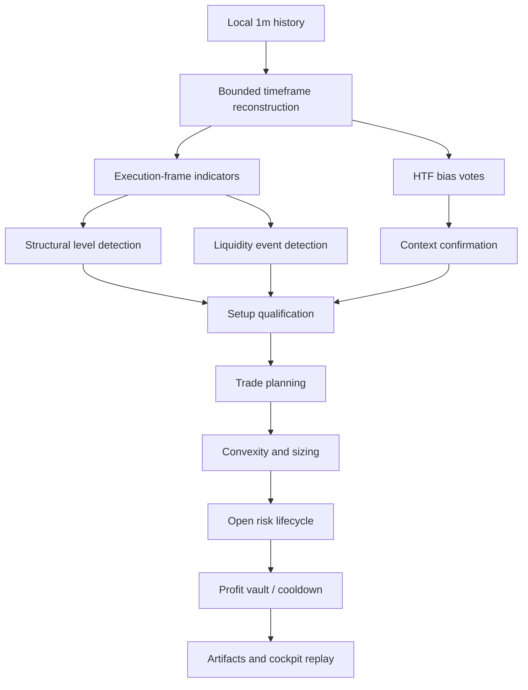
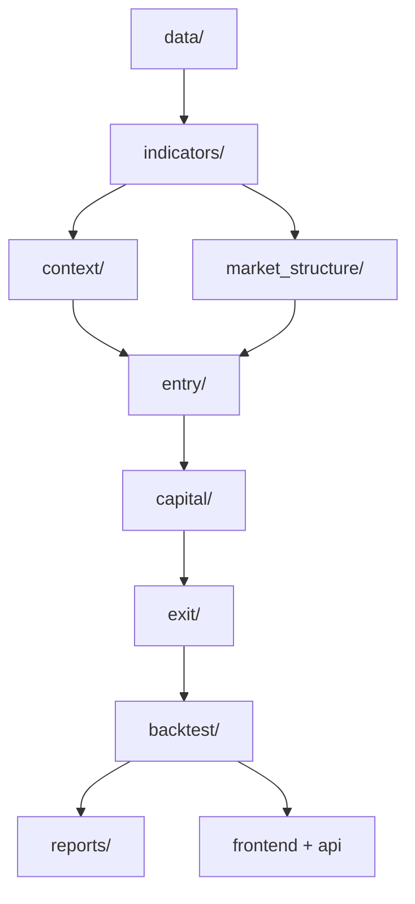
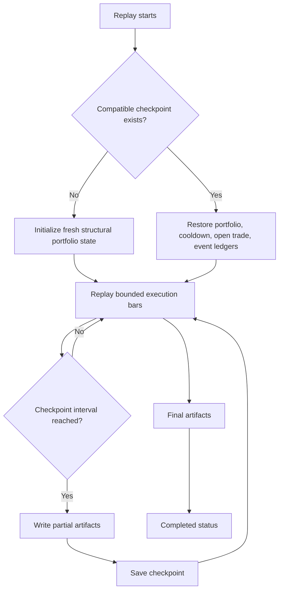

# Structural Compounding Lab

Structural Compounding Lab is a separate research project inside the repository.
It is not a hidden branch of the active routed engine and it is not allowed to
mutate paper/live runtime state. The purpose of the lab is to study a different
economic idea:

- structure-first entries instead of signal-stack routing
- liquidity sweeps and failed breaks instead of generic momentum triggers
- asymmetric compounding through a profit vault
- proof-based pyramiding only after trade quality improves
- cooldown logic that can clear early for genuinely strong aligned setups

The lab borrows the main repo's data conventions, dashboard language, and local
artifact discipline, but it remains isolated from:

- the active allocator
- sleeve routing
- paper soak
- real-money permissions
- the running Phase 2 capital-lane replay

This project should be read as a research engine specification, not as a toy
strategy note. The lab is designed to answer whether a structure-centric,
liquidity-aware, capital-compounding process can produce better trade geometry
than a generic momentum or sleeve-routing model when the operator is willing to
wait for richer local context before deploying risk. In practice that means the
engine must reconstruct market state from the `1m` archive, infer higher-order
structure from bounded rolling windows, qualify local liquidity events, convert
those observations into economically tradable setups, and then track capital
through a compounding process that explicitly distinguishes base capital,
floating profit, locked profit, and cooldown state.

The technical bar for the lab is therefore high. A visually attractive cockpit
is necessary but not sufficient. The underlying Python path must be able to
explain exactly what data window was used, what structural references were
visible, why a setup qualified or failed, why capital expanded or stayed flat,
when profits were withdrawn from circulation, and how replay can survive long
multi-hour runs through checkpointing and resumption without contaminating
artifact truth. The README is intentionally written at that systems level
because that is the level required for serious research promotion later.

## Table of Contents

- [Mission](#mission)
- [Validation Ladder](#validation-ladder)
- [What Makes This Lab Different](#what-makes-this-lab-different)
- [Current Safety Contract](#current-safety-contract)
- [Project Layout](#project-layout)
- [Research Philosophy](#research-philosophy)
- [System Narrative](#system-narrative)
- [Strategy Architecture](#strategy-architecture)
- [Data Model](#data-model)
- [Run Window Semantics](#run-window-semantics)
- [Market-Structure Logic](#market-structure-logic)
- [Breakout / Retest Philosophy](#breakout--retest-philosophy)
- [Liquidity Logic](#liquidity-logic)
- [Momentum Personality Layer](#momentum-personality-layer)
- [Intelligent Pullback Buying](#intelligent-pullback-buying)
- [Setup Qualification](#setup-qualification)
- [Risk Expression](#risk-expression)
- [Convexity / Pyramiding / Profit Vault](#convexity--pyramiding--profit-vault)
- [Cooldown Logic](#cooldown-logic)
- [Backtest Artifact Contract](#backtest-artifact-contract)
- [Checkpointing And Resumption](#checkpointing-and-resumption)
- [Frontend / Cockpit](#frontend--cockpit)
- [Configuration Model](#configuration-model)
- [Per-Bar Decision Pipeline](#per-bar-decision-pipeline)
- [Artifact Semantics](#artifact-semantics)
- [Computational Characteristics](#computational-characteristics)
- [Commands](#commands)
- [Testing](#testing)
- [Current Boundaries](#current-boundaries)

## Mission

The main system already specializes across `15m`, `1H`, and `12H` sleeves. This
lab explores a different future path where the edge is supposed to come from:

1. waiting for price to interact with meaningful structure,
2. requiring a liquidity event or a very clean structural reclaim,
3. only risking fixed base capital plus qualified floating profit,
4. locking profit out of circulation when danger rises.

This makes the lab less about constant trade flow and more about selective,
high-information participation.

## Validation Ladder

This lab now follows the same research discipline as the main routed system:
fast windows are for iteration, full history is for confirmation, and promotion
is not allowed from one lucky sample.

Authoritative ladder artifact:

`config/validation_ladder.json`

Default progression:

1. `smoke`
2. `diagnostic_fast` using `BTCUSDT` 6-month checkpointed baseline
3. `stress_windows` using curated BTC-only regimes
4. `holdout_recent` using trailing BTC-only 12 months
5. `full_history_confirmation`
6. `robustness`
7. optional multi-symbol expansion only after BTC-only proof

The rule is strict: `BTCUSDT` proves the structure engine first. Multi-symbol
full-history expansion does not begin until BTC-only evidence survives the fast
ladder and the recent holdout.



## What Makes This Lab Different

| Area | Active routed stack | Structural compounding lab |
| --- | --- | --- |
| Primary edge source | sleeve specialization and shared-cap routing | support/resistance + liquidity + EMA alignment |
| Capital expression | shared allocator competition | single-track capital with vault resets |
| Position expansion | sleeve-specific trade management | proof-based convex add-ons only |
| Cooldown | runtime safety and lifecycle logic | danger-aware compounding reset logic |
| Dashboard role | operational cockpit | research replay and visual audit |
| Runtime authority | paper-ready only | research-only |

Another important distinction is that the lab is not trying to maximize signal
count by default. The intended economic behavior is to let the main routed stack
remain the dense multi-sleeve execution system while this lab explores whether a
slower but higher-information structural process can create a different return
distribution: fewer but more asymmetric trades, cleaner invalidation, more
meaningful add-ons, and more deliberate profit withdrawal.

## Current Safety Contract

The lab is intentionally fenced off.

- `research_only=true`
- read-only frontend
- no live orders
- no paper-runtime mutation
- no allocator integration
- no real-money path
- no dependency on current Phase 2 replay

If the lab ever becomes interesting enough for promotion, it still has to earn
that through its own validation, holdout, and paper-soak path.

## Project Layout

```text
structural_compounding_lab/
|-- api/
|-- backtest/
|-- capital/
|-- common/
|-- config/
|-- context/
|-- data/
|-- docs/
|-- entry/
|-- exit/
|-- frontend/
|-- indicators/
|-- market_structure/
|-- output/
|-- position/
|-- reports/
|-- scripts/
|-- simulation/
`-- tests/
```

## Research Philosophy

The lab assumes a good structural trade should survive three separate questions:

1. Is price interacting with a level that matters?
2. Did liquidity get swept, reclaimed, or fail in a way that changes local odds?
3. Is the trade worth financing after stop distance, target geometry, and HTF
   context are considered together?

This means the lab does not treat pattern presence as sufficient. It tries to
filter for setups that are structurally meaningful and economically tradable.

## System Narrative

At a technical level, the lab is a deterministic replay engine operating on a
locally stored `1m` market-history base. The engine does not consume broker
state, exchange callbacks, or allocator decisions from the main system. Instead,
it reconstructs a self-contained research state from the local candle archive
and repeatedly answers one question:

> Given the current execution bar, the recent structural map, the latest
> liquidity events, and the higher-timeframe context, should capital be deployed,
> expanded, reduced, locked, or withheld?

That question is evaluated sequentially for every execution-timeframe bar.

The engine therefore behaves more like a controlled market simulator than a
generic rule script:

1. build the canonical timeframe bundle from local `1m` data,
2. derive indicator state on the execution frame,
3. derive higher-timeframe directional context,
4. detect local structure and liquidity from bounded rolling windows,
5. qualify or reject a setup,
6. convert accepted setups into trade plans,
7. manage open risk through stop, danger, pyramiding, and vault logic,
8. emit a complete research artifact set for charting and forensic review.

The README requirement here is important: the lab is not just “a strategy that
trades support and resistance.” It is an event-driven state machine with
artifact-first observability.

## Strategy Architecture

### Data layer

- local `1m` history is still the canonical source
- higher timeframes are rebuilt from the local base feed
- the adapter now slices the loaded frame to the configured analysis window

### Context layer

- `12H`, `1D`, and `1W` context are collapsed into a simple bias vote
- danger state tracks shock candles, EMA reversal, HTF loss, and stop breaks

### Structure layer

- pivots generate candidate support/resistance anchors
- rolling range high/low/midpoint give local framing
- prior day and prior week extremes are added as reference levels
- level strength combines touch count, timeframe weight, and recency

### Liquidity layer

- equal highs / equal lows
- sweep highs / sweep lows
- failed breakouts / failed breakdowns
- reclaim / retest implications

### Entry layer

- only recent liquidity events are considered actionable
- setups must sit close enough to structure in ATR terms
- nearest relevant structure is selected by intended side
- target geometry prefers opposing structure before falling back to rolling extremes

### Capital layer

- base capital is the reset anchor
- floating profit can temporarily increase active trading capital
- realized gains can be locked away from future risk
- convexity scales risk and add-on permission rather than blindly pyramiding

### Exit layer

- active stop remains authoritative
- danger can force an early exit
- slow-grind and moonshot capture logic remain explicit
- cooldown starts after danger-driven vault resets and can fast-clear only for
  aligned high-quality setups

Each layer intentionally contributes a different type of information:

- `market_structure/` answers where price is interacting
- `liquidity/` answers whether that interaction is likely to trap or release inventory
- `context/` answers whether the broader path of least resistance helps or hurts
- `entry/` answers whether the local opportunity is worth financing
- `capital/` answers how aggressively the system may express the idea
- `exit/` answers when adverse information invalidates the thesis

That separation matters because it keeps the system extensible. Future changes
can improve one information domain without forcing the whole lab to be rewritten.



## Data Model

The lab uses the main repo's local market-history store:

`data_storage/<SYMBOL>/1m/*.csv`

The structural adapter resolves the best matching source file and then enforces
the configured analysis window after load. This matters because a large local
history file may cover many years, while a given experiment may only want a
trailing segment.

The important implementation detail is that the data adapter now distinguishes:

- storage coverage: which local file is eligible to load
- analysis coverage: which timestamps the engine is actually allowed to replay

That avoids a common research failure mode where a nominal “6-month” experiment
secretly consumes a much larger historical span than intended.

## Run Window Semantics

The lab now distinguishes between storage coverage and analysis intent.

| Field | Meaning |
| --- | --- |
| `data.history_start_date` | lower storage/search bound |
| `data.history_end_date` | upper storage/search bound |
| `data.analysis_start_date` | optional explicit backtest start |
| `data.analysis_end_date` | optional explicit backtest end |

If analysis dates are not set, the lab falls back to the history dates. The
backtest summary/report now records:

- config analysis start/end
- loaded execution start/end
- source CSV path
- structure/liquidity/setup window sizes

That makes the artifact set self-describing instead of forcing you to infer the
run window later.

Forensic traceability depends on this. Every serious backtest should be able to
answer, from artifacts alone:

- which source file was used,
- what the configured analytical boundary was,
- what the realized execution boundary became after preprocessing,
- and how much local rolling context the engine used while computing structure
  and liquidity.

## Market-Structure Logic

The lab currently derives levels from:

- pivot highs and lows
- rolling range high / low / midpoint
- previous day high / low
- previous week high / low

This is intentionally modest rather than pretending the lab already has a full
institutional market-structure engine. The important improvement is that levels
are scored and filtered instead of treated as equal.

The design target is not just a line-based S/R model. The intended end-state is
band or zone quality that behaves professionally:

- narrow enough to remain actionable
- wide enough to acknowledge auction noise
- stronger when multiple references overlap
- weaker when touch count is stale, isolated, or repeatedly pierced

The lab should therefore evolve toward confluence-aware structure zones rather
than hyper-precise lines that look impressive in hindsight but fail in replay.
The rule is simple: structure should improve trade quality without choking off
great moves by making every entry too tight.

## Breakout / Retest Philosophy

Breakout and retest behavior must also stay economically sane.

- not every breakout deserves a trade
- not every retest should be treated as weakness
- continuation entries should prefer clean acceptance beyond structure
- failed breakouts and failed breakdowns should remain high-information events
- reclaimed structure should be valued more when liquidity was swept first

The lab should use indicators intelligently here, but not as a permission wall
that kills trade frequency. EMA, ATR, slope, and volatility context are meant to
improve odds and stop placement, not to overengineer the system into paralysis.

## Liquidity Logic

Liquidity is modeled through event rows, not just chart decoration.

- equal highs / lows imply potential pooled stops
- a sweep plus close-back-inside implies failed expansion
- a close-through-range implies reclaim / continuation context

The setup detector now prefers recent actionable liquidity instead of scanning a
long unsorted tail of stale events.

## Momentum Personality Layer

The lab now treats `MACD` and `Bollinger Bands` as a personality and confluence
layer rather than a veto layer. That distinction is fundamental. The core setup
authority remains:

- higher-timeframe structure
- support/resistance context
- EMA stack alignment
- ATR-aware geometry
- volume and liquidity interaction

MACD and Bollinger then answer a different question:

> What kind of structural trade is this?

The current research labels are:

- `MOMENTUM_BURST`
- `COMPRESSION_BREAKOUT`
- `PULLBACK_CONTINUATION`
- `STRUCTURAL_RUNNER`
- `EXHAUSTION_RISK`
- `CHOPPY_LOW_TRUST`
- `NO_PERSONALITY_EDGE`

This lets the lab distinguish a strong but overextended continuation from a
strong and well-behaved continuation without silently canceling either. That is
important because the project is trying to learn role, quality, and lifecycle
differences, not force perfect agreement from every indicator.

## Intelligent Pullback Buying

One of the highest-priority research questions in the lab is now
`intelligent_pullback_accumulation`, also referred to as
`structural_pullback_compounding_entry`.

This is explicitly **not** naive dip-buying. The lab only studies pullback
entries when larger structure is already supportive:

- HTF trend aligned or at least not hostile
- structural setup already valid or close to valid
- price pulling back into meaningful support, EMA, VWAP, prior breakout, or liquidity zone
- stop distance still economically tradable
- nearby resistance not obviously choking the upside
- no clear breakdown of structure

The lab classifies pullbacks into:

- `HEALTHY_CONTINUATION_PULLBACK`
- `MICRO_PULLBACK_MOMENTUM`
- `BREAKOUT_RETEST_PULLBACK`
- `DEEP_VALUE_PULLBACK`
- `EXHAUSTION_DIP`
- `STRUCTURE_BREAK_DIP`

The pullback objective is geometric, not cosmetic. If the same trade thesis can
be financed from a cleaner pullback, the lab may discover:

- better entry price
- smaller stop distance
- higher `R`
- stronger add-on base
- better compounding potential

But the research layer also measures the downside honestly:

- winners missed while waiting
- deeper pullbacks that were actually breakdowns
- tighter-stop stopouts
- frequency lost from excessive patience

The artifact contract reflects that dual-sided analysis directly:

- `diagnostics/pullback_quality_report.json`
- `diagnostics/original_vs_pullback_entry.csv`
- `diagnostics/pullback_type_performance_report.json`
- `diagnostics/missed_due_to_waiting_report.csv`
- `diagnostics/pullback_compounding_readiness_report.json`

## Setup Qualification

The setup detector is now stricter in the places that matter:

- recent liquidity horizon is configurable
- level distance is enforced in ATR terms
- minimum level strength is enforced
- target selection prefers opposing structure
- fallback breakout logic only applies when EMA structure is clean

The scoring model also now accounts for:

- level strength
- distance from level
- liquidity confidence
- liquidity recency
- EMA stack quality
- HTF alignment
- realized RR geometry

Artifact semantics are also cleaner:

- `qualified` means the setup passed scoring
- `cooldown_blocked` means it qualified but was not allowed to open
- `opened` means a trade was actually launched

The larger design goal is that entries remain selective but not fragile. A
world-class structural system should still be able to capture large expansions,
fast trend continuation, and genuine moonshots instead of rejecting them because
too many confirmation rules fired one bar late.

Technically, the lab now treats setup qualification as a composition problem:

- structure must be meaningful enough,
- proximity to structure must still be tradable,
- liquidity must be recent enough to matter,
- EMA alignment must describe participation quality rather than serve as a
  decorative filter,
- reward geometry must exist before capital is committed.

This is a stronger contract than “pattern seen, trade entered.”

## Risk Expression

The default economic stance remains conservative:

- baseline risk is `1%` per trade
- stop distance and position size should still be derived from actual market structure
- higher `R` outcomes and moonshots are expected to come from trade geometry and
  lifecycle management, not from oversized default risk

That said, the lab explicitly allows a future elite-risk path for genuinely
exceptional setups:

- `2%` to `3%` risk is acceptable only for rare explosive states
- those states must be earned through exceptional structure, liquidity, context,
  and convexity evidence
- the higher-risk path should be reversible, observable, and tightly attributable
- the goal is to capture explosive moves into profits, not to turn the whole
  system into a high-risk default engine

In other words, risk can expand for brilliance, not for boredom.

## Convexity / Pyramiding / Profit Vault

The lab is deliberately asymmetric here.

- `A`/`B` quality can receive more risk than weak setups
- add-ons are only allowed after stop quality improves
- add-on budget is capped by convexity state
- profit locking removes realized gains from active trading capital
- a new cycle starts after a vault reset

This is closer to a compounding process than a flat-size strategy.

The architectural point is that compounding is not treated as a broker-account
afterthought. It is part of the model state:

- `ProfitVaultState` tracks base capital, active capital, locked profit, and floating profit
- convexity profiles convert setup quality into risk multiplier and add-on budget
- pyramiding is disabled for weak states even when the trade is profitable
- vault locking explicitly removes realized gains from future risk circulation

That gives the lab an internal capital narrative, not just an equity curve.

## Cooldown Logic

Cooldown is not meant to be blind dead time.

- danger-driven exits can trigger a cooldown
- cooldown can require danger to clear first
- minimum bars can still be enforced
- a strong aligned setup can fast-resume the engine before the nominal timer expires

That allows caution without permanently missing the next clean move.

This is where the lab tries to avoid the classic “cooldown stupidity” problem.
A cooldown is useful only if it prevents emotional or structurally degraded
re-entry while still allowing genuine high-quality continuation to be financed
again when the evidence improves.

## Backtest Artifact Contract

The structural backtest writes a complete research bundle:

- `summary.json`
- `equity.csv`
- `trades.csv`
- `setup_log.csv`
- `level_log.csv`
- `liquidity_events.csv`
- `profit_vault.json`
- `cooldown_log.csv`
- `pyramiding_log.csv`
- `report.md`

These artifacts are the source of truth for the structural cockpit. The chart
should visualize them, not invent them.

For operator review, the dashboard should also expose explicit PnL aggregation
tables derived from the artifact stream:

- daily PnL
- weekly PnL
- monthly PnL
- yearly PnL

Each row should remain visually readable:

- green for gains
- red for losses
- linked to the underlying trade count
- accompanied by execution reasons and exit reasons where available

That allows the lab to be reviewed at both trade level and rhythm level instead
of only as one cumulative equity curve.

In practice, the artifact contract is designed to support three different review
styles:

1. portfolio review
   - summary, equity, vault progression, drawdown behavior
2. trade review
   - entries, exits, reasons, `R` outcomes, add-ons, cooldown interactions
3. market review
   - candle replay, structure overlays, liquidity overlays, and decision tape

## Checkpointing And Resumption

Long structural replays are materially more expensive than the routed-stack
backtests because they rebuild bounded structural and liquidity state during the
loop and can emit a larger artifact surface. The lab therefore now includes a
native checkpoint and resumption model instead of assuming every run will finish
in one uninterrupted terminal session.

Checkpoint behavior:

- replay state is persisted under `output/_checkpoints/`
- compatible reruns resume from the saved `next_index`
- portfolio state, cooldown state, open trade state, and event ledgers are restored
- partial artifacts can be written during the run so the cockpit has something truthful to display
- `status.json` and `scenario_progress.json` provide operator-visible progress state

This is important for two reasons:

1. long runs should survive interruption without restarting from zero
2. the cockpit should be able to show partial but truthful structural results
   while the replay is still advancing



## Frontend / Cockpit

The structural cockpit is read-only and isolated from the production-like
cockpit routes. It is served under:

- `/structural-lab`
- `/structural-lab/market-replay`
- `/structural-lab/structure-map`
- `/structural-lab/profit-vault`
- `/structural-lab/trade-review`
- `/structural-lab/settings`

It reuses the current dashboard's chart engine, fullscreen behavior, price-scale
controls, KPI language, and replay conventions, but it reads only structural
artifacts.

The intended cockpit standard is not a toy backtest screen. The structural UI
should eventually make these things obvious without clutter:

- all candles and relevant timeframes
- structural zones and liquidity overlays
- breakout, reclaim, retest, and rejection markers
- trade reasons, exit reasons, and pyramiding events
- vault resets, profit locks, and cooldown periods
- period PnL tables from daily through yearly

The chart should remain the primary truth surface, while the tables and panels
explain why the engine acted.

That means the dashboard is expected to present the same decision in multiple
coherent forms:

- on-chart markers for where the event occurred,
- tabular summaries for when and why it occurred,
- KPI rollups for how often it occurred and whether it paid,
- vault/equity panels for what it did to capital.

## Configuration Model

Primary files:

- `config/structural_compounding_settings.json`
- `config/structural_compounding_settings.yaml`
- `config/structural_compounding_smoke.yaml`

Important sections:

| Section | Purpose |
| --- | --- |
| `data` | storage root and analysis window |
| `engine` | local structure/liquidity/setup lookback horizons |
| `risk` | base risk budget and hold constraints |
| `ema` | stack definition |
| `atr` | volatility and danger thresholds |
| `sr` | pivot/range structure parameters |
| `liquidity` | equal-level and sweep logic |
| `setup` | level proximity and actionable-liquidity constraints |
| `pyramiding` | add-on permissions |
| `convexity` | risk multiplier and add-on budgeting |
| `cooldown` | fast-clear and release rules |
| `profit_vault` | capital lock / reset behavior |

The configuration is therefore not cosmetic. It defines:

- what context is considered,
- how strict structure interaction is,
- how much liquidity evidence matters,
- how aggressively risk can expand,
- when capital is withdrawn from circulation.

That makes config changes economically meaningful, which is why they should be
treated as research hypotheses rather than preference toggles.

## Per-Bar Decision Pipeline

For each execution bar, the engine performs the following sequence:

1. select the current execution bar and all prior history up to that timestamp
2. derive higher-timeframe bias from `12H`, `1D`, and `1W`
3. build bounded structure and liquidity windows
4. detect structural levels and liquidity events with no future leakage
5. update cooldown state if one is active
6. if no trade is open, detect and score a fresh setup
7. if a trade is open, evaluate danger, stop progression, add-on eligibility,
   and exit state
8. if a qualified setup is allowed, convert it into a trade plan and open risk
9. write equity progression and append event rows for later replay

The engine is therefore event-driven and stateful rather than vectorized into a
single static signal column.

## Artifact Semantics

The structural artifact set is meant to be auditable.

- `summary.json` is the portfolio-level truth artifact
- `equity.csv` is the capital time series
- `trades.csv` contains actual opened and closed trades only
- `setup_log.csv` contains setup-level reasoning, including setups that were
  qualified but blocked
- `level_log.csv` contains structural references visible to the engine
- `liquidity_events.csv` contains event-level liquidity interpretations
- `cooldown_log.csv` records cooldown start and release transitions
- `pyramiding_log.csv` records add-ons and profit-lock transitions

This separation is deliberate. The lab must be able to distinguish:

- opportunity observed
- opportunity accepted
- opportunity blocked
- capital expanded
- profit locked
- thesis invalidated

Without that separation, the replay surface becomes impossible to trust.

## Computational Characteristics

The engine is intentionally more expensive than the routed stack because it
recomputes bounded structure and liquidity state during replay. That is not a
bug by itself. It is the cost of having a richer local market map.

What matters is that the computational expense remains disciplined:

- rolling windows must be explicit
- analysis boundaries must be explicit
- no future leakage is allowed
- artifacts must still be produced deterministically

If the engine later needs optimization, the correct path is to optimize bounded
computation and caching, not to weaken the market model just to make the loop
faster.

## Commands

Run the fixture smoke test backtest:

```bash
python -m structural_compounding_lab.scripts.run_smoke_backtest
```

Run a custom backtest:

```bash
python -m structural_compounding_lab.backtest.run_structural_backtest --symbol BTCUSDT --source-csv structural_compounding_lab/tests/fixtures/btcusdt_structural_fixture_1m.csv --output-dir output/manual_run
```

Launch the read-only cockpit:

```bash
python run_structural_compounding_cockpit.py
```

Default route:

```text
http://127.0.0.1:3202/structural-lab
```

## Testing

Run the structural-lab test suite:

```bash
python -m unittest discover -s structural_compounding_lab/tests -v
```

Typecheck the shared dashboard frontend:

```bash
cd dashboard
npm exec tsc -- --noEmit
```

## Current Boundaries

This lab is still early-stage. It now has a stronger contract and better
economic logic than the initial scaffold, but it is still:

- research-only
- isolated
- read-only from the cockpit
- not validated for paper routing
- not validated for real money

That is intentional. Promotion comes later, if the evidence deserves it.
